 

{{TutorialInfo
|Topic= Modeling an architectural panel
|Level= Beginner
|Time= 60 minutes
|Author= Yorik
|FCVersion=
|Files=
}}

This is a cross-post of a [tutorial](http://opensourceecology.org/wiki/FreeCAD_Architecture_Tutorial) originally written for [Open-Source Ecology](http://opensourceecology.org).

## Presenting FreeCAD 

  

FreeCAD is a parametric 3D modeler. Parametric modeling allows you to easily modify your design by going back into your model history and changing its parameters. FreeCAD is open source (LGPL license) and very modular, allowing for very advanced extension and customization, specially thanks to its intensive use of the Python language.

-   FreeCAD website: <http://www.freecadweb.org/>
-   FreeCAD documentation wiki: <http://www.freecadweb.org/wiki/index.php?title=Main_Page>
-   FreeCAD workbenches: <http://www.freecadweb.org/wiki/index.php?title=Workbench_Concept>
-   FreeCAD forum: <http://forum.freecadweb.org/>
-   Getting started with FreeCAD: <http://www.freecadweb.org/wiki/index.php?title=Getting_started>
-   Architecture tutorial: <http://www.freecadweb.org/wiki/index.php?title=Arch_tutorial>

## Installing FreeCAD 

You have the choice to install the latest stable version (as of today, may 2015: version 0.15) or a development version (currently 0.16). In fact, development versions of FreeCAD are usually pretty stable, and you are strongly encouraged to try a development version, unless you have a specific reason not to do so. Since FreeCAD development is quite fast, be sure, if you are downloading manually, to check back from time to time and reinstall/update to benefit from latest improvements.

-   On Windows: Download the most recent version for your windows version (32 or 64bits) from <https://github.com/FreeCAD/FreeCAD/releases>. Double-click the file to install.
-   On Mac OS: Download the most recent version from <https://github.com/FreeCAD/FreeCAD/releases>. Double-click the file to install.
-   On Ubuntu: The version of FreeCAD provided by Ubuntu is usually out of date, so you are advised to use the PPA maintained by the FreeCAD community instead. To install, open the "Software Sources" application of Ubuntu, and add either ppa:freecad-maintainers/freecad-stable for the stable version, or ppa:freecad-maintainers/freecad-daily for the development version to the software sources.
-   On other platforms: On most mainstream Linux distributions (Debian, Fedora, etc), FreeCAD is included in the official software repositories. It might not always be the most up-to-date version, though. If the version you need is not available, your only option is to compile FreeCAD yourself (instructions on the FreeCAD website)

## Additional optional contents 

-   Enabling IFC import/export: To import and export projects to/from the IFC file format, FreeCAD relies on the IfcOpenShell importer, that you must install separately from <http://ifcopenshell.org/python.html>. Be sure to choose a python2.7-based version, which is the same python version used by FreeCAD.
-   Drawing dimensioning workbench: An additional workbench for FreeCAD, that offer many convenient tools to add dimensions and annotations to FreeCAD\'s 2D drawing sheets: <https://github.com/hamish2014/FreeCAD_drawing_dimensioning> (Install instructions on the web page)
-   Assembly2 workbench: An additional workbench for FreeCAD, that offers a series of basic assembly tools: <https://github.com/hamish2014/FreeCAD_assembly2> (Install instructions on the web page)

## Quick startup tips 

The collection of tutorials available on the FreeCAD wiki is still very sparse. However, many members of the FreeCAD community use youtube to publish video tutorials. Be sure to search for FreeCAD-related contents on youtube, that is certainly the best source of learning material.

FreeCAD is a very technical application, and its learning curve can be steep. Be sure to rely on tutorials, the documentation wiki and don\'t hesitate to ask questions on the forum if you meet a specific problem. Questions that are clearly enunciated usually receive very fast and extensive replies.

### A very rough list of things you must know 

-   The FreeCAD interface is divided into workbenches. Workbenches are simply collections of tools (toolbar buttons and menus) that are grouped together, usually for a certain task. When you switch to another workbench, the interface shows you the tools from that workbench. But the contents of your 3D document don\'t change. You are still working on the same document, and on the same objects.

-   FreeCAD is still in development, there are still many bugs, and the application might crash sometimes. Save often, and enable backup files in Edit → Preferences → Document

-   Most objects in FreeCAD are parametric. It means their geometry is created automatically from a series of parameters. These parameters are always editable in the Properties View. They are always divided between the parameters that affect the geometry itself (Data tab) and the parameters that only affect the display of the object (View tab). However, objects created with other applications, and imported into FreeCAD, will usually not be defined by parameters, and are therefore uneditable.

-   Several workbenches (PartDesign and Arch) are made to work only with solid objects, and will refuse to work on objects that are not solid. A good rule of thumb is always try to work with solid objects.

-   Although FreeCAD can import and work with mesh objects (Mesh workbench), it is primarily designed to work with a more advanced object type called brep, that is used by most of its workbenches (Part, PartDesign, Draft, Sketcher, Arch). When importing mesh-based files (.dae, .orb, .stl\...) you will usually need to convert these objects to brep before being able to do something interesting with them. Solid-based file formats however (.step, .iges), when imported into FreeCAD, directly produce brep objects. 2D formats (.dxf, .svg) also produce brep contents.

-   FreeCAD has different ways, or modes, to use the mouse buttons. These modes can be set in the preferences or changes on-the-fly by right-clicking on the 3D view background. They are described on <http://www.freecadweb.org/wiki/index.php?title=Mouse_Model>. The best suited modes for CAD work are CAD or Gestures.

## Exercise: modeling a roof panel 

To showcase a typical workflow in FreeCAD, let\'s model a roof panel as described on <http://opensourceecology.org/wiki/MicroHouse_4_Roof_-_Module_-_Build_Instructions>. To do that,we will start from drawing the different pieces in a 2D constrained sketch, then we will take advantage of the special Arch Window object, which is able to build complex 3D objects from a 2D sketch containing the contours of several pieces. Finally, since what we need is not a window but a roof panel, we will simply convert our window object to another Arch type.

### 1. Open FreeCAD, then set your preferred units to "imperial" 

In menu Edit → Preferences → General → Units

### 2. Switch to the sketcher workbench and create a new sketch in the XY plane. 

 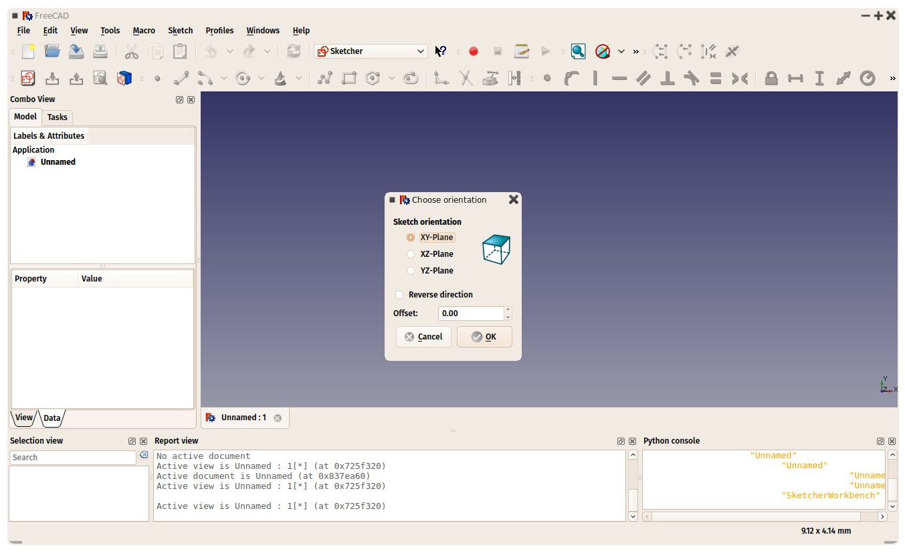 

Usually, unless there is a specific reason not to do so,you\'ll always want to start drawing your 2D sketches on the ground plane, around the (0,0) origin point. Then, it is the 3D object generated from that, that will be moved/rotated into position.

### 3. Draw two rectangles. On each of them, place a vertical constraint of 16 ft and an horizontal constraint of 2 in. 

 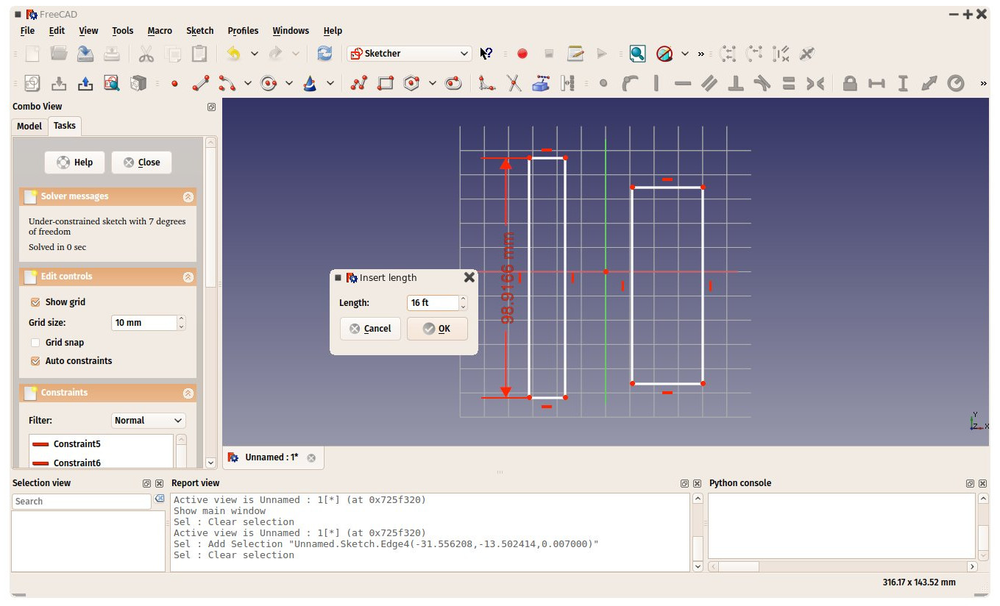 

Don\'t worry about the dimensions your pieces have when you draw them, the constraints will resize them accordingly. To add a dimension constraint (vertical or horizontal), you can either select a line, or two points (with CTRL pressed).

### 4. Once your two rectangles have the correct size, place a vertical constraint of 0 in between their corner points, and a horizontal constraint of 4 ft. 

 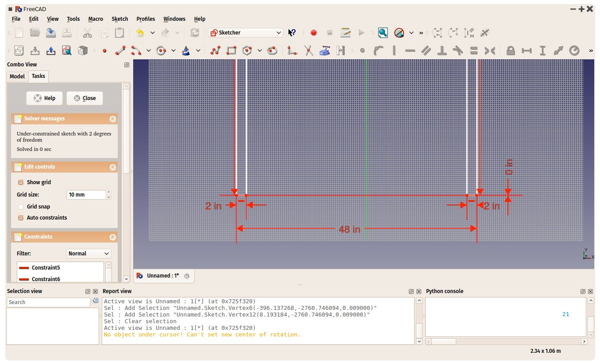 

This ensures that our two rectangles are correctly positioned in relation to each other.

### 5. Add the two additional 2 in x 6 in pieces 

 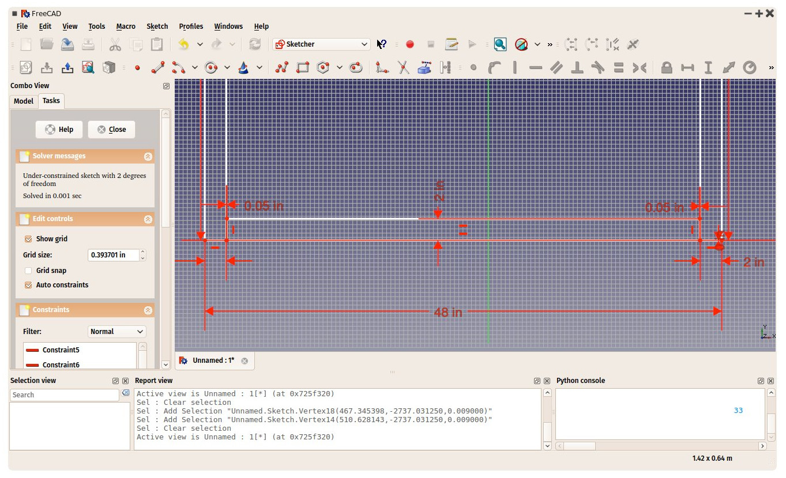 

Add two more rectangles and repeat the process. Note that in the example above, we didn\'t specify the length of these pieces, but rather placed a distance constraint between their extremities and the long vertical pieces, and we let a small gap of 0.05 inches between them. This is because if we make the rectangles touch each other, FreeCAD might deduce the loops wrongly, and we might get strange results with the Arch window tool. This little trick ensures that each rectangle will be recognized as an independent loop by the Arch window tool.

### 6. Add the corner reinforcement pieces 

 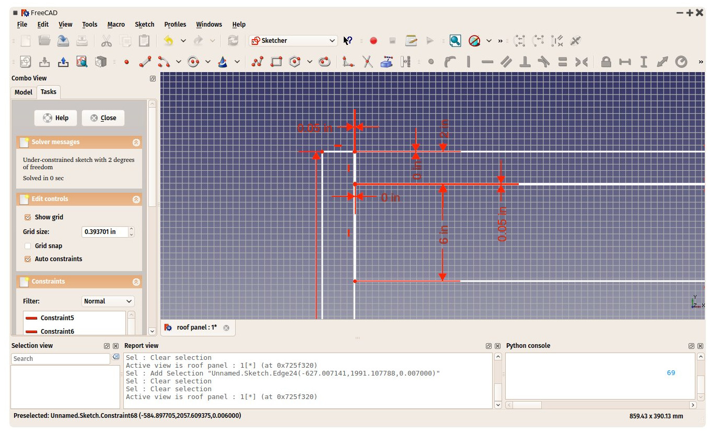 

Same thing. Make them 6 inches wide, and separated them from other rectangles by 0.05 inches.

### 7. Draw 7 intermediary reinforcement pieces, set their width to 2 inches, and constrain their left and right endpoints at 0.05 inches of the vertical rectangles (or at 0 inch of the endpoints of the other horizontal rectangles) 

 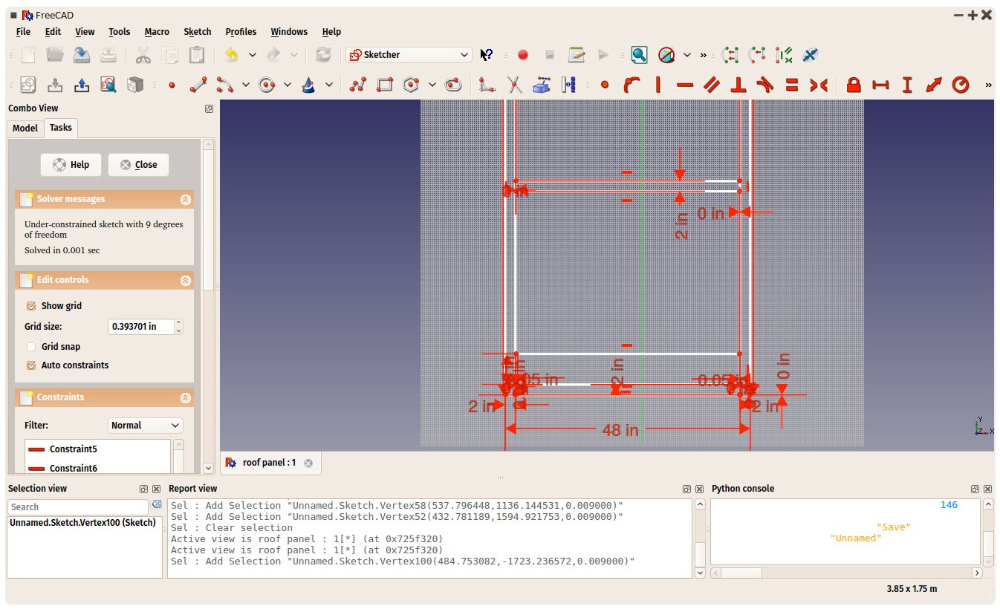 

Depending on your system, FreeCAD might begin to be slow to process new constraints. This is the disadvantage of using constrained objects, they quickly swallow up a lot of system resources. You must always consider if you absolutely need them. You can also delete constraints when they have done their job. These dimensions won\'t be fixed anymore, but unless you move the pieces around, they won\'t change. If needed, you can also always re-add constraints later.

### 8. Calculate the spacing between the 7 reinforcement pieces and set vertical constraints between them. 

In our case, our total length is 192 inches, minus the two end pieces (2 x 2 inches) and the two corner reinforcements (2 x 6 inches), = 192 -- (4 + 12) = 176. Removing the 7 reinforcement pieces ( 7 x 2 ) = 162. Dividing this by 8 gives us the space between each reinforcement: 20.25.

 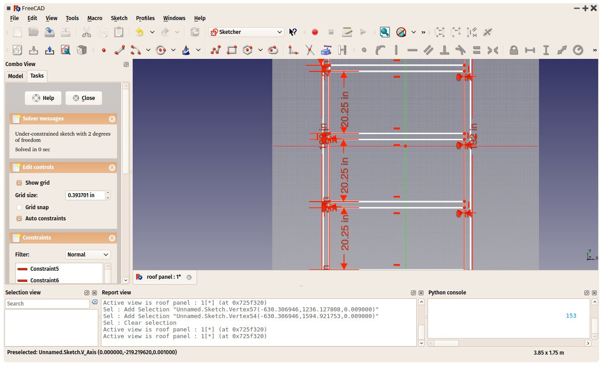 

### 9. Obtaining a fully constrained sketcher 

On the right panel (Tasks tab in the Combo View -\> Solver messages), you can see the message "\... 2 degrees of freedom". This means that our sketch is not fully constrained (it still has two "ways" of being deformed). This is because, although no piece of it can now move in relation to the others, the whole sketch can still move vertically and horizontally. To prevent this, we can simply take one of its corner points, select the origin point of the grid (where the green and red axes intersect) and press the Point Constraint button. This turns our sketch green, meaning it is fully constrained, no part of it can move anymore.

 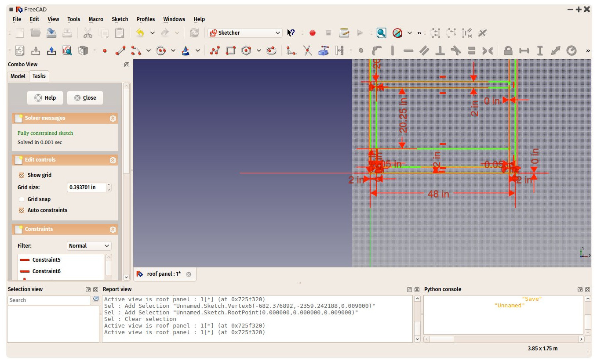 

This is actually not absolutely necessary. But it is always better to keep track of the exact position of objects (we are now certain that our corner is at the (0,0) point). In case something goes wrong later, or we need to figure out the position of an object built upon this sketch, this will be useful.

We can now press the "close" button and our base sketch is built:

 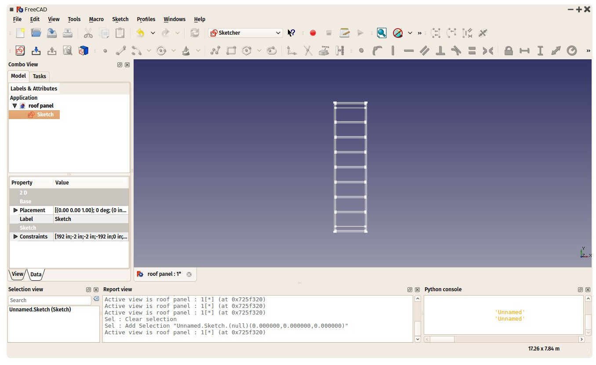 

### 10. Switch to the Arch workbench and, with the sketch selected, press the "window" button 

Our sketch has now vanished and one of its rectangles has been extruded slightly into a solid piece:

 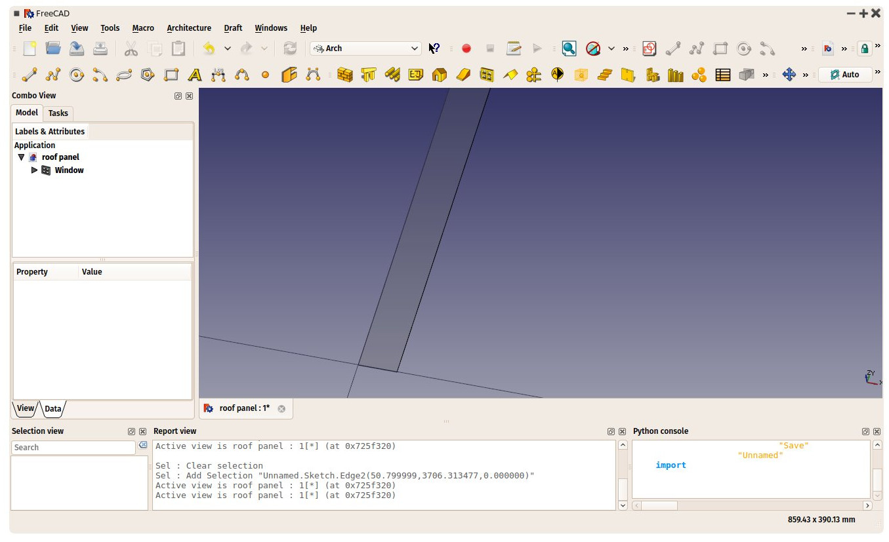 

Although this seems wrong, it is simply because the Arch Window tool has created a default piece from the biggest loop it could find in the base sketch. We will fix that soon. Also, notice take note that the sketch has not disappeared, it has simply been turned off and "swallowed" by its new parent object. You can still find it in the tree view, by expanding the window object, and turn its display on/off by pressing the SPACE key.

### 11. Edit the window components by double-clicking it in the tree view 

 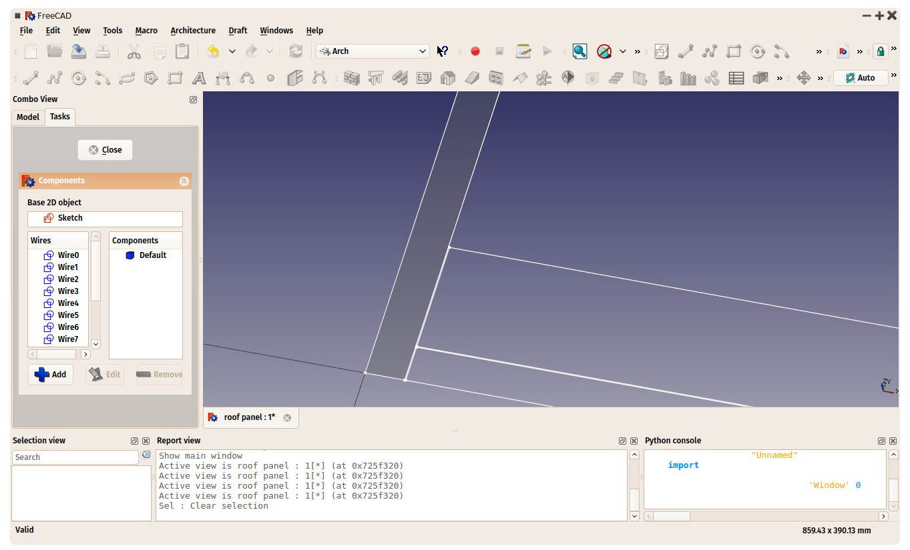 

When double-clicking the window, its base sketch becomes visible again, and we get its edit interface: At the left, a list of the loops found in the base sketch, at the right the solid pieces built on it.

Begin with removing the "Default" piece.

Then, select the first loop (Wire0). It will highlight in the 3D view. Press the "Add" button to create a new piece from it. Give it a name, make sure the correct wire is set, and give it a 6 inches extrusion. The offset should stay 0 since we want it placed "on the ground".

The "Type" value will be used to attribute materials to the window (not implemented yet), so you can currently leave to "Frame".

 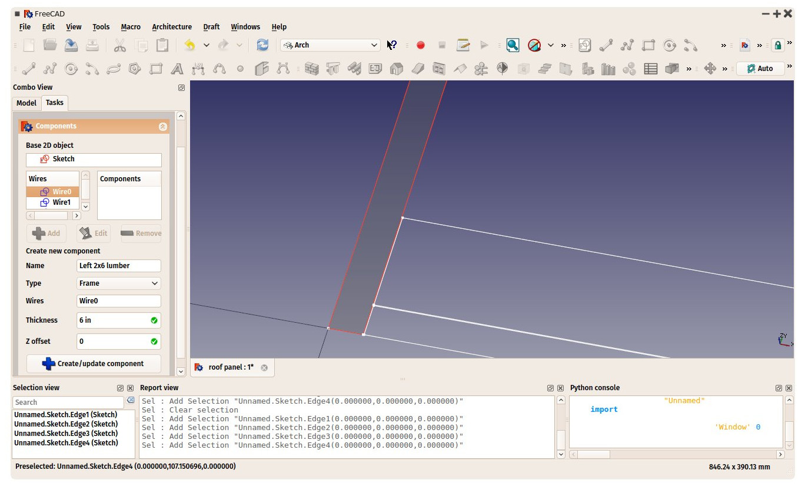 

Then press the "Create component" button. Sometimes FreeCAD fails to guess correctly the direction of the extrusion, and you must therefore edit your component and change the 6 inches value by -6 inches.

Repeat this for all the needed pieces:

 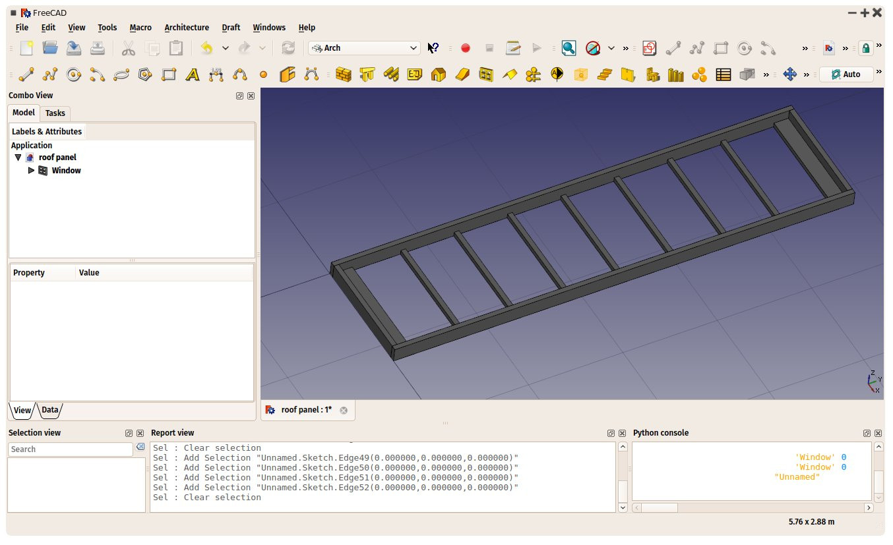 

When closing the edit panel we obtain the object above. Note that by default, window objects are represented semi-transparent. Since this will actually not be a window, we can just turn that off by setting its Transparency value to 0 in its View properties.

### 12. Add the cover panel 

We now have our panel frame, but not the base panel itself. To do that, the best way is to open our base sketch, and add a new rectangle. Remember though to not make any of the corners of that rectangle coincident to corners of other rectangles, in order not to confuse our window object, which might require us to redo the whole series of components if the order of the loops would change.

We can therefore constrain this new rectangle 0.05 inches inside the perimeter. This will require us to place 4 new constraints.

We can then edit our window again, and add new components. We can see that a new Wire has been found. This time, we will use it to add a 8mm polycarbonate panel (note that you can mix units without problems in FreeCAD, and write "8mm" as the thickness, even if you are working in inches). We will also give it an offset of 0.05 inches, so it is slightly offsetted from the frame, just for consistency, as all the parts of our object have that offest between them.

 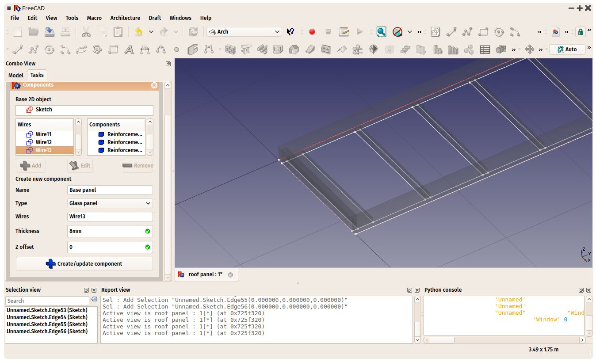 

We can now create another component based on the same Wire, in order to place another panel on top of our frame. This time, we will give it an offset of 6.05 inches. Our panel is finally complete:

 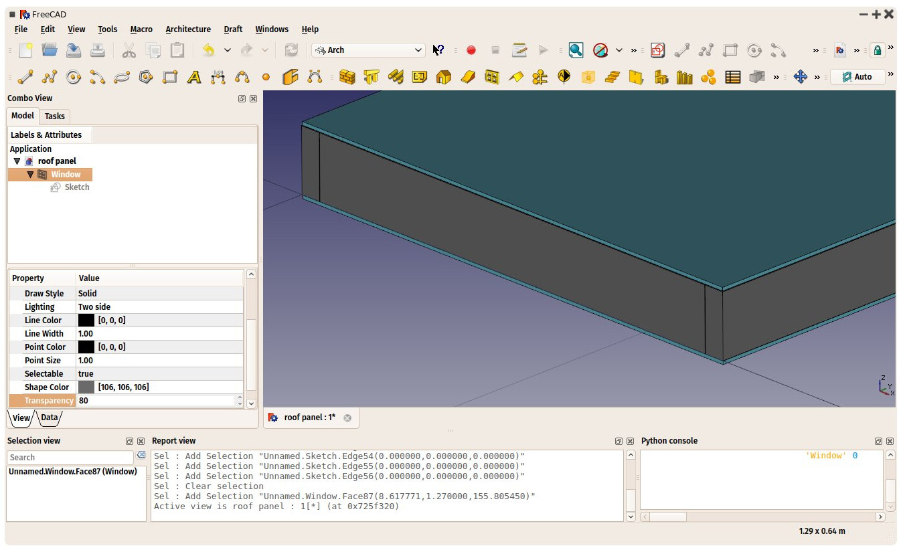 

### 13. Turn the window into another type of Arch component 

This is not really necessary at the moment, but it might become important later when we export or work to other construction-oriented applications, for example via IFC, we don\'t want our panel to be identified as a window.

The Arch workbench of FreeCAD provides an easy way to handle that, which is that any object type can always become another, by being the base of another type. In this case, let\'s turn our window into a Panel object, simply by selecting the window and pressing the Panel tool.

 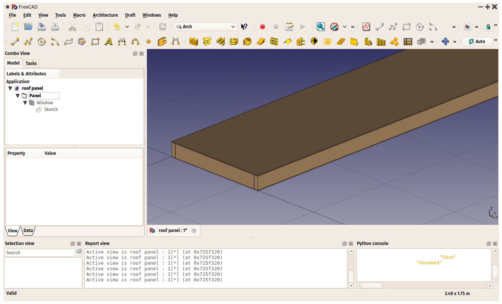 

Notice that the color of the resulting panel has changed, that is because materials support in FreeCAD and the Arch module is still incomplete. When it is finished, this will be properly handled.

### 14. Duplicating the panel 

Our panel can then be duplicated and copied over in several ways, for example by using copy/paste. But a more interesting way is to use the Draft Clone tool (also present on the Arch workbench, like all other Draft tools). The Clone tool keeps the relationship between the base object and its clone, so any modification to the base object will reflect in all its clones.

 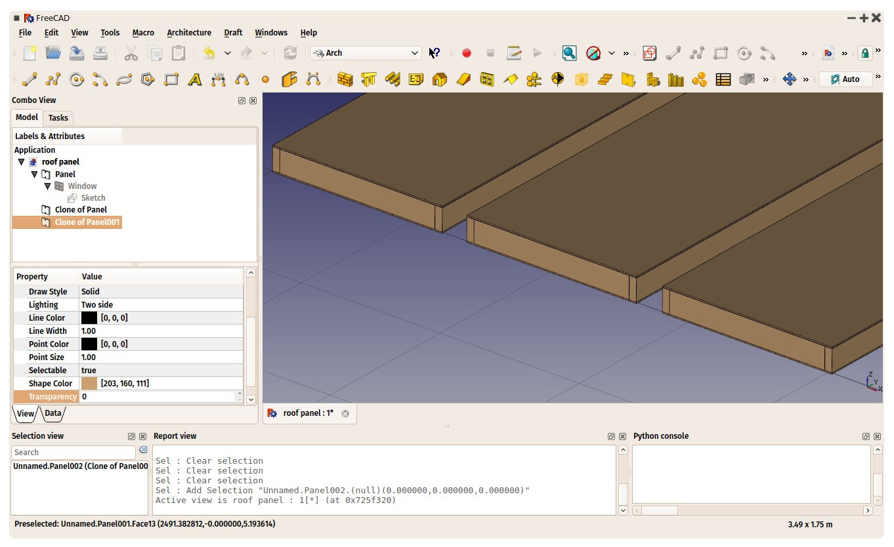 

In the current development version of FreeCAD, clones of Arch objects are now Arch objects themselves too.

### 15. Rotating and positioning the panels. 

While the assembly workbench of FreeCAD is not ready yet, we need to position our pieces manually, either by manipulating their Placement property, or by using the Draft Move and Rotate tools, which are actually only visual ways to modify the Placement of objects.

Both Draft Rotate and Move tools make use of the Draft Snapping system. Different snapping positions (endpoints, midpoints, etc) are available, that can be switched on/off, allowing to perform very precise positionning and rotations.

 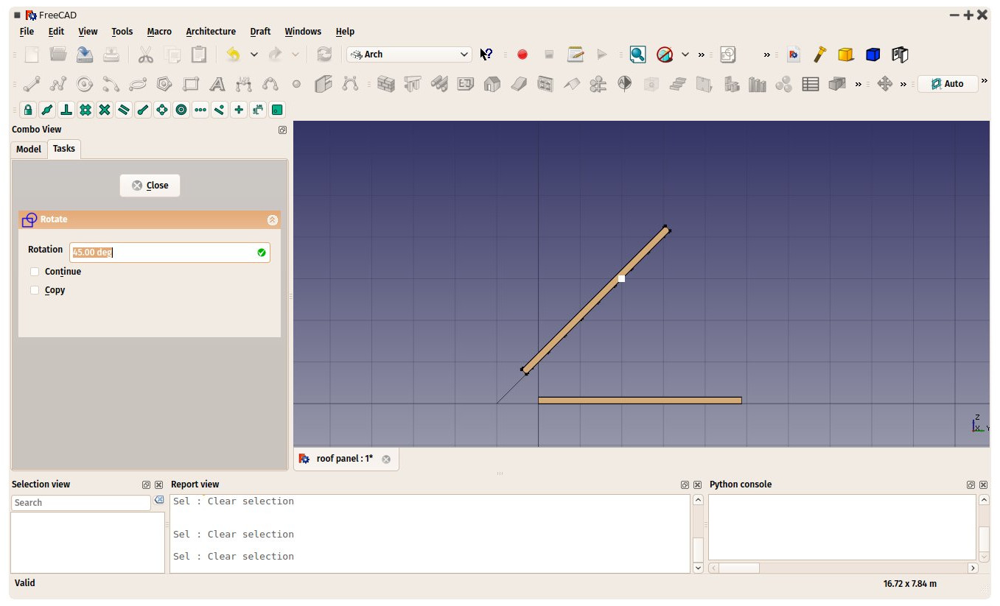

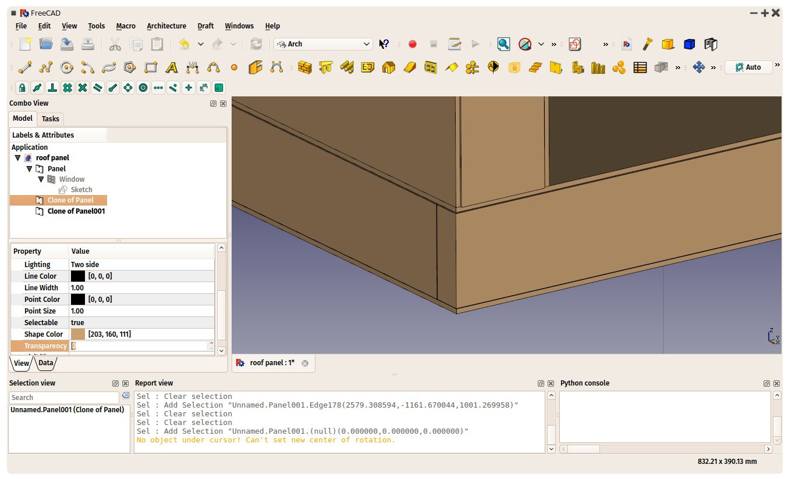

{{Tutorials navi

}}   {{Sketcher Tools navi}} 
