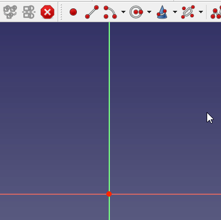
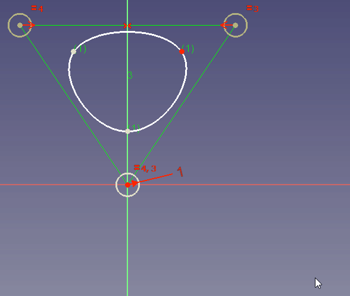
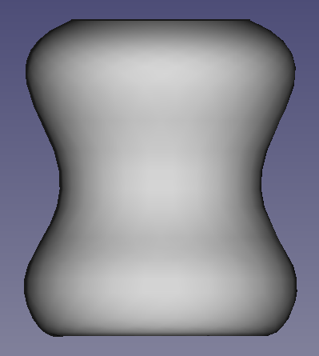

 

This page describes how to use B-splines in FreeCAD. It gives also background information what B-splines are and for what applications they are useful.

## Motivation

If you know already about B-splines and their application, you can directly continue with section [B-splines in FreeCAD](#B-splines_in_FreeCAD.md).

Let\'s assume you want to design a part that should be produced with a 3D printer. The part must have an edge this way:

  

You have to print the part in direction of the sketch\'s bottom to the top. Outer support structures might not be an option. Therefore you need to add a support directly to your part. What options do you have?

-   Option 1: you could add a line from point (20, 0) to point (80, 40):

  

However this solution needs a lot of volume, thus weight and material.

-   Option 2: you can connect the two points with an arc of a circle. To save volume, the arc should end tangentially in point (80,40). Then your solution looks like this:

  

OK. But at the bottom you don\'t need immediate support.

-   Option 3: you could save some more volume if the connection between the 2 points is a curve that begins tangentially at (0, 20) and ends tangentially at (80, 40):

  

So a curve with which you can connect two points tangentially to a reference point can be very useful for constructions. Bézier curves provide this feature.

## Bézier curves {#bézier_curves}

### Derivation

Bézier curves are polynomials to describe the connection between 2 points. The simplest polynomial connecting 2 points is a line ($A*x^1+B$) thus also linear Bézier curves are linear:

   *Animation 1: Linear Bézier curve.*

However a polynomial becomes first be useful when we can control it. So there should be a point between the 2 endpoints that allows us to define how the endpoints are connected. Like in the above example option 3 the curve is helpful when it starts and ends tangentially to lines crossing the endpoints. And this is a main feature of Bézier curves. So let\'s add a control point between the 2 endpoints. The curve will start tangentially towards this control point, meaning it is tangential to the line that we can draw between the startpoint and the control point. Going backwards from the endpoint the curve will also be tangential to the line we can draw between the control point and the end point. Animation 2 shows how such a curve looks.

   *Animation 2: Quadratic Bézier curve. P1 is hereby the control point.*

The animation makes clear what the curve basically is - a transition from P0 to P2 by rotating the line P0-P1 to become the line P1-P2. Therefore we get the nice tangential start/end feature.

Such a curve can only be described by a quadratic polynomial. (The number of left-hand/right-hand turns + 1 is the necessary polynomial order. A quadratic polynomial is a single turn, a cubic polynomial has two turn, and so on.) Therefore a Bézier curve with one control point is a quadratic (second order) Bézier curve.

Having only one control point is often not sufficient. Take the above motivation example. There in option 3 we end the curve tangentially in x-direction. But how can you connect the points (20, 0) and (80, 40) so that the curve ends tangentially in y-direction? To achieve this you need first a right-hand and then a left-hand turn, so a cubic (third order) polynomial. And that means for a Bézier curve that we need (or you can say we gain) a second control point. Animation 3 shows a cubic Bézier curve.

   *Animation 3: Cubic Bézier curve.*

To answer the question, the solution with the tangential y-direction ending for the example is this one:

  

### Math

If you are interested to understand the background math, here are the basics.

A Bézier curve is calculated using this formula:

$\quad
\textrm{Bezier}(n,t)=\sum_{i=0}^{n}\underbrace{\binom{n}{i}}_{\text{polynomial term}}\underbrace{\left(1-t\right)^{n-i}t^{i}}_{\text{polynomial term}}\; \underbrace{P_{i}}_{\text{point coordinate}}$

*n* is hereby the degree of the curve. So a Bézier curve of degree *n* is a polygon with order *n*. The factors $P_{i}$ are hereby in fact the coordinates of the Bézier curves\' control points. For a visualization see [Controlling Bézier curvatures](https://pomax.github.io/bezierinfo/#control).

If you are further interested, have a look at [The mathematics of Bézier curves](https://pomax.github.io/bezierinfo/#explanation) with a nicely animated derivation of the math of Bézier curves.

### Rules

In the above text you might already noticed some \"rules\" for Bézier curves:

-   The polynomial degree is also the degree of the curves.
-   If you need $n$ turns, you need at least a $n+1$ degree Bézier curve.
-   A Bézier curve always begins tangentially to the line between the startpoint and the first control point (and ends tangentially to the line between the last control point and the endpoint).

## B-Splines {#b_splines}

### Basics

[This video](https://www.youtube.com/watch?v=bE1MrrqBAl8) lists at the beginning the practical problems with Bézier curves. For example that adding or changing a control point changes the whole curve. These problems can be resolved by joining several Bézier curves. The result is a so-called spline, in particular a B-spline (basis spline). The video also explains that a union of quadratic Bézier curves forms a uniform quadratic B-spline and that a union of cubic Bézier curves forms a uniform cubic B-spline.

From the videos we can collect useful \"rules\" for B-splines:

-   The first and last control point is the end/start point of the spline.
-   Like for Bézier curves, splines always begin tangentially to the line between the startpoint and the first control point (and end tangentially to the line between the last control point and the endpoint).
-   A union of $S$ Bézier curves with the degree $D$ has $S+D$ control points.
    -   Since one is in most cases working with cubic B-splines we can then state that $N$ control points lead to $N-3$ Bézier segments and in turn $N-4$ segment junction points.
-   A B-spline with the degree $D$ offers at every point a continuous $D-1$ order derivative.
    -   For a cubic B-spline this means that the curvature (second order derivative) does not change when traveling from one segment to the next one. This is a very useful feature as we will later see.

If you are interested in more details about B-Spline properties, have a look at video [MOOC Curves 8.2: Properties of B-spline curves](https://www.youtube.com/watch?v=xXJylM2S72s).

### Basis

The name *B-spline* stands for *Basis spline*. Instead of forming the spline as a combination of Bézier curves, the approach is to to model **the same spline** a different way. The idea is hereby to use another set of polynomials as basis. A linear combination of these basis polynomials $B_D(t)$ with the order $D$ forms the B-spline. [This video](https://www.youtube.com/watch?v=dPPTCy4L4rY) explains the transition from the Bézier control points to the polynomial basis functions describing the spline. Mathematically we can describe a B-spline with this formula:

$\quad
c(t)=\sum_{k=0}^{N}p_{k}B_{k, D}(t)$

Hereby $p_k$ is the $k$-th control point of the B-spline and also a factor for the $k$-th base polynomial $B_{k, D}(t)$. Every basis polynomial describe the spline in a certain region and therefore moving a control point does not affect the whole spline. To understand this, it is highly recommended to have a look at [this video](https://www.youtube.com/watch?v=vjTyWIKviNc) starting at minute 2:23.

As explained in the video, the basis polynomials are Bernstein polynomials. The set of basis polynomials for a certain B-spline can be visualized this way:

   *A set of Bernstein polynomials with order 4. They describe a 4th order B-spline with 5 control points.*

At every spline position $t$ the sum of polynomials is 1 (indicated by the orange line). At the start only the red polynomial has an influence since all other polynomials are there 0. At greater $t$ the spline is described by a linear combination of different basis polynomials. In the image above, every polynomial is greater than 1 for the whole range $0 < t < 1$. This is not necessarily the case. As shown in the video, the basis polynomials are basically only greater than 0 for a certain spline position range. The interval at which a basis polynomial is greater than 0 is described by the *knot vector*. If you are interested in learning about the knot vector, have a look at [this video](https://www.youtube.com/watch?v=ni5NNPCVvDY).

### Non-uniform B-splines {#non_uniform_b_splines}

A property of the Bernstein polynomials is that when looking at the different S-spline Bézier parts, the path length of every part is the same. (The path length is often called the *travel time*). As you can imagine, it can be useful to have B-splines whose Bézier parts have different path lengths. This can be achieved by weighting the different polynomials:

$\quad
c(t)=\sum_{k=0}^{N}d_{k}B_{k, D}(t)w_k$

$w_k$ is hereby the weight of the $k$-th control point. When the weights are not equal, the B-spline is called **non-uniform**.

Especially when B-splines should be used for 3D modelling, normalized, non-uniform B-splines are necessary. The normalization is done by a division by the weighted basis functions. Thus when all $w_k$ are equal, we get a uniform B-spline, independent on the weight itself:

$\quad
c(t)=\cfrac{\sum_{k=0}^{N}d_{k}B_{k, D}(t)w_k}{\sum_{k=0}^{N}B_{k, D}(t)w_k}$

These non-uniform and rational (because of the division) B-splines are often called **NURBS**. Looking at their formula, we see that they are in fact a B-spline with a weighted basis $R_{k, D}(t)$:

$\quad
c(t)=\sum_{k=0}^{N}d_{k}R_{k, D}(t)$

whereas

$\quad
R_{k, D}=\cfrac{B_{k,D}(u)w_k}{\sum_{l=1}^N B_{l,D}(t)w_l}$

## B-splines in FreeCAD {#b_splines_in_freecad}

FreeCAD offers to create uniform or non-uniform B-splines of any degree in 2D via the [Sketcher workbench](Sketcher_Workbench.md).

### Creation

To create B-splines, go into a sketch and use the toolbar button ** [Create B-spline](Sketcher_CreateBSpline.md)**. Then left-click to set a control point, move the mouse left-click to set the next control point and so on. Finally right-click to finish the definition and create the B-spline.

By default uniform cubic splines are created, except there are not enough control points to do this. So when you create a B-spline with only 2 control points, you get of course a spline that is single linear Bézier curve, for 3 control points you get a quadratic Bézier curve, first with 5 control points you get a cubic B-spline consisting of 2 Bézier segments.

To create periodic B-splines (B-splines that form a closed curve), use the toolbar button ** [Periodic B-spline](Sketcher_CreatePeriodicBSpline.md)**. It is not necessary to set the last control point onto the first one because the B-spline will automatically be closed:

  

B-splines can also be generated out of existing sketch segments. To do this, select the elements and press the the toolbar button ** [Convert Geometry to B-spline](Sketcher_BSplineApproximate.md)**.

### Changing the Degree {#changing_the_degree}

To change the degree, select the B-spline and use either the toolbar button **  [Decrease B-spline degree](Sketcher_BSplineDecreaseDegree.md)**.

**Note:** Decreasing the degree cannot revert a prior increase of the degree, see the Wiki page [Decrease B-spline degree](Sketcher_BSplineDecreaseDegree.md) for an explanation.

### Changing the Knot Multiplicity {#changing_the_knot_multiplicity}

The points where two Bézier curves are connected to form the B-spline are called knots. The knot multiplicity determines how the Bézier parts are connected, see the Wiki page [Increase knot multiplicity](Sketcher_BSplineIncreaseKnotMultiplicity.md) for details.

To change the knot multiplicity, use the toolbar buttons **  [B-spline decrease knot multiplicity](Sketcher_BSplineDecreaseKnotMultiplicity.md)**.

**Note:** Creating two B-Splines that are connected to each other will not unite to a single new B-spline. So their connection point is not a knot. The only way to get a new knot in an existing B-spline is to decrease the degree. However, you may get many new knots. Thus the better choice is to redraw the B-spline with more control points.

### Changing the Weight {#changing_the_weight}

Around every control point you see a dark yellow circle. Its radius sets the weight for the corresponding control point. By default all circles have the radius *1*. This is indicated with a radius constraint for the first control point circle.

To create a non-uniform B-spline the weights have to be non-uniform. To achieve that you can either change the [radius constraint](Sketcher_ConstrainRadius.md) of the first control point circle:

  

or you delete the constraint that all circles are equal and then set different radius constraints for the circles.

If no radius constraint is set, you can also change the radius by dragging:

  

In the dragging example you see that a high weight attracts the curve to the control point while a very low weight changes the curve so as if the control point does almost not exist.

When you look at the [creation function](#Non-uniform_B-splines.md) for non-uniform rational B-splines you see that a weight of zero would lead to a division by zero. Therefore you can only specify weights greater than zero.

### Display Information {#display_information}

Since the form of a B-spline does not tell much about its properties, FreeCAD offers [different tools](Sketcher_Workbench#Sketcher_B-spline_tools.md) to display the properties:

+-----------------------+-----------------------------------------------------------------------------------------------------------------------------------------+
| Property              | Toolbar button                                                                                                                          |
+-----------------------+-----------------------------------------------------------------------------------------------------------------------------------------+
| **Degree**            |                                                                                                                          |
|                       | ** [Show/Hide B-spline degree](Sketcher_BSplineDegree.md)**                                |
|                       |                                                                                                                                      |
+-----------------------+-----------------------------------------------------------------------------------------------------------------------------------------+
| **Control polygon**   |                                                                                                                          |
|                       | ** [Show/hide B-spline control polygon](Sketcher_BSplinePolygon.md)**                     |
|                       |                                                                                                                                      |
+-----------------------+-----------------------------------------------------------------------------------------------------------------------------------------+
| **Curvature comb**    |                                                                                                                          |
|                       | ** [Show/hide B-spline curvature comb](Sketcher_BSplineComb.md)**                            |
|                       |                                                                                                                                      |
+-----------------------+-----------------------------------------------------------------------------------------------------------------------------------------+
| **Knot multiplicity** |                                                                                                                          |
|                       | ** [Show/hide B-spline knot multiplicity](Sketcher_BSplineKnotMultiplicity.md)** |
|                       |                                                                                                                                      |
+-----------------------+-----------------------------------------------------------------------------------------------------------------------------------------+
| **Weights**           |                                                                                                                          |
|                       | ** [Show/hide B-spline control point weight](Sketcher_BSplinePoleWeight.md)**          |
|                       |                                                                                                                                      |
+-----------------------+-----------------------------------------------------------------------------------------------------------------------------------------+

### Limitations

At the moment (FreeCAD 0.19) there are some limitations when using splines you should know:

1.  You cannot set tangential constraints.In this example  you want to assure that the spline touches the blue curve 2 times tangentially. This would be useful because the blue line could for example be the spatial border for your design.
2.  You cannot insert a new control point between two selected existing control points. There is no other way than to redraw the spline.
3.  You cannot delete a control point. Also in this case you must redraw the spline
4.  You cannot create an offset curve for a B-spline using the tool [Draft Offset](Draft_Offset.md).

## Typical Use Cases {#typical_use_cases}

According to the properties of B-splines, there are 3 main use cases:

1.  Curves that start/end tangentially to a certain direction. An example for this is the motivation example [above](#Motivation.md).
2.  Curves describing larger designs and providing the freedom of local changes. See [this example](#Designing.md) below.
3.  Curves providing a certain continuity (derivative). See [this example](#Continuity_at_Geometric_Transitions.md) below.

### Designing

Take for example the case that you design a housing of a kitchen mixer. Its desired shape should look like this one:

  

To define the outer form it is advantageous to use a B-spline because when you change a control point to change the curvature at the bottom, the curvature at the side and top will not be changed:

  

### Continuity at Geometric Transitions {#continuity_at_geometric_transitions}

There are several cases where it is physically necessary to have a certain surface continuity at geometric transitions. Take for example the inner walls of a fluid channel. When you have a change in the diameter of the channel, you don\'t want to have an edge because edges would introduce turbulences. Therefore, like in the motivation example [above](#Motivation.md), one uses splines for this purpose.

The development of the Bézier curves was initially triggered by the French car industry. Besides the saving of material and the reduction of the air flow drag, the look of the cars should also be improved. And when you look at the fancy design of French cars from the 60\'s and 70\'s you see that the Bézier curves gave car design a boost.

Let\'s take for example this task in the design of cars: The car fender should \"look nice\". Here is a basic sketch of our task:

  

\"Looking nice\" means that the (potential) customer looks at the fender and does not see unexpected light reflections and also no sudden changes in the reflection from the automotive paint at all. So what do you need to avoid changes in the reflections? Looking closely to the fender:

   
*At the spatial area above the edge the intensity of reflected light is low (denoted by the red ellipse) because no light is directly reflected in the direction from the edge to the eye.*

you see when there is an edge, there is a spatial area where the reflected light has less intensity and this is what you will notice when looking at the fender. To avoid this you need a continuous change in the slope of your surface elements. The slope is the first order derivative and as explained in section [Basics](#Basics.md), a second degree (quadratic) B-spline offers at every point a continuous first order derivative.

But is this really sufficient? At the point of geometric transition we have now at both sides the same slope, but the slope might change differently at both sides. Then we have this situation:

  

So we have also spatial areas in which the intensity of reflected light is different. To avoid this, we need at the geometrical point of transition also a continuity of the second order derivative and thus a cubic B-spline.

