 {{TutorialInfo
|Topic=Attachment
|Level=Beginner/Intermediate
|Author=Bance
|Time=1 hour
|FCVersion=0.17 or above
|Files=[https://github.com/BanceFC/Examples/blob/master/AttachmentTutorial.FCStd Basic Attachment Tutorial.FCStd]
}}

This tutorial should serve as an introduction to [Part:Attachment](Part_Attachment.md), it is not comprehensive, but hopefully will help users experiment.

Attachment is a utility to attach an object to another one. This links the two objects\' placement properties, the attached object will then follow the original(if its placement is changed.) The focus is on Part Design workbench and attaching sketches to other sketches, this being a recommended method for making [*stable*](Feature_editing#Advice_for_creating_stable_models.md) models. Written for V0.19, but should be valid for any version 0.17 and later. However, things may differ in some details. The original model was designed by Md. Aminul Islam and downloaded from here:-https://grabcad.com/library/50-cad-exercise-drawing-1

## Pre-requisites {#pre_requisites}

Before attempting this tutorial users should :-

1.  Use version 0.17 or greater.
2.  Be comfortable navigating the [3D view](3D_view.md).
3.  Be able to make and constrain a [sketch](Sketcher_Workbench.md).
4.  Have a basic understanding of the  [Part Design workbench](PartDesign_Workbench.md).
5.  Have a basic understanding of [Expressions](Expressions.md).

## Objectives

The purpose of this tutorial is to show how a model can be constructed by positioning sketches relative to other geometry using some of the various attachment modes available.

Although it is possible to use solid geometry (Vertices, Edges and Faces) for reference geometry, in the interest of what is considered good practice, this tutorial will refrain from doing so. See [Feature Editing](Feature_editing.md) for further explanations.

## Preliminaries

Before we start let us examine how, we should go about building this model.

From whichever angle we look at it, we see a square or rectangle with a corner trimmed off.

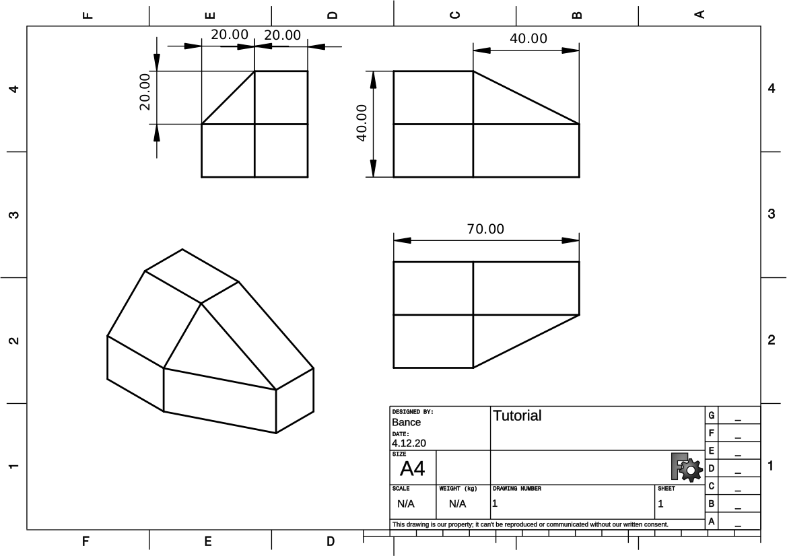

There is however an obvious axis from which all features are common.

It is perfectly possible to create some Data geometry here and attach all sketches to it. In some models that would be a wise choice, for the sake of this tutorial we will confine ourselves to Std Planes and sketches.

We could make a sketch on any of the major planes. We could include a trimmed corner in our base sketch, but let\'s forego that and include an extra sketch and pocket, for learning purposes.

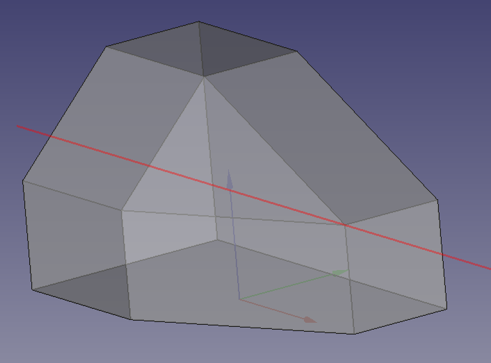

## Attachment

We will start with a block and pocket the excess away.

Switch to Part Design workbench, open a new document, create a body and a new sketch on the XY plane.

There, you have just made an ***attachment***. When you select the plane to make the sketch on, that is in fact what is being done, the select plane dialogue is just simplified version of the attachment dialogue, where all offsets are set at zero.

Sketch a rectangle, centre it on the origin, constrain with a (horizontal) length of 70mm and name it \"length\", further constrain it with a (vertical) width of 40mm, and name it \"width\".

Select the sketch, press **F2**, and rename it to \"BaseSketch\".

[Top](#Top.md)

### Attachment offset {#attachment_offset}

If we leave the sketch where it is, the example would be too easy, so let\'s change the sketch\'s position by altering its attachment offset.

In the combo view (Data tab), look in the Attachment section of the properties pane, here we can see that BaseSketch has a support of XY\_Plane and is attached with mode Flat Face. Look further down and find attachment Offset and expand it, by clicking the plus sign next to it.

Do the same for the Position sub heading. Change the X offset to 80mm, and the Y offset to 90mm.

Attachment offset is commonly used in conjunction with expressions to offer a parametric parallel to plane position, eg. positioning a sketch on the top face of a Pad, using a (Pad.Length) expression for Z offset.

The Sketch can now be padded , let\'s assume that the pad\'s height should be the same as the sketch\'s width. In the **Pad parameters** dialog select the **Length** box, press **<nowiki>=</nowiki>** or select the function icon  and type \"**Sketch.Constraints.width**\", this expression should resolve to \"40 mm\", then tick **Symmetric to plane** and press **OK**.

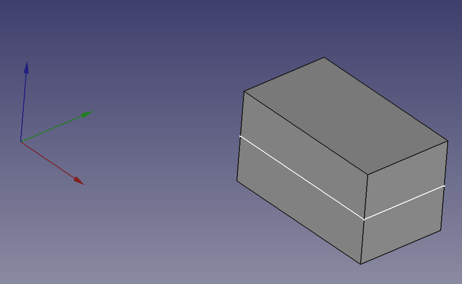

Let\'s make the next sketch, it\'s not really important which one we choose, but the easiest one is the 20x20 isosceles triangle that pockets through the length of the block.

Make a new sketch, choose whichever plane you like (we\'re going to change its attachment anyway.)

Draw the triangle, make two sides equal and constrain the length the same way as you did the Pad Length only this time make the formula \"**Sketch.Constraints.width/2**\".

There should be two degrees of freedom remaining, they are the position with regards to the origin. Fix one of the corners to the origin so that the sketch looks thus:-

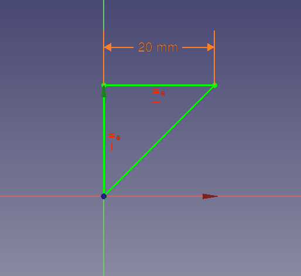

[Top](#Top.md)

### Changing Attachment {#changing_attachment}

Close the sketch. Rename the sketch, call it \'IsoscelesSketch\'. The origin of the sketch is the point that will be attached in the future, so choosing how the sketch is constrained to the origin is important. The origin can be thought of as hook that catches onto the reference. We can adjust the position of the sketch using offsets, but it is better to choose wisely in the first place.

Now we are going to change the attachment mode of the sketch in our model.

Select Pad and make it invisible, and make BaseSketch visible. We need to see the BaseSketch, and we want to hide the pad so that we avoid making incorrect selections.

The 3D view should look something like this:-

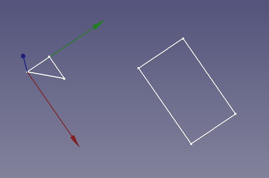

I chose the XY plane for my isosceles sketch, yours may be different.

Now we need to select IsoscelesSketch and go to the properties pane in the Combo view. Click in the value box next to the Map Mode property, a button will appear with an elipsis **...**.

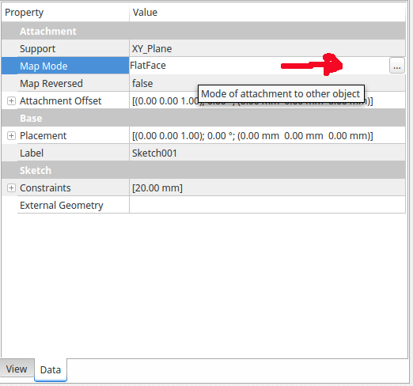

Click on that and a task pane will open with the Attachment Dialogue.

Here we can see the attachment that we chose when the sketch was created (in the select Plane dialogue.)

The **Reference 1** button is in selecting mode, so in the 3D view select one of the long sides of the Base Sketch.

The IsoscelesSketch will attach itself to the line you selected, and the attachment mode window will change to reflect the available modes.

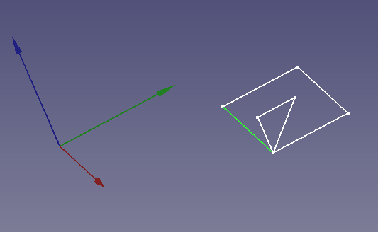

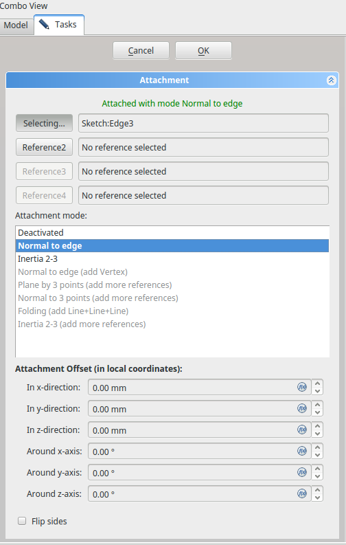

You can see that the IsoscelesSketch has been attached to the selected line at the point we constrained to the origin earlier on.

This concept of the origin being the attachment point is important, it makes the attachment modes very flexible, and can be a powerful tool in your modeling.

It can be used with the addition of offsets to precisely position sketches without relying on generated geometry and all the problems that may arise from using them.

FreeCAD tries to predict the attachment mode for you, and filters the modes available for the given selection.

In this case, the options are \"Deactivated,\" \"**Normal To Edge**\" and \"Inertia 2-3\". Normal To Edge is in bold and is deemed the preferred selection.

The notification area at the top of the dialogue, shows a message in green stating the mode in use.

Grayed out options show that more selections are required in order to activate them.

At this point you could make another selection, and see the difference in modes. Don\'t forget to change back to \"**Normal To Edge**\" mode before continuing with the tutorial.

The IsoscelesSketch is now correctly positioned so confirm and exit the dialogue.

You can now pocket the sketch.

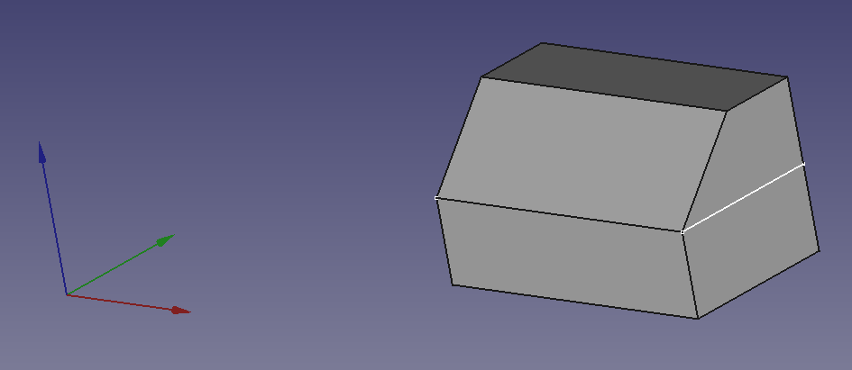

[Top](#Top.md)

### A Step Further {#a_step_further}

Create the next sketch, the dimensions should be expressions (\"**Sketch.Constraints.width**\",\"**Sketch.Constraints.width/2**\") and it should be constrained to the origin at the vertex adjacent the hypotenuse and its shortest side. (In the empty sketch, if you are familiar with ** [CarbonCopy](Sketcher_CarbonCopy.md)** you can use it to make a copy of the \'IsoscelesSketch\' sketch, and edit its parameters to suit.)

Rename the sketch RightAngleTriangleSketch.

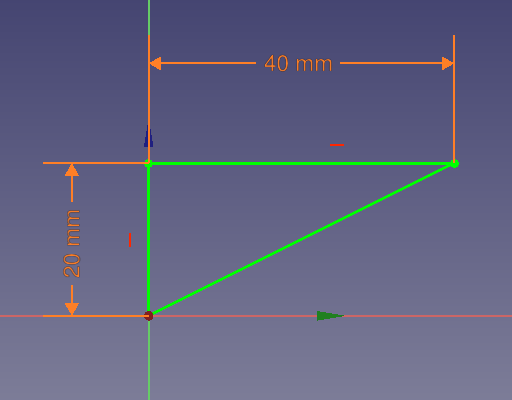

Once again we need to hide the solid, in this case Pocket, and make sure both sketches are visible for selection (leave isoscelesSketch invisible it will just get in the way!).

Select RightAngleTriangleSketch and open its attachment mode dialogue.

Select one of the rectangles short sides as the first reference.

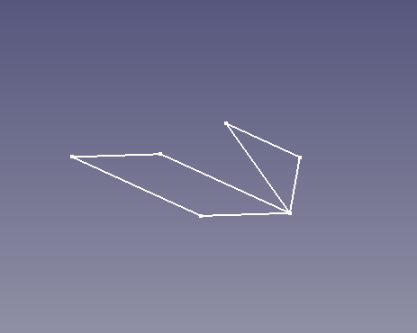

The 3D view should be similar to the picture above. It is not important which end of the line the triangle is attached to (it depends on how the rectangle was drawn!)

If you chose the wrong line, change it now. If the triangle is pointing the wrong way you can correct it by checking the \"Flip Sides\" checkbox at the bottom of the dialogue (or later on after closing the dialogue it can be changed in the properties data tab by setting \"Map Reversed\" to \"True\").

The RightAngleTriangleSketch is now in a position that will give us the correct Geometry after a pocket operation, however we can get a little inventive here, and position the sketch so that it makes it easier for us to attach further geometry later on. We are going to shift our sketch to the middle of the line so that it provides us with a vertex at the top of the corner chamfer.

In the attachment dialogue, we are going to change the attachment mode from \"Normal To Edge\" to \"Inertia 2-3\". This will change the position to the centre of the line, it\'s beyond the scope of this tutorial to describe all the attachment modes, their descriptions can be found at  [Part Attachment](Part_Attachment.md). Suffice to say inertia 2-3 uses the centre of mass and does the job here.

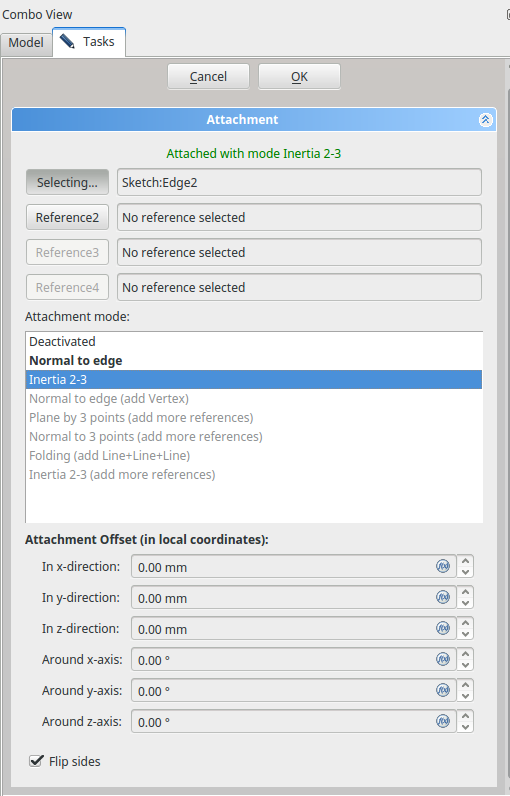

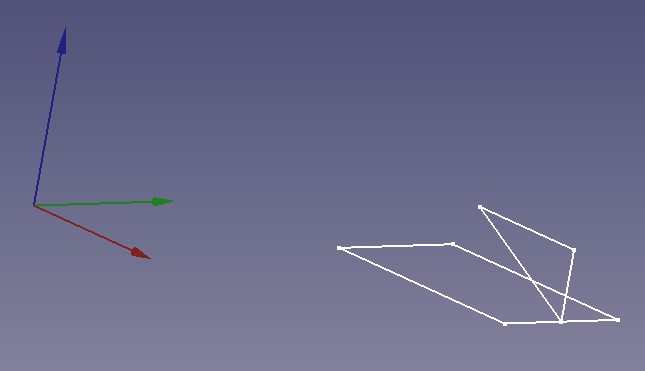

The RightAngleTriangleSketch is now correctly positioned so confirm and exit the dialogue.

You can now pocket the sketch. This time use Symmetric to plane.

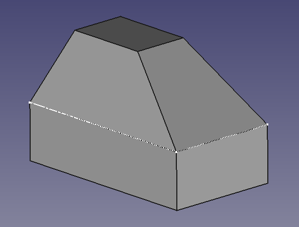

[Top](#Top.md)

### Manipulating Attachment {#manipulating_attachment}

In general it is better to position our sketches simply with attachment modes. But it is not always possible to position the sketches exactly where we need without modifying the attachment mode in some way.

FreeCAD provides a number of ways to do this.

1.  Attachment offset, allows positioning relative to the local coordinates of the attachment point. (where the origin of the positioned sketch is attached.)
2.  Map Path parameter (in the Property data tab with show all enabled) This allows for the positioning along a selected edge.
3.  Flip Sides/Map Reversed. Effectively mirrors the sketch.

For our final sketch, we will Attach it arbitrarily, and correct its position using the modifiers listed above.

Create the final sketch, the dimensions should be expressions(\"**Sketch.Constraints.width**\",\"**Sketch.Constraints.width/2**\") and it should be constrained to the origin at the vertex adjacent the hypotenuse and its shortest side.

Rename the sketch FinalSketch.

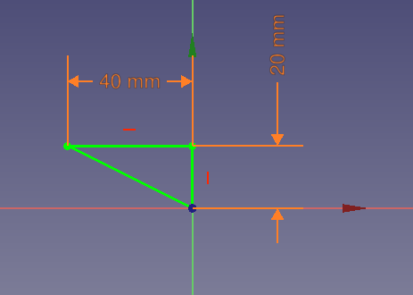

Note that FinalSketch has been constrained to the origin differently. Otherwise we could\'ve used ** [CarbonCopy](Sketcher_CarbonCopy.md)**, but the sketch is only Three lines and five constraints.

Once again we need to hide the solid, in this case Pocket001, and make sure both sketches are visible for selection (BaseSketch and FinalSketch).

Select FinalSketch and open the attachment dialogue, Select one of the rectangles short sides as the first reference.

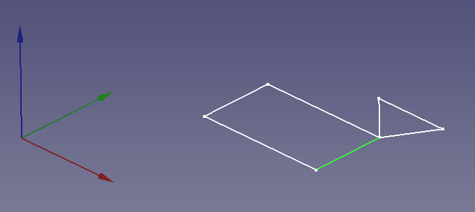

The 3D view should be similar to the picture above. It is not important which end of the line the triangle is attached to (it depends on how the rectangle was drawn!)

Now we need to Flip(mirror) it, translate it through 90° and shift it up to the corner.

At the bottom of the attachment dialogue is a check box labeled \'Flip Sides\', check this box.

The FinalSketch mirrors itself.

Now we will translate through 90°. From the illustration FinalSketch above we can see the axis of revolution should be the X axis. In the Wiki this termed Roll. Remember this is relative to the local Coordinate System. Enter 90° in the \"around X-axis\" box of the attachment offset section of the dialogue.

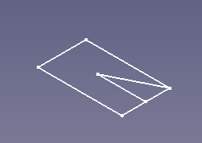

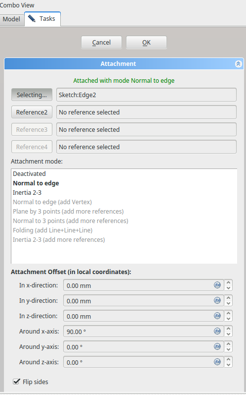

We could use Z-direction offset \-- which now corresponds to the opposite Y-direction in the global coordinate system \-- to shift FinalSketch to the corner, but I would like to demonstrate another feature.

So let\'s confirm and close the dialogue for now.

[Top](#Top.md)

### Map Path Parameter {#map_path_parameter}

Select FinalSketch and look in the combo view, properties pane in the attachment section, just below the Map Mode property is the Map Path Parameter.

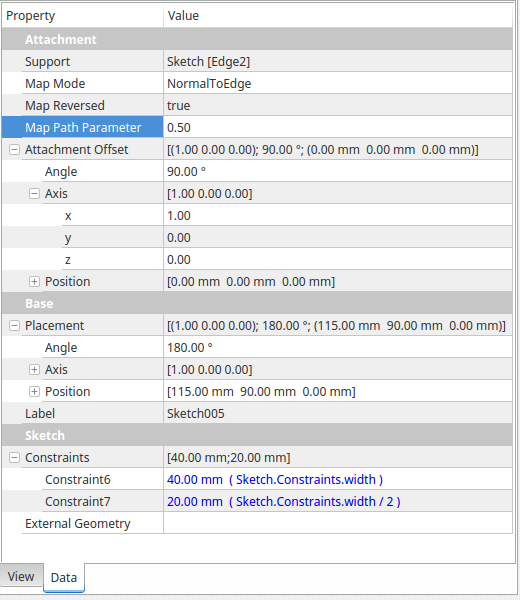

The default setting is 0.0 if we change it to 1 the sketch will map to the other end of the line, and 0.5 gives us half way. Enter 0.5 in the value column.

The combination of \'Normal To Edge\' and Map Path Parameter is very useful for positioning sketches for Lofts or Sweeps.

You can now pocket the sketch. Don\'t forget to use Symmetric to plane.

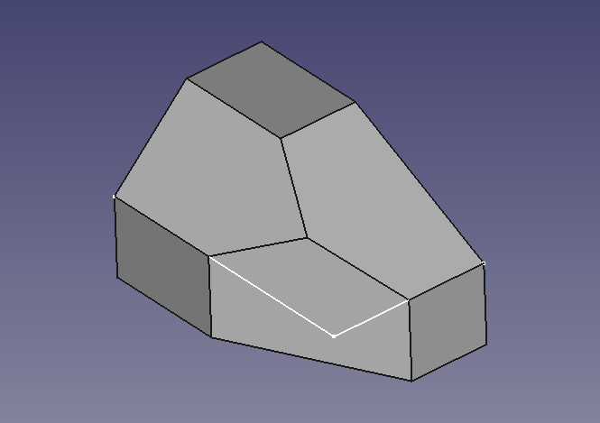

[Top](#Top.md)

### A Different Selection Mode {#a_different_selection_mode}

So far we have seen how to position sketches with attachment modes and offsets, but we could\'ve used Standard planes because the relative positioning was quite simple.

Now we are faced with a more challenging problem, how do we cut away this lump that\'s left?

We can sees that there is a plane that passes through the corners of the red triangle, it would be simple if we could just slice it away there.

Well because we were careful with how we positioned our sketches earlier on, we can!

First make the solid invisible, in fact make everything except RightAngleTriangleSketch and FinalSketch invisible.

Now select the three points that form the plane, Don\'t forget to hold the **Ctrl** key (CMD on a Mac) while making the selection.

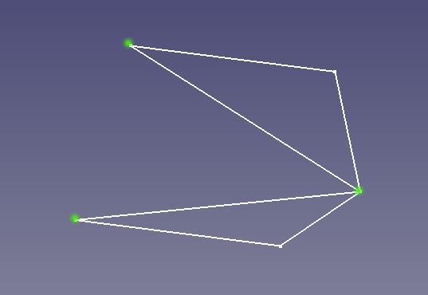

When pressing ** [Create a datum plane](PartDesign_Plane.md)**, the attachment Dialogue will open showing the three points you selected as references 1-3 and a mode of \'Plane By 3 Points\'.

Confirm and close the Dialogue. We could now use the Datum Plane to create a Sketch, but there is no need we can use the plane directly to pocket the excess material away. Make sure the datum Plane is selected, and click on pocket, in the pocket Dialogue select \"through all\" and \"reversed\". Close the Dialogue and we are all done.

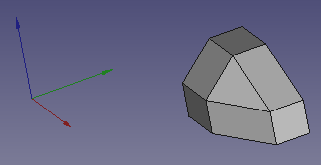

[Top](#Top.md)

### Temporarily attaching to a generated plane {#temporarily_attaching_to_a_generated_plane}

Sometimes it is difficult to work out how to align sketch or datum plane to generated face without actually attaching to it, which as noted above can be problematic. One solution is to attach to the generated geometry and then change the attachment to one of the coordinate planes. FreeCAD will retain the existing position and orientation intact but now reference it to stable planes, thus avoiding the topological renaming problems. However, the cost of doing this that the parametric linkage to the generated geometry is lost. If the underlying model is change, it will not all fall apart as often happens when attaching to generated geometry but attachment will not follow the changes and will need adjusting by repeating the temporary attachment trick.

The previous method is more robust but more abstract and complex to achieve. The temporary attachment trick is quick and easy to implement, more robust than attachment to generated geometry but looses a degree of linkage in the parametric modelling process.

## Conclusion

Part Attachment does not guarantee a robust model, the key is to avoid attaching or placing sketches on generated geometry such as faces or edges of pads and pockets.

There are many attachment modes available to users, only the basics are covered here.

One important thing to take away from this tutorial, is the importance of the origin being the \'Hook\'. Remember also that orientation is in Local Coordinate System.

Happy Attaching!

[Top](#Top.md)

{{Tutorials_navi

}} {{PartDesign_Tools_navi}} {{Sketcher_Tools_navi}} 

[Category:Tutorials](Category:Tutorials.md)
