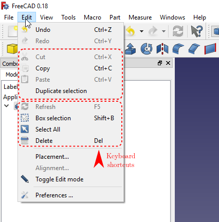

# Copying Objects
## Overview

Like many other software FreeCAD also has the ability to copy/cut and paste objects (paragraphs, spreadsheet cells, images, etc.). [Document](Document_structure.md) objects may be freely copied within a document or between documents using the ** [Copy](Std_Copy.md)**, ** [Paste](Std_Paste.md)** and **[Duplicate Selection](Std_DuplicateSelection.md)** commands.

Please consider that the copy-pasted objects are not dependent on the original. If You want dependant clones please use  [ Draft Workbench\'s Clone](Draft_Clone.md) or  [ Part Design Workbench\'s Clone](PartDesign_Clone.md). If you need a dependant clone nor a parametric replica, you may also use  [ Part Workbench\'s Simple Copy](Part_SimpleCopy.md). For patterned clones, please look into the [ Other Methods section](Copying_Objects#Other_Methods.md) of this page.

## Copying Linked Objects 

[Document](Document_structure.md) objects may be linked to other objects (for example, a Pad feature is linked to its Sketch, and a Fusion feature is linked to its component objects). This means that some care must be exercised in selecting objects to copy.

If an object is selected without its children, those children are not automatically duplicated by Copy/Paste or Duplicate Selection. In this case, the copied object may exhibit unexpected behaviour due to expected links not being present.

In general, recommended practice is to select all dependent objects when copying a parent object.

## Finding and Positioning Pasted Object(s) 

After the Copy/Paste operation, it may not be obvious where the new object(s) are located in the Document window. That is because the new object has the same [Placement](Placement.md) property as the original. Toggle the Visibility property (**Spacebar**) to hide the original. Then use the Placement dialog to move the copy to its correct position.

## Other Methods 

Like most things in FreeCAD, there are many ways of making a copy. For more ideas, look at:

-   PartDesign: [Mirror](PartDesign_Mirrored.md), [Linear Pattern](PartDesign_LinearPattern.md), [Polar Pattern](PartDesign_PolarPattern.md), [MultiTransform](PartDesign_MultiTransform.md)
-   Part: [Mirror](Part_Mirror.md), [Create simple copy](Part_SimpleCopy.md)
-   Draft: [Offset](Draft_Offset.md), [Scale](Draft_Scale.md), [Array](Draft_OrthoArray.md), [PathArray](Draft_PathArray.md), [Clone](Draft_Clone.md), [Mirror](Draft_Mirror.md)

## Notes

-   If an object to be copied has links to object(s) not in the selection, FreeCAD will ask if the unselected objects should be included in the copy operation. <small>(v0.14)</small> 

## More

-   [Copy](Std_Copy.md)
-   [Paste](Std_Paste.md)
-   [Duplicate Selection](Std_DuplicateSelection.md)

---
[documentation index](../README.md) > Copying Objects
