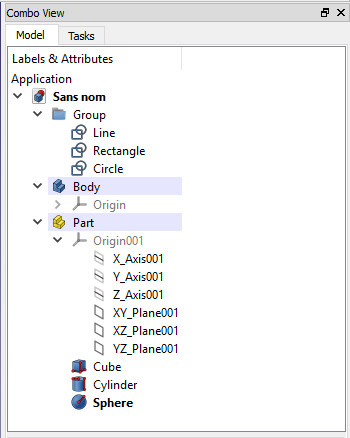

# Document structure
 


 

 A FreeCAD document contains all the objects of your scene. It can contain groups, and objects made with any workbench. You can therefore switch between workbenches, and still work on the same document. The document is what gets saved to disk when you save your work. You can also open several documents at the same time in FreeCAD, and open several views of the same document.

Inside the document, the objects can be moved into groups, and have a unique name. Managing groups, objects and object names is done mainly from the [Tree view](Tree_view.md). **Note:** It can also be done, of course, like everything in FreeCAD, from the [Python](Python.md) interpreter. In the [Tree view](Tree_view.md), you can create  [groups](Std_Group.md), move objects to groups, delete objects or groups, by right-clicking in the [tree view](tree_view.md) or on an object, rename objects by double-clicking on their names, or possibly other operations, depending on the current workbench.

The objects inside a FreeCAD document can be of different types. Each workbench can create its own types of objects, for example the  [Mesh Workbench](Mesh_Workbench.md) creates mesh objects, the  [Part Workbench](Part_Workbench.md) create Part objects, the  [Draft Workbench](Draft_Workbench.md) also creates Part objects, etc.

If there is at least one document open in FreeCAD, there is always one and only one active document. That\'s the document that appears in the current 3D view, the document you are currently working on.

## Application and User Interface 

Like almost everything else in FreeCAD, the graphical user interface part (GUI) is separated from the base application part (App). This is also valid for documents. The documents are also made of two parts: the Application document, which contains our objects, and the View document, which contains the representation on screen of our objects.

Think of it as two spaces, where the objects are defined. Their constructive parameters (is it a cube? a cone? which size?) are stored in the Application document, while their graphical representation (is it drawn with black lines? with blue faces?) are stored in the View document. Why is that? Because FreeCAD can also be used {{emphasis|without}} graphical interface, for example, inside other programs, and we must still be able to manipulate our objects, even if nothing is drawn on the screen.

Another thing that is contained inside the View document are 3D views. One document can have several views opened, so you can inspect your document from several points of view at the same time. Maybe you would want to see a top view and a front view of your work at the same time? Then, you will have two views of the same document, both stored in the View document. Creating new views or closing views can be done from the View menu or by right-clicking on a view tab.

## Scripting

Documents can be easily created, accessed and modified from the [Python](Python.md) interpreter. For example:  
```python
FreeCAD.ActiveDocument
``` Will return the current (active) document  
```python
FreeCAD.ActiveDocument.Blob
``` Would access an object called \"Blob\" inside your document  
```python
FreeCADGui.ActiveDocument
``` Will return the view document associated to the current document  
```python
FreeCADGui.ActiveDocument.Blob
``` Would access the graphical representation (view) part of our Blob object  
```python
FreeCADGui.ActiveDocument.ActiveView
``` Will return the current view


 
