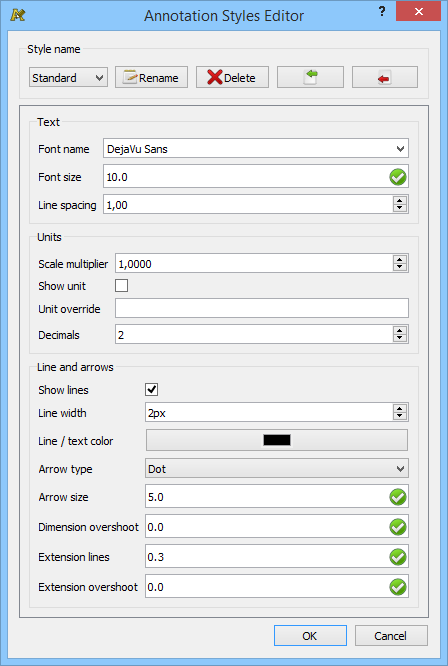

---
- GuiCommand:
   Name:Draft AnnotationStyleEditor
   MenuLocation:Annotation → Annotation styles...
   Workbenches:[Draft](Draft_Workbench.md)
   SeeAlso:[Draft Text](Draft_Text.md), [Draft Label](Draft_Label.md), [Draft Dimension](Draft_Dimension.md)
   Version:0.19
---

# Draft AnnotationStyleEditor

## Description

The  **Draft AnnotationStyleEditor** command allows you to define styles that affect the visual properties of annotation-like objects, such as those create by the [Draft Text](Draft_Text.md), [Draft Dimension](Draft_Dimension.md) and [Draft Label](Draft_Label.md) commands.

   
*The Annotation Styles Editor dialog box*

## Usage

1.  There are several ways to invoke the command:
    -   Press the ** [Draft AnnotationStyleEditor](Draft_AnnotationStyleEditor.md)** button.
    -   Select the **Annotation →  Annotation styles...** option from the menu.
2.  The **Annotation Styles Editor** dialog box opens.
3.  Select a style from the **Style name** dropdown list, or choose {{Value|Add new...}} to define a new style.
4.  Optionally adjust the properties of the style.
5.  Optionally press the **[ Rename** button to rename the style.
6.  Optionally press the **[ Delete** button to delete the style.
7.  Optionally press the **[** button to import all styles from a {{FileName|.json}} file. This will overwrite existing styles with the same name.
8.  Optionally press the **[** button to export all styles to a {{FileName|.json}} file.
9.  Press the **OK** button to close the dialog box and finish the command.

## Scripting

See also: [Autogenerated API documentation](https://freecad.github.io/SourceDoc/) and [FreeCAD Scripting Basics](FreeCAD_Scripting_Basics.md).

The annotation styles are saved as serialized dictionaries in the `Meta` attribute of the document. This attribute is inspected by the annotation style editor when it is opened.

 
```python
>>> print(App.ActiveDocument.Meta["Draft_Style_Lane 1:100"])
{"FontName": "DejaVu Sans", "FontSize": "8.0000 ", "LineSpacing": "1 cm", "ScaleMultiplier": 1.0, "ShowUnit": false, "UnitOverride": "", "Decimals": 2, "ShowLines": true, "LineWidth": 2, "LineColor": 1095216660480, "ArrowType": 0, "ArrowSize": "5.0000 ", "DimensionOvershoot": "1.0000 ", "ExtensionLines": "5.0000 ", "ExtensionOvershoot": "1.0000 "}
```

Each style that appears in the editor is internally saved with the style name prefixed by `Draft_Style_`; this will prevent name clashes with other keys that may be saved in `Meta`, which can hold arbitrary information.

You may define any new style by adding the necessary information to a key that starts with  
```python
import json

meta = App.ActiveDocument.Meta
props = {"LineWidth": 6, "ArrowSize": "7"}
meta["Draft_Style_Thick_lines"] = json.dumps(props)
App.ActiveDocument.Meta = meta
``` The values not entered will be filled automatically when this style is selected in the style editor.

In a similar way, any serialized dictionary can be unpacked for edition.  
```python
meta = App.ActiveDocument.Meta
new_dict = json.loads(meta["Draft_Style_Thick_lines"])
```

Because the graphical interface widgets check the units of the input values, many of these values must be saved as strings, rather than floating point numbers.

Strings:  
```python
props = {
  "FontName": "DejaVu Sans",
  "FontSize": "12.0000 ",
  "LineSpacing": "1 cm",
  "UnitOverride": "m",
  "ArrowSize": "5.0000 ",
  "DimensionOvershoot": "1.0000 ",
  "ExtensionLines": "5.0000 ",
  "ExtensionOvershoot": "1.0000 "
}
```

Numbers:  
```python
props = {
  "ScaleMultiplier": 1.0,
  "Decimals": 2,
  "LineWidth": 1,
  "LineColor": 1095216660480,
  "ArrowType": 0
}
``` The line color corresponds to the 32-bit integer, from which the individual RGBA values can be extracted.

Boolean:  
```python
props = {
  "ShowUnit": False,
  "ShowLines": True
}
```

---
[documentation index](../README.md) > [Draft](Draft_Workbench.md) > Draft AnnotationStyleEditor
