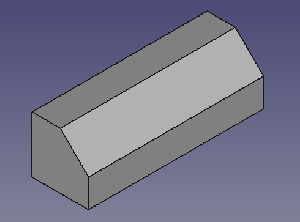
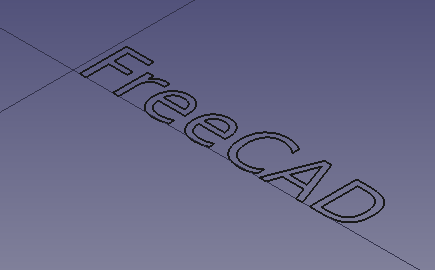
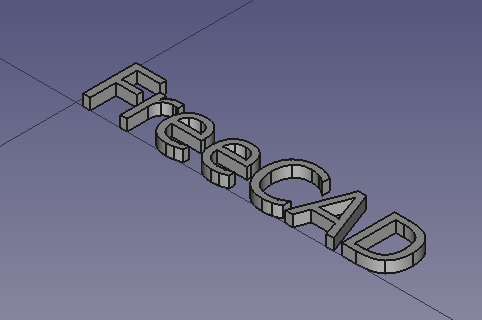
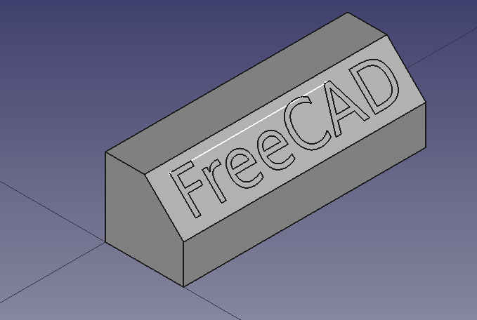

  {{TutorialInfo
|Topic=Product design
|Level=Beginner
|Time=30 minutes
|Author=r-frank and vocx
|FCVersion=0.17 and above
|Files=[https://github.com/FreeCAD/Examples/blob/master/Draft_Shapestring_Tutorial_Examples/Draft_Shapestring_Tutorial_Text.FCStd?raw=true Draft_Shapestring_Text]
}}

## Introduction

This tutorial was originally written by Roland Frank (†2017, r-frank), and it was rewritten and re-illustrated by vocx.

This tutorial describes a method to create 3D text and use it with solid objects in the  [Part Workbench](Part_Workbench.md). We will discuss how to

-   insert outlined text with the ** [Draft ShapeString](Draft_ShapeString.md)** tool,
-   extrude it to be a 3D solid with ** [Part Extrude](Part_Extrude.md)**,
-   position it in 3D space using  [Draft Move](Draft_Move.md)** (it uses a sketch as auxiliary geometry), and
-   engrave the text by applying a boolean ** [Part Cut](Part_Cut.md)**.

To use ShapeStrings inside the  [PartDesign Workbench](PartDesign_Workbench.md), the process is essentially the same as with the Part Workbench, but the ShapeString is placed inside the [PartDesign Body](PartDesign_Body.md) to extrude it. Go to the end of this tutorial for more information.

   *Final model of the engraved text.*

The [Sketcher Workbench](Sketcher_Workbench.md) is used briefly to draw an auxiliary line. More information about the tools of this workbench can be found in

-   [Basic Sketcher tutorial](Basic_Sketcher_Tutorial.md)
-   [Sketcher reference](Sketcher_reference.md)

## Setup

1\. Open FreeCAD, create a new empty document with {{MenuCommand|File →  [New](Std_New.md)}}, and switch to the [Part Workbench](Part_Workbench.md).

:   1.1. Press the ** [View isometric](Std_ViewIsometric.md)** button, or press **0** in the numerical pad of your keyboard, to change the view to isometric to visualize the 3D solids better.
:   1.2. Press the ** [View fit all](Std_ViewFitAll.md)** button whenever you add objects in order to pan and zoom the [3D view](3D_view.md) so that all elements are seen in the view.
:   1.3. Hold **Ctrl** while you click to select multiple items. If you selected something wrong or want to de-select everything, just click on empty space in the [3D view](3D_view.md).

## Create the basic shape {#create_the_basic_shape}

2\. Insert a primitive cube by clicking on ** [Box](Part_Box.md)**.

:   2.1. Select `Cube` in the [tree view](tree_view.md).
:   2.2. Change the dimensions in the {{MenuCommand|Data}} tab of the [property editor](property_editor.md).
:   2.3. Change {{MenuCommand|Width}} to `31 mm`.

3\. Create a chamfer.

:   3.1. Select the upper edge (`Edge6`) on the front face of the `Cube` in the [3D view](3D_view.md).
:   3.2. Press ** [Chamfer](Part_Chamfer.md)**.
:   3.3. In the {{MenuCommand|Chamfer edges}} [task panel](task_panel.md) go to {{MenuCommand|Selection}}, choose {{MenuCommand|Select edges}}. As {{MenuCommand|Fillet type}} choose `Constant length`, then set {{MenuCommand|Length}} to `5 mm`.
:   3.4. Press **OK**. This will create a `Chamfer` object.
:   3.5. In the [tree view](tree_view.md), select `Chamfer`, in the {{MenuCommand|View}} tab change the value of {{MenuCommand|Line Width}} to `2.0`.

   *Base object created from a cube and a chamfer operation.*

## Insert the ShapeString {#insert_the_shapestring}

4\. Switch to the [Draft Workbench](Draft_Workbench.md).

:   4.1. Make sure nothing is selected in the [tree view](tree_view.md).
:   4.2. Establish the working plane to XY (Top) by clicking on **  [Top (XY)](Std_ViewTop.md)**.

5\. Insert the text \"FreeCAD\".

:   5.1. Press on ** [ShapeString](Draft_ShapeString.md)**.
:   5.2. Change {{MenuCommand|X}} to `0 mm`.
:   5.3. Change {{MenuCommand|Y}} to `0 mm`.
:   5.4. Change {{MenuCommand|Z}} to `0 mm`.
:   5.5. Or press **Reset point**.
:   5.6. Change {{MenuCommand|String}} to `FreeCAD`; change {{MenuCommand|Height}} to `5 mm`; change {{MenuCommand|Tracking}} to `0 mm`.
:   5.7. Make sure {{MenuCommand|Font file}} points to a valid font, for example, `/usr/share/fonts/truetype/dejavu/DejaVuSans.ttf`. Press the ellipsis **...** to open the operating system\'s dialog to find a font.

    :   
        **Note:**
        
        for more details about working with fonts please refer to the [Draft ShapeString Notes](Draft_ShapeString#Notes.md) section.
:   5.8. Press **OK**. This will create a `ShapeString` object.
:   5.9. Recompute the document by pressing ** [Refresh](Std_Refresh.md)**.
:   5.10. In the [tree view](tree_view.md), select `ShapeString`, in the {{MenuCommand|View}} tab change the value of {{MenuCommand|Line Width}} to `2.0`.
:   5.11. In the [tree view](tree_view.md), select `Chamfer`, in the {{MenuCommand|View}} tab change the value of {{MenuCommand|Visibility}} to `false`, or press **Space** in the keyboard. This will hide the object, so you can see the `ShapeString` better.
:   5.12. To see the ShapeString from above change the view by pressing ** [Top (XY)](Std_ViewTop.md)**, or **2** in the keyboard.
:   5.13. To restore the view to isometric, press ** [View isometric](Std_ViewIsometric.md)**, or **0** in the keyboard.

   *Text created as a ShapeString, that is, as a collection of edges in a plane.*

## Create the solid 3D text {#create_the_solid_3d_text}

6\. Switch back to the [Part Workbench](Part_Workbench.md).

:   6.1. In the  [Extrude](Part_Extrude.md)**.
:   6.2. In the {{MenuCommand|Extrude}} [task panel](task_panel.md) go to {{MenuCommand|Direction}}, choose {{MenuCommand|Along normal}}; in {{MenuCommand|Length}}, set {{MenuCommand|Along}} to `1 mm`; also tick the {{MenuCommand|Create solid}} option.
:   6.3. Press **OK**. This will create an `Extrude` object.
:   6.4. In the [tree view](tree_view.md), select `Extrude`, in the {{MenuCommand|View}} tab change the value of {{MenuCommand|Line Width}} to `2.0`.

   *Text created as a ShapeString, and turned into a solid by extrusion.*

## Insert auxiliary sketch for positioning {#insert_auxiliary_sketch_for_positioning}

Now we will draw a simple sketch that will be used as auxiliary geometry to position the ShapeString extrusion.

7\. In the [tree view](tree_view.md), select `Extrude`, and press **Space** in the keyboard to make it invisible.

8\. Switch to the [Sketcher Workbench](Sketcher_Workbench.md).

9\. In the [tree view](tree_view.md), select `Chamfer`, and press **Space** in the keyboard to make it visible.

:   9.1. Choose the sloped face created by the chamfer operation (`Face3`).
:   9.2. Click on ** [NewSketch](Sketcher_NewSketch.md)**. In the {{MenuCommand|Sketch attachment}} dialog, select `FlatFace`, and press **OK**.
:   9.3. The view should adjust automatically so that the camera is parallel to the selected face.
:   9.4. Draw a horizontal line in a general position on top of the face. The length is not important; we are just interested in its position.
:   9.5. Constrain the left endpoint to be `2.5 mm` away from the local X axis and from the local Y axis, using **  [ConstrainDistanceY](Sketcher_ConstrainDistanceY.md)**.
:   9.6. Since the sketch is just an auxiliary object, we don\'t need to have it fully constrained. You can do this if you wish by assigning a fixed distance, say, `20 mm`, again with ** [ConstrainDistanceX](Sketcher_ConstrainDistanceX.md)**.
:   9.7. Close the sketch.

   
*Line being created with the sketcher, with constraints.*

   
*Sketch line created on top of the solid face, to be used as reference guide for positioning the extruded text.*

## Positioning the solid text in 3D space {#positioning_the_solid_text_in_3d_space}

10\. In the [tree view](tree_view.md), select `Extrude`, and press **Space** in the keyboard to make it visible.

11\. In the [tree view](tree_view.md), select `Extrude`, in the {{MenuCommand|Data}} tab of the [property editor](property_editor.md), click on the {{MenuCommand|Placement}} value so the ellipsis button **...** appears on the right.

:   11.1. Tick the option {{MenuCommand|Apply incremental changes}}.
:   11.2. Change the {{MenuCommand|Rotation}} to `Rotation axis with angle`; {{MenuCommand|Axis}} to `Z`, and {{MenuCommand|Angle}} to `90 deg`, then click on **Apply**. This will apply a rotation around the Z-axis, and will reset the {{MenuCommand|Angle}} field to zero.
:   11.3. Change the {{MenuCommand|Rotation}} to `Rotation axis with angle`; {{MenuCommand|Axis}} to `Y`, and {{MenuCommand|Angle}} to `45 deg`, then click on **Apply**. This will apply a rotation around the Y-axis, and will reset the {{MenuCommand|Angle}} field to zero.
:   11.4. Click on **OK** to close the dialog.

12\. Switch again to the [Draft Workbench](Draft_Workbench.md).

:   12.1. Switch to \"Wireframe\" draw style with {{MenuCommand|View →  Wireframe}}, or press the ** [Wireframe](Std_DrawStyle.md)** button in the view toolbar. This will allow you to see the objects behind other objects.
:   12.2. Make sure the     [Snap endpoint](Draft_Snap_Endpoint.md)** buttons in the Snap toolbar.

13\. In the [tree view](tree_view.md), select `Extrude`.

:   13.1. Click on ** [Move](Draft_Move.md)**.
:   13.2. In the [3D view](3D_view.md) click on the upper left corner point of the `Extrude` object (1), and then click on the leftmost point in the line drawn with the sketcher (2).
:   13.3. If ** [Snap endpoint](Draft_Snap_Endpoint.md)** is active, as soon as you move the pointer close to a vertex, you should see that it attaches to it exactly.
:   
    **Note:**if you have problems snapping to vertices, make sure only the ** [Snap endpoint](Draft_Snap_Endpoint.md)** method is enabled. Having multiple snapping methods active at the same time may make it difficult to select the right feature.
:   13.4. The extruded text should now be inside the body of the `Fillet` object.

   *The extruded ShapeString should be moved to the position of the sketched line that lies on the face of the base body.*

   *Extruded ShapeString positioned in the `Fillet*.`

## Creating engraved text {#creating_engraved_text}

14\. Switch back to the [Part Workbench](Part_Workbench.md).

:   14.1. Switch to \"As is\" draw style with {{MenuCommand|View →  As is}}, or press the ** [As is](Std_DrawStyle.md)** button in the view toolbar. This will show all objects with the normal shading and color.
:   14.2. In the [tree view](tree_view.md), select `Sketch`, and press **Space** in the keyboard to make it invisible.

15\. In the [tree view](tree_view.md) select `Chamfer` first, and then `Extrude`.

:   15.1. Then press ** [Cut](Part_Cut.md)**. This will create a `Cut` object. This is the final object.
:   
    **Note:**the order in which you select the objects is important for the cut operation. The base object is selected first, and the subtracting object comes at the end.
:   15.2. In the [tree view](tree_view.md), select `Cut`, in the {{MenuCommand|View}} tab change the value of {{MenuCommand|Line Width}} to `2.0`.

   *Final model of a filleted cube, with carved text created from a ShapeString, Extrude, and boolean Cut operations.*

## Engraving 3D text with the PartDesign Workbench {#engraving_3d_text_with_the_partdesign_workbench}

A similar process as described above can be done with the [PartDesign Workbench](PartDesign_Workbench.md).

1.  Create the ** [Draft ShapeString](Draft_ShapeString.md)** first.
2.  Create a **  [PartDesign Pad](PartDesign_Pad.md)**.
3.  Move the `ShapeString` object into the active body.
4.  Attach the `ShapeString` object to one of the faces of the solid, or to a **  [Part Attachment](Part_Attachment.md)**.
5.  Now create a **  [PartDesign Pocket](PartDesign_Pocket.md)** from the `ShapeString`, in order to produce an additive or a subtractive [feature](PartDesign_Feature.md) of the base body, respectively.

See the forum thread, [How to use ShapeStrings in PartDesign](https://forum.freecadweb.org/viewtopic.php?f=3&t=36623).

## Notes

-   To create curved text you can use the macro  [Circular Text](Macro_Circular_Text.md).
-   To import text from an SVG file look at the [Import text and geometry from Inkscape](Import_text_and_geometry_from_Inkscape.md) tutorial.

 {{Tutorials navi}}  {{PartDesign Tools navi}} {{Sketcher Tools navi}} 
