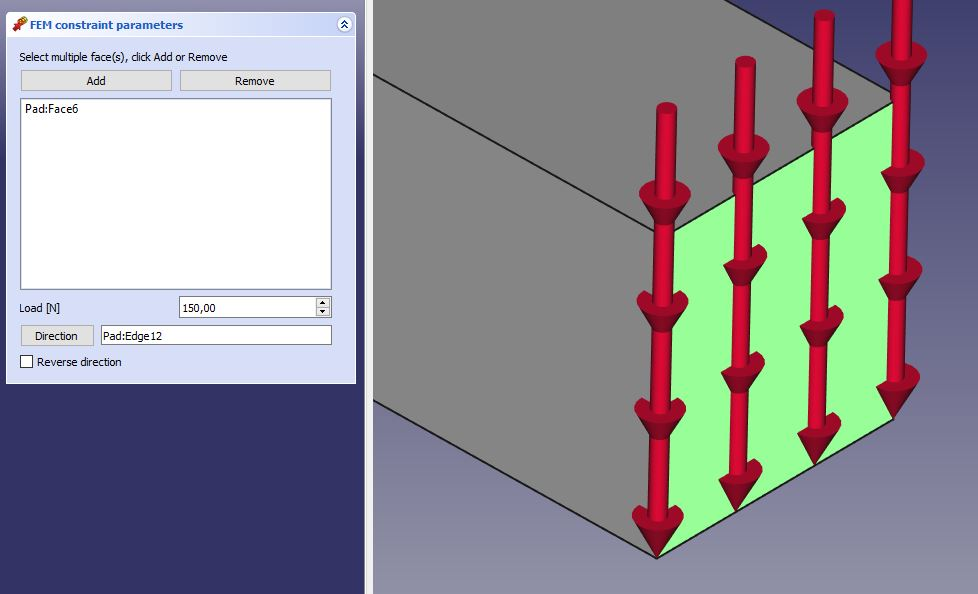

---
- GuiCommand   *
   Name   *FEM ConstraintForce
   MenuLocation   *Model → Mechanical Constraints → Constraint force
   Workbenches   *[FEM](FEM_Workbench.md)
   SeeAlso   *[FEM ConstraintPressure](FEM_ConstraintPressure.md)
---

# FEM ConstraintForce

## Description

This command applies a force of given value \[N\] to selected target geometry.

## Usage

1.  There are several ways to invoke the command to apply a force to a face, line or point   *
    -   Click on ** [FEM Constraint force](FEM_ConstraintForce.md)** button
    -   Select the **Model → Mechanical Constraints →  Constraint force** option from the menu.

2.  If you have Mesh displayed, you need to hide it (select the mesh object and press **spacebar** or right-click and select **Hide item**) and show the original model.

3.  Click on a *face*, *line* or *point* to which a force should be applied. It will appear in the list of geometrical objects.

4.  Fill in **Load [N]** with a force value in \[N\].

5.  
    **Direction**   * In a typical case, you\'ll leave this field empty to apply a force in the normal direction. You can revert the direction of the force by clicking **Reverse direction**. In other cases, you need to pick a face/plane or edge, which serves as reference for force direction.

6.  Click **OK** to finish the dialog and create **[ ConstraintForce** object.

  

## Notes

Defined force is applied uniformly to selected objects. For example, if you define one force constraint with 200 N applied to two faces having the same area, each face will be uniformly loaded with 100 N.

 {{FEM Tools navi}}

---
 [documentation index](../README.md) > [FEM](Category_FEM.md) > FEM ConstraintForce
