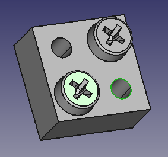

---
- GuiCommand:
   Name:Fasteners Move
   MenuLocation:Fasteners → Move
   Workbenches:[Fasteners](Fasteners_Workbench.md)
---

# Fasteners Move

## Description

The  [Fasteners Move](Fasteners_Move.md) attaches an existing fastener to a different feature. This tool is part of the [external workbench](External_workbenches.md) called [Fasteners](Fasteners_Workbench.md).

For example to attach a screw to a part, the part must have features with circular edges, such as holes. To attach screws to holes, select the desired circular edge or several edges (You can also select a face if you want to select all holes in that face).

## Usage

1.  Switch to the  _ is necessary, if not previously installed)

2.  Choose the fastener by clicking on it

3.  
    **Ctrl**\+ select the new feature.

4.  Invoke the Fasteners Move tool several ways:
    -   Press the  button
    -   Use the **Fasteners → Move** entry in the Fasteners menu

Result: fastener will move to the new location.

## Notes

-   An attached screw will move with the part it is attached to. If you wish to detach the screw from the parent part, simply select only the screw, then press the  [Fasteners Move](Fasteners_Move.md) button. The screw is now detached and can be moved individually.

## Limitations

## Properties

{{Properties_Title|Base}}

-    **View**: Invert, boolean, default: false

## Scripting

 {{Fasteners Tools navi}} 

_

---
[documentation index](../README.md) > [External Command Reference](Category_External Command Reference.md) > Fasteners Move
