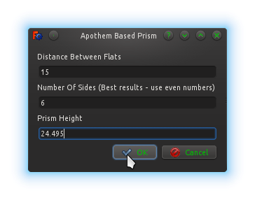

# Macro Apothem Based Prism GUI
  {{Macro
|Name=Apothem Based Prism
|Icon=Part Prism Apothem.svg
|Description=This macro will present the user with a dialog to provide the distance between centers, the number of sides, and height and will create a prism based on the apothem, or inradius of a polygon. This can be extremely handy when one only knows the distance between flats. An example of this would be hexagonal stock of plastics or metal provided by vendors. Most vendors define such stock by the distance between flats. If one is using such stock in their projects, this Macro can be a real time saver. 
|Author=Quick61
|Version=1.0
|Date=2014-12-31
|Download=[https://www.freecadweb.org/wiki/images/4/4e/Part_Prism_Apothem.svg ToolBar Icon]
|FCVersion=All
}}

## Description

This macro will present the user with a dialog to provide the distance between centers, the number of sides, and height and will create a prism based on the apothem, or inradius of a polygon. This can be extremely handy when one only knows the distance between flats. An example of this would be hexagonal stock of plastics or metal provided by vendors. Most vendors define such stock by the distance between flats. If one is using such stock in their projects, this Macro can be a real time saver.

## How To Use 

Copy the Macro into your FreeCAD Macro directory. Then either run the macro from the Execute Macro dialog or create a shortcut to use from your custom toolbar.

When run, the Macro wil present the user with a dialog like seen below. First enter the desired distance between flats. This can be any number and can include a decimal value, it will not take fractional input. Next enter the number of sides. This number is a whole number and should be an even number as well for proper results. Lastly enter the height you wish the prism to be. Again, this can be any number and can include a decimal value. Click OK and the prism will be created in your document.   

## The Macro 

ToolBar Icon 

**Macro\_Apothem\_Based\_Prism\_GUI.FCMacro**

{{MacroCode|code=
# # # # # # # # # # #
#
# Apothem Based Prism
#
# This script will take the input of the distance between flats, (apothem, aka inradius), 
# and the number of sidesfor a regular polygon along with a height and produce a 
# correctly sized prism derived from the circumradius.
#
# # # # # # # # # # #
 
import FreeCAD, FreeCADGui, Part, PartGui, math
from FreeCAD import Base
from PySide import QtGui, QtCore
from math import cos, radians
App = FreeCAD
Gui = FreeCADGui
 
class p():
 
 
    def priSm(self):
 
        try:
            dbf = float(self.d1.text())
            nos = int(self.d2.text())
            hth = float(self.d3.text())
            aR = dbf / 2
            op1 = 180/float(nos)
            coS = cos(math.radians(op1))
            cR = aR / coS
            prism=App.ActiveDocument.addObject("Part::Prism","Prism")
            prism.Polygon=nos
            prism.Circumradius=cR
            prism.Height=hth
            prism.Placement=Base.Placement(Base.Vector(0.00,0.00,0.00),Base.Rotation(0.00,0.00,0.00,1.00))
            prism.Label='Prism'
            App.ActiveDocument.recompute()
            Gui.SendMsgToActiveView("ViewFit")
        except:
            FreeCAD.Console.PrintError("Unable to complete task")
 
            self.close()
 
    def close(self):
        self.dialog.hide()
 
 
#
# Make dialog box and get input for distance between flats, number of sides, and height
#
 
    def __init__(self):
        self.dialog = None
 
        self.dialog = QtGui.QDialog()
        self.dialog.resize(280,110)
 
        self.dialog.setWindowTitle("Apothem Based Prism")
        la = QtGui.QVBoxLayout(self.dialog)
 
        iN1 = QtGui.QLabel("Distance Between Flats")
        la.addWidget(iN1)
        self.d1 = QtGui.QLineEdit()
        la.addWidget(self.d1)
 
        iN2 = QtGui.QLabel("Number Of Sides (Best results - use even numbers)")
        la.addWidget(iN2)
        self.d2 = QtGui.QLineEdit()
        la.addWidget(self.d2)
 
        iN3 = QtGui.QLabel("Prism Height")
        la.addWidget(iN3)
        self.d3 = QtGui.QLineEdit()
        la.addWidget(self.d3)
 
        okbox = QtGui.QDialogButtonBox(self.dialog)
        okbox.setOrientation(QtCore.Qt.Horizontal)
        okbox.setStandardButtons(QtGui.QDialogButtonBox.Cancel{{!}}

QtGui.QDialogButtonBox.Ok)

       la.addWidget(okbox)
       QtCore.QObject.connect(okbox, QtCore.SIGNAL("accepted()"), self.priSm)
       QtCore.QObject.connect(okbox, QtCore.SIGNAL("rejected()"), self.close)
       QtCore.QMetaObject.connectSlotsByName(self.dialog)
       self.dialog.show()
       self.dialog.exec_()

p() }} 

## Additions

SVG icon for use in custom toolbar shortcut.

  

## Acknowledgements

A thanks to FreeCAD main developer [shoogen](http://forum.freecadweb.org/memberlist.php?mode=viewprofile&u=765) and FreeCAD programmer [wandererfan](http://forum.freecadweb.org/memberlist.php?mode=viewprofile&u=1375) for their invaluable help and advice in constructing this Macro.  
