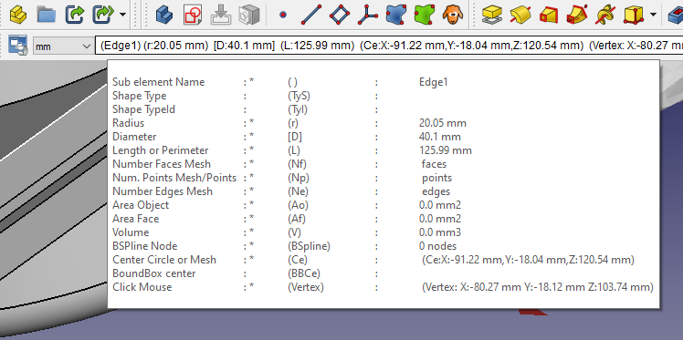

# Macro FCInfo ToolBar
{{Macro
|Name=Macro FCCInfo ToolBar
|Icon=FCInfoToolBar.png
|Description=Gives information about the selected shape and can display a conversion of radius, diameter, length, area, volume ... in different units (metric and imperial) in a toolBar. The information to be displayed in real time is parametrizable in the Parameter of FreeCAD.
|Author=Mario52
|Version=00.03
|Date=2022/03/29
|FCVersion=0.18 and more
|Download= [https://wiki.freecadweb.org/images/9/9d/FCInfoToolBar.png The toolBar icon]
|SeeAlso = [Arch Survey](Arch_Survey.md) </br>[Macro FCInfo](Macro_FCInfo.md) </br>[Macro FCInfoGlass](Macro_FCInfoGlass.md) 
}}

## Description

Gives information about the selected shape and can display a conversion of radius, diameter, length, area, volume \... in different units (metric and imperial) in a toolBar. The information to be displayed is parametrizable in the Parameter of FreeCAD.

 

 
*FCInfo_ToolBar*

## Usage

After run the macro, go to Menu → Tools → Edit parameters \... :BaseApp/Preferences/Macros/FCMmacros/FCInfo\_ToolBar

and check the info to display.

The complete info hare displayed in the ToolTip window, the checked option is visible if the \"\*\" is displayed.

Use the button reset after change one option in the parameter window.

The Unit size can be selected : km, hm, dam, m, dm, cm, mm, µm, nm, pm, fm, inch, link, foot, yard, perch, chain, furlong, mile, league, nautique.

 
*FCInfo_ToolBar the info toolTip*

## Options

The options hare located in the Parameter of FreeCAD

*Menu → Tools → Edit parameters \... :BaseApp/Preferences/Macros/FCMmacros/FCInfo\_ToolBar*

-   ***switch\_User\_ToolbarIconSize***
    -   if = `False`: the icon toolBar respect the FreeCAD value for the icon size
    -   if = `True`: the icon take the values of the variable **seT\_User\_sizeIconX** and **seT\_User\_sizeIconY**

-   ***seT\_User\_sizeIconX***
    -   set the value X of the Icon

-   ***seT\_User\_sizeIconY***
    -   set the value Y of the Icon

-   ***seT\_User\_setFixed\_Tool\_Bar\_Width***
    -   set the Width of the ToolBar

-   ***seT\_User\_setFixed\_Tool\_Bar\_Height***
    -   set the Height of the ToolBar

-   ***switch\_User\_Work\_With\_Preselection***
    -   Work With the Preselectiond, update the data in real time

-   ***seT\_User\_StyleSheetColorToolBar***
    -   set the color of the toolBar in HTML format example : **\#F8E6E0**
    -   if the value is **0** the toolBar take the system color

-   ***seT\_User\_DecimalValue***
    -   give the number of decimal of the number (Default **2**)

-   ***seT\_User\_TextHeigthValue***
    -   give the text height of the toolBar

-   ***switch\_User\_Display\_objectName***
    -   display the object Name ()

-   ***switch\_User\_Display\_SubElementName***
    -   display the SubElementName ()

-   ***switch\_User\_Display\_ShapeType***
    -   display the Shape type (TyS:)

-   ***switch\_User\_Display\_TypeId***
    -   display the TypeId (TyI:)

-   ***switch\_User\_Display\_RadiusObject***
    -   display the radius and the diameter (r:) \[D:\]

-   ***switch\_User\_Display\_LengthObject***
    -   display the Length of the edge selected or the Perimeter of the face selected
        -   (L:) display the Length of the wire, edge, line selected
        -   (P:) display the Perimeter if the face is selected

-   ***switch\_User\_Display\_SommeAllEdgesObject***
    -   display the somme of the all edge of the object selected (Se:)

-   ***switch\_User\_Display\_NumberFacesMesh***
    -   display the number of Faces of the Mesh object (Nf:)

-   ***switch\_User\_Display\_NumberPointsMeshPoints***
    -   display the number of points of the Mesh object (Np:)

-   ***switch\_User\_Display\_NumberEdgesMesh***
    -   display the number of edges of the Mesh object (Ne:)

-   ***switch\_User\_Display\_AreaObject***
    -   display the area of the object (A:)

-   ***switch\_User\_Display\_AreaSubObject***
    -   display the area of the face selected (Af:)

-   ***switch\_User\_Display\_VolumeObject***
    -   display the volume of the object (V:)

-   ***switch\_User\_Display\_BsplineObject***
    -   display the number of node of the Bspline selected
        -   (BSpline) display the number of node of the BSpline
        -   (BSrA) BSPline radius approximative first radius of the BSpline
        -   (BSS) BSPline Points Shape number points of the Bspline (case Shape)
        -   (BSc) BSPline Points Sub Object number points of sub object selected (case Edge)

-   ***switch\_User\_Display\_CentreObject***
    -   display the center of the circle (if one circle is detected) or of the object selected
        -   (Ce:) display the center of circle (if detected), face, edge \... BBoxCenter of face, edge \... Sub selection\" + \"\\n\\n\")

-   ***switch\_User\_Display\_CentreBoundBoxObject***
    -   display the boundingBox center of the object (BBCe:)

-   ***switch\_User\_Display\_Position***
    -   display the coordinates point mouse pointed (Pos:)

-   ***switch\_User\_NotInfoOnBeginning***
    -   if it is `False` the info (this information) is displayed
    -   if it is `True` the info is not displayed

-   ***seT\_User\_UnitSymbolSquare***
    -   give the symbol square (Default **2**)

-   ***seT\_User\_UnitSymbolCube***
    -   give the symbol cube (Default **3**)

-   ***seT\_User\_UnitSymbolMicro***
    -   give the symbol micro (Default **u**)

## For automatic Run 

#### in command line 

In your shortcut *verify your right path*

\"Complete\_path\_of\_FreeCAD\" \"Complete\_path\_of\_the\_macro.FCMacro\"

example:

 
```python
"C:/FreeCAD_0.20.26858_Win-LPv12.5.4_vc17.x-x86-64/bin/FreeCAD.exe" "C:/Users/User/AppData/Roaming/FreeCAD/Macro/FCInfo_ToolBar.FCMacro"
```

#### in Mod directory 

1.  After install the macro with AddonManager
2.  Create the *FCInfo\_ToolBar* directory
3.  Copy the macro FCInfo\_ToolBar.FCMacro (copy not move) in the *FCInfo\_ToolBar* directory and rename it in FCInfo\_ToolBar.py
4.  Create a file named InitGui.py
5.  Paste the code in InitGui.py:

 
```python
#### FC Version: 0.1 #16/02/2022
#### Mario52
#### FCInfo_ToolBar : mini FCInfo ####
#
import importlib
from importlib import reload
import FreeCAD, FreeCADGui
App = FreeCAD
Gui = FreeCADGui


switch_User_NotRunAuto = FreeCAD.ParamGet("User parameter:BaseApp/Preferences/Macros/FCMmacros/FCInfo_ToolBar").GetBool("switch_User_NotRunAuto")
## switch_User_NotRunAuto 0 (False) = run the macro in begin
## switch_User_NotRunAuto 1 (True)  = not run automatic the macro


if switch_User_NotRunAuto == False:
    import FCInfo_ToolBar
    #reload(FCInfo_ToolBar)
    FreeCAD.ParamGet("User parameter:BaseApp/Preferences/Macros/FCMmacros/FCInfo_ToolBar").SetBool("switch_User_NotRunAuto", False)
    #FreeCAD.Console.PrintMessage("InitGui Ok FCInfo_ToolBar" + "\n")
```

1.  save the file
2.  run FreeCAD
3.  if the macro not run (normal) execute the macro FCInfo\_ToolBar.FCMacro as a normal macro
4.  the next start of FreeCAD the macro must start automatically

enjoy

## Link

The forum discussion [Feature request: coordinates display](https://forum.freecadweb.org/viewtopic.php?f=8&t=66294)

## Version

version: (00.02 +) 00.03 2022/03/22 : add somme all edges

version: 00.02 2022/03/14 : add calcul in real time (with preselection), dimension of toolBar, add info mesh and points

version: 00.01 2022/02/16 :


---
 [documentation index](../README.md) > Macro FCInfo ToolBar
