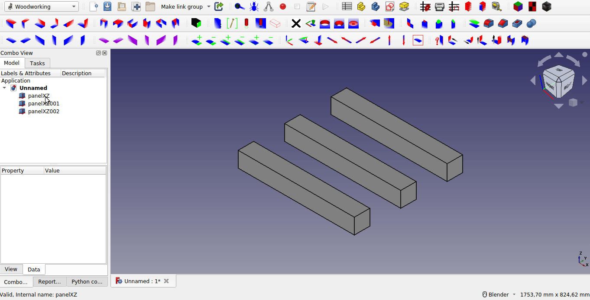
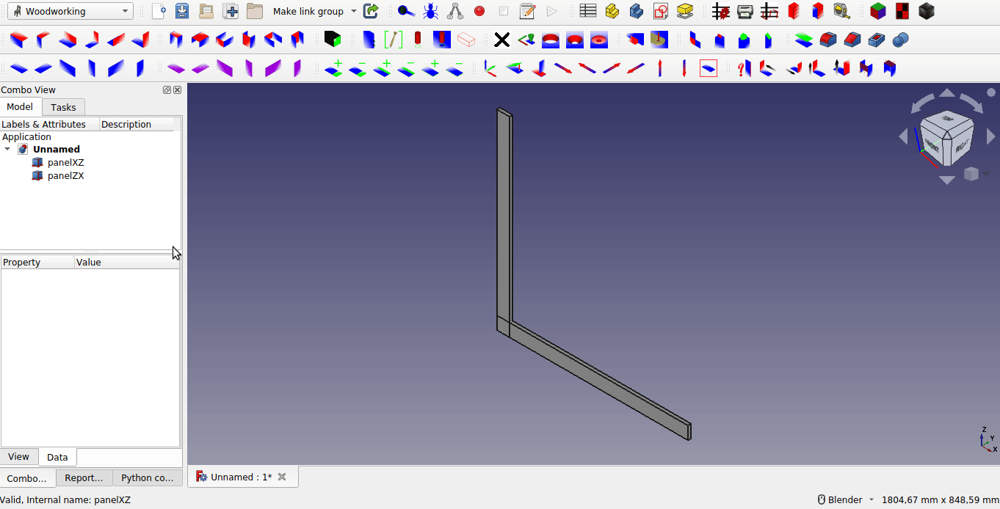
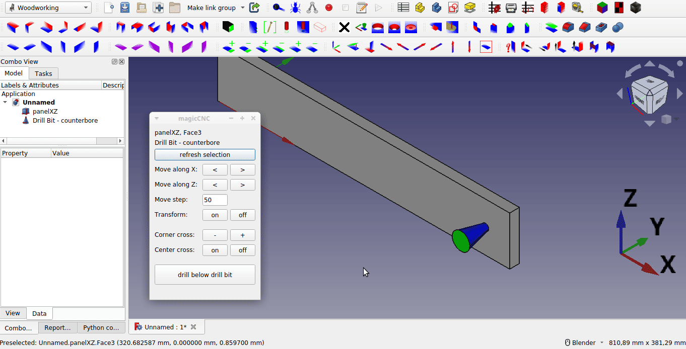

# Macro TNP Solution
{{Macro
|Name=Macro TNP solution
|Icon=TNP_solution.png
|Description=This is a solution for Topological Naming Problem.
|Author=Dprojects
|Date=2022-08-16
|Version=1.0
}}

## Description

This is one solution for Topological Naming Problem example described at the page   * [Topological Naming Problem](Topological_naming_problem.md)

If you build object at another object, and also with Sketch it is straightforward to solve, because you know two things   *

1.  Points from Sketch is always part of the face below
2.  The Sketch and the face below are in the same plane

To solve Topological Naming Problem problem you can   *

**Store the key before any operation   ***

You need only store the key before any operation. For this example described at [Topological Naming Problem](Topological_naming_problem.md) page, the object is at XY plane. So, I use Z axis value from Sketch BoundBox center   *

 {{MacroCode|code=
ad = FreeCAD.ActiveDocument
p2 = ad.Pad002
s2 = p2.Profile[0]
key = round(s2.Shape.BoundBox.Center[2], precision)
}}

**Next search all faces for the stored key   ***

After the resize, I search all faces for the stored key. Because if the Sketch and Face were at the same plane XY, the Z axis value was the same for both. In PartDesign Worbench, you cannot move 3rd Pad above the 2nd Pad, to have gap between, this is single object, the next Pad with the Sketch always will be touching the face. At the new face the Z axis value always will be the same with the stored key. So, return the face index. Nothing more to be done.

 {{MacroCode|code=

def getFaceIndex(iObj, iBB)   *index = 0   

    for f in iObj.Shape.Faces   *

        index += 1
        bb = round(f.BoundBox.Center[2], precision)
        if bb == iBB   *
            return index

    return -1

}}

**Final steps**

At the end, I assign the new face to the Sketch and recompute. To be honest, the most difficult part was to assign the face to Sketch.Support, for me the syntax is mind-blowing ;-)

## Code for the example 

File for testing has been uploaded at FreeCAD forum   * [TNP.FCStd](https   *//forum.freecadweb.org/download/file.php?id=198537).

 {{MacroCode|code=

__Title__="TNP_solution"
__Author__ = "Dprojects"
__Version__ = "1.0"
__Date__    = "2022-08-16"
__Comment__ = ""
__Web__ = "https   *//github.com/dprojects/Woodworking"
__Wiki__ = "https   *//wiki.freecadweb.org/TNP_solution"
__Icon__  = "TNP_solution.png"
__IconW__  = "TNP_solution.png"
__Help__ = "solution for Topological Naming Problem"
__Status__ = "stable"
__Requires__ = ""
__Communication__ = "http   *//www.freecadweb.org/wiki/index.php?title=User   *Dprojects"

# ####################################################################
#
# This is solution for Topological Naming Problem described at 
# https   *//wiki.freecadweb.org/Topological_naming_problem
#
# MIT License
# 
# Copyright (c) 2022 Darek L github.com/dprojects
# 
# Permission is hereby granted, free of charge, to any 
# person obtaining a copy of this software and associated 
# documentation files (the "Software"), to deal in the 
# Software without restriction, including without limitation 
# the rights to use, copy, modify, merge, publish, distribute, 
# sublicense, and/or sell copies of the Software, and to permit 
# persons to whom the Software is furnished to do so, subject 
# to the following conditions   *
# 
# The above copyright notice and this permission notice shall 
# be included in all copies or substantial portions of the Software.
# 
# THE SOFTWARE IS PROVIDED "AS IS", WITHOUT WARRANTY OF ANY KIND, 
# EXPRESS OR IMPLIED, INCLUDING BUT NOT LIMITED TO THE WARRANTIES 
# OF MERCHANTABILITY, FITNESS FOR A PARTICULAR PURPOSE AND 
# NONINFRINGEMENT. IN NO EVENT SHALL THE AUTHORS OR COPYRIGHT 
# HOLDERS BE LIABLE FOR ANY CLAIM, DAMAGES OR OTHER LIABILITY, 
# WHETHER IN AN ACTION OF CONTRACT, TORT OR OTHERWISE, ARISING FROM, 
# OUT OF OR IN CONNECTION WITH THE SOFTWARE OR THE USE OR OTHER 
# DEALINGS IN THE SOFTWARE.
# 
# ####################################################################

import FreeCAD

# this should be set according 
# FreeCAD user GUI precision settings
precision = 5

# global settings
ad = FreeCAD.ActiveDocument

# middle object to be resized
p1 = ad.Pad001
s1 = p1.Profile[0]

# top object bottom to store key
p2 = ad.Pad002
s2 = p2.Profile[0]

# ####################################################################
def getFaceIndex(iObj, iBB)   *index = 0   

    for f in iObj.Shape.Faces   *

        index += 1
        bb = round(f.BoundBox.Center[2], precision)
        
        FreeCAD.Console.PrintMessage("\n")
        FreeCAD.Console.PrintMessage(index)
        FreeCAD.Console.PrintMessage(" ")
        FreeCAD.Console.PrintMessage(bb)

        if bb == iBB   *
            FreeCAD.Console.PrintMessage(" <=== found")
            return index

    return -1

# ####################################################################
def makeTNP()   *

    # set key
    key = round(s2.Shape.BoundBox.Center[2], precision)

    # resize and cause TNP
    s1.setDatum(9, FreeCAD.Units.Quantity('350'))

    # recompute
    s1.recompute()
    p1.recompute()
    ad.recompute()

    FreeCAD.Console.PrintMessage("\n\n")
    FreeCAD.Console.PrintMessage("Stored key   *"+str(key))
    FreeCAD.Console.PrintMessage("\n")

    # search all faces for solution
    solutionIndex = getFaceIndex(p1, key)
    solution = "Face"+str(solutionIndex)FreeCAD.Console.PrintMessage("\n\n")
    FreeCAD.Console.PrintMessage("Solution   * "+solution)# set exact face to Sketch
    s2.Support = (p1, (solution,))
    ad.recompute()

# ####################################################################
def moveBack()   *

    s1.setDatum(9, FreeCAD.Units.Quantity('250'))
    s2.Support = (p1, ('Face13',))
    ad.recompute()

# ####################################################################
# main
# ####################################################################

# uncomment what you want
makeTNP()
#moveBack()

# ####################################################################

}}

## THE Solution 

This code above shows how to solve the example from Topological Naming Problem described at   * [Topological Naming Problem](Topological_naming_problem.md) but exactly the same rules you can use to solve other problems. The approach is simple   *

1.  Store the key before any operation
2.  Search for the key after operation

The specific implementation may be different. In this example the plane is XY, but you can do exactly the same for other axes. Also you can choose other key. At [Woodworking project](https   *//github.com/dprojects/Woodworking) I make many operations at non-existing objects, so I had to solve the Topological Naming Problem many times.

Here I change Cube objects into PartDesign Thickness objects   *

On the example below, I change Cubes into PartDesign Chamfers, so I had to store key for edges   *

This example below is little more complicated because as you see at the GUI screen, the references to the object and face changes automatically. But also to make a hole I call function defined in my library not directly in the tool. So, I had to use small trick with selection and deselection, to get new reference   *

There are many such problems when programming in FreeCAD, but they can all be solved in a similar way. I hope, it helps.

---
 [documentation index](../README.md) > Macro TNP Solution
