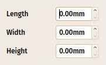
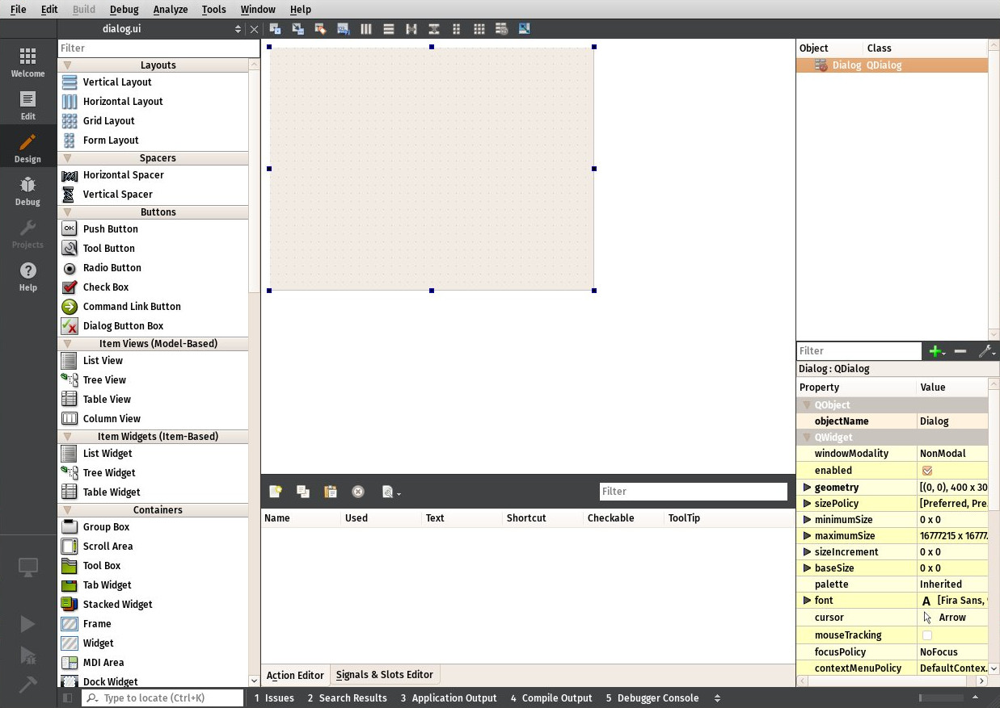
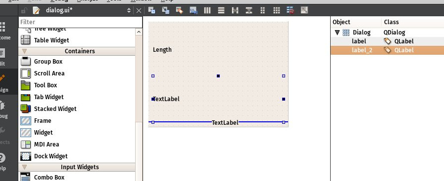
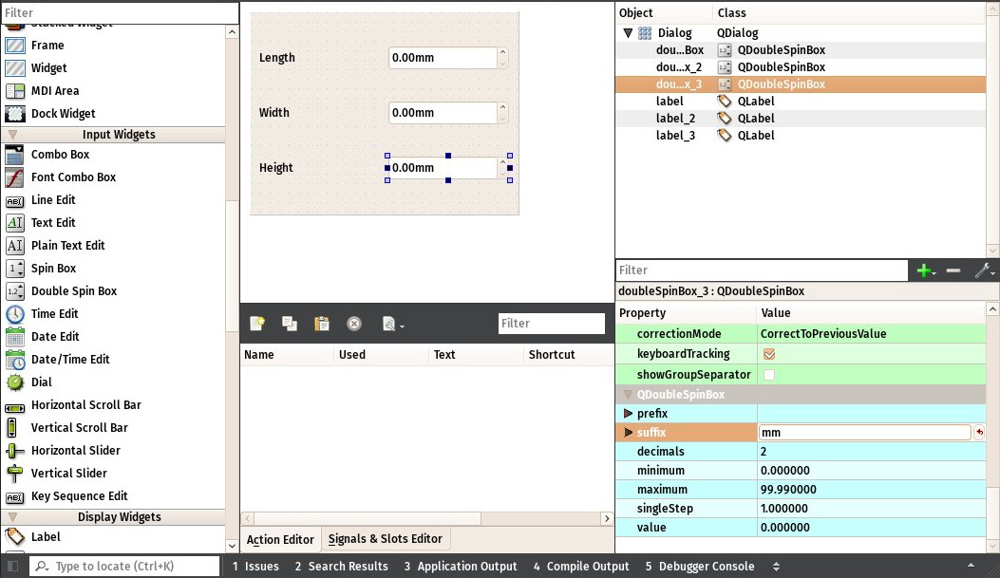
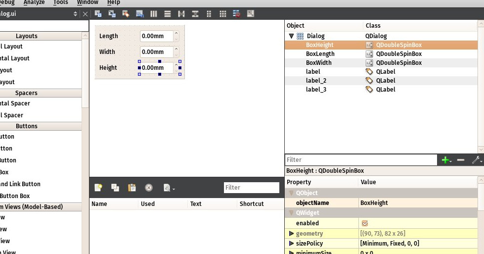

# Manual:Creating interface tools
{{Manual:TOC}}

In the last two chapters, we saw how to [create Part geometry](Manual:Creating_and_manipulating_geometry.md) and [create parametric objects](Manual:Creating_parametric_objects.md). One last piece is missing to gain full control over FreeCAD: Create tools that will interact with the user.

In many situations, it is not very user-friendly to construct an object with zero-values, like we did with the rectangle in the previous chapter, and then ask the user to fill in the Height and Width values in the Properties panel. This works for a very small number of objects, but will become very tedious if you have a lot of rectangles to make. A better way would be to be able to already give the Height and Width when creating the rectangle.

Python offers a basic tool to have the user enter text on screen:

text = raw\_input(\"Height of the rectangle?\")

print("The entered height is ",text)

However, this requires a running Python console, and when running our code from a macro, we are not always sure that the Python console will be turned on on the user\'s machine.

The [Graphical User Interface](https://en.wikipedia.org/wiki/Graphical_user_interface), or GUI, that is, all the part of FreeCAD that is displayed on your screen (the menu, toolbars, 3D view, etc), is all there for that purpose: interact with the user. FreeCAD\'s interface is built with [Qt](https://en.wikipedia.org/wiki/Qt_(software)), a very common open source GUI toolkit that offers a wide range of tools such as dialog boxes, buttons, labels, text input boxes or pull-down menus. These are all generically called \"widgets\".

The Qt tools are very easy to use from Python, thanks to a Python module called [Pyside](https://en.wikipedia.org/wiki/PySide) (there are several other Python modules to communicate with Qt from Python too). This module allows you to create and interact with widgets, read what the user did with them (what was filled in text boxes) or do things when, for example, a button was pressed.

Qt also provides another interesting tool called [Qt Designer](http://doc.qt.io/qt-4.8/designer-manual.html), which is today embedded inside a bigger application called [Qt Creator](https://en.wikipedia.org/wiki/Qt_Creator). It allows to design dialog boxes and interface panels graphically, instead of having to code them manually. In this chapter, we will use Qt Creator to design a panel widget that we will use in the **Task** panel of FreeCAD. So you will need to download and install Qt Creator from its [official page](https://www.qt.io/ide/) if you are on Windows or Mac (on Linux it will usually be available from your software manager application).

In the following exercise, we will first create a panel with Qt Creator that asks for length, width and height values, then we will create a Python class around it, that will read the values entered by the user from the panel, and create a box with the given dimensions. This Python class will then be used by FreeCAD to display and control the task panel:



Let\'s start by creating the widget. Start Qt Creator, then menu **File → New File or Project → Files and Classes → Qt → Qt Designer Form → Dialog without buttons**. Click **Next**, give it a filename to save, click **Next**, leave all project fields to their default value (\"\"), and **Create**. FreeCAD\'s Task system will automatically add OK/Cancel buttons, that\'s why we chose here a dialog without buttons.



-   Find the **Label** in the list in the left panel, and drag it onto the canvas of our widget. Double-click the recent placed Label, and change its text to **Length**.
-   Right-click the widget canvas, and choose **Lay out → Lay out in a Grid**. This will turn our widget into a grid with currently only one cell, occupied by ourfirst label. We can now add the next items at the left, right, top or bottom of our first label, and the grid will expand automatically.
-   Add two more labels below the first one, and change their text to Width and Height:



-   Now place 3 **Double Spin Box** widgets next to our Length, Width and Height labels. For each of them, in the lower right panel, which shows all the available settings for the selected widget, locate **Suffix** and set their suffix to **mm**. FreeCAD has a more advanced widget, that can handle different units, but that is not available in Qt Creator by default (but can be [compiled](Compile_on_Linux/Unix#Qt_designer_plugin.md)), so for now we will use a standard Double Spin Box, and we add the \"mm\" suffix to make sure the user knows in which units they work:



-   Now our widget is done, we just need to make sure of one last thing. Since FreeCAD will need to access that widget and read the Length, Width and Height values, we need to give proper names to those widgets, so we can easily retrive them from within FreeCAD. Click each of the Double Spin Boxes, and in the upper right window, double-click their Object Name, and change them to something easy to remember, for example: BoxLength, BoxWidth and BoxHeight:



-   Save the file, you can now close Qt Creator, the rest will be done in Python.
-   Open FreeCAD and create a new macro from menu **Macro → Macros → Create**
-   Paste the following code. Make sure you change the file path to match where you saved the .ui file created in QtCreator:

 
```python
import FreeCAD,FreeCADGui,Part
 
# CHANGE THE LINE BELOW
path_to_ui = "C:\Users\yorik\Documents\dialog.ui"
 
class BoxTaskPanel:
   def __init__(self):
       # this will create a Qt widget from our ui file
       self.form = FreeCADGui.PySideUic.loadUi(path_to_ui)
 
   def accept(self):
       length = self.form.BoxLength.value()
       width = self.form.BoxWidth.value()
       height = self.form.BoxHeight.value()
       if (length == 0) or (width == 0) or (height == 0):
           print("Error! None of the values can be 0!")
           # we bail out without doing anything
           return
       box = Part.makeBox(length,width,height)
       Part.show(box)
       FreeCADGui.Control.closeDialog()
        
panel = BoxTaskPanel()
FreeCADGui.Control.showDialog(panel)
```

In the code above, we used a convenience function (PySideUic.loadUi) from the FreeCADGui module. That function loads a .ui file, creates a Qt Widget from it, and maps names, so we can easily access the subwidget by their names (ex: self.form.BoxLength).

The \"accept\" function is also a convenience offered by Qt. When there is an \"OK\" button in a dialog (which is the case by default when using the FreeCAD Tasks panel), any function named \"accept\" will automatically be executed when the \"OK\" button is pressed. Similarly, you can also add a \"reject\" function which gets executed when the \"Cancel\" button is pressed. In our case, we omitted that function, so pressing \"Cancel\" will do the default behaviour (do nothing and close the dialog).

If we implement any of the accept or reject functions, their default behaviour (do nothing and close) will not occur anymore. So we need to close the Task panel ourselves. This is done with:

 
```python
FreeCADGui.Control.closeDialog() 
```

Once we have our BoxTaskPanel that has 1- a widget called \"self.form\" and 2- if needed, accept and reject functions, we can open the task panel with it, which is done with these two last lines:

 
```python
panel = BoxTaskPanel()
 FreeCADGui.Control.showDialog(panel)
```

Note that the widget created by PySideUic.loadUi is not specific to FreeCAD, it is a standard Qt widget which can be used with other Qt tools. For example, we could have shown a separate dialog box with it. Try this in the Python Console of FreeCAD (using the correct path to your .ui file of course):

 
```python
from PySide import QtGui
 w = FreeCADGui.PySideUic.loadUi("C:\Users\yorik\Documents\dialog.ui")
 w.show()
```

Of course we didn\'t add any \"OK\" or \"Cancel\" button to our dialog, since it was made to be used from the FreeCAD Task panel, which already provides such buttons. So there is no way to close the dialog (other than pressing its Window Close button). But the function show() creates a non-modal dialog, which means it doesn\'t block the rest of the interface. So, while our dialog is still open, we can read the values of the fields:

 
```python
w.BoxHeight.value() 
```

This is very useful for testing.

Finally, don\'t forget there is much more documentation about using Qt widgets on the FreeCAD Wiki, in the [Python Scripting](Power_users_hub.md) section, which contains a [dialog creation tutorial](Dialog_creation.md), a special 3-part [PySide tutorial](PySide.md) that covers the subject extensively.

## Relevant Links 

-   [Qt Creator Documentation](https://en.wikipedia.org/wiki/Qt_Creator)
-   [Installing Qt Creator](https://www.qt.io/ide/)
-   [FreeCAD Python scripting documentation](Power_users_hub.md)
-   [FreeCAD Dialog creation tutorial](Dialog_creation.md)
-   [FreeCAD PySide tutorials](PySide.md)
-   [PySide documentation](http://srinikom.github.io/pyside-docs/index.html)


 {{Powerdocnavi}} 

[Category:Developer Documentation](Category:Developer_Documentation.md) [Category:Python Code](Category:Python_Code.md)

---
[documentation index](../README.md) > [Developer Documentation](Category:Developer Documentation.md) > Manual:Creating interface tools
