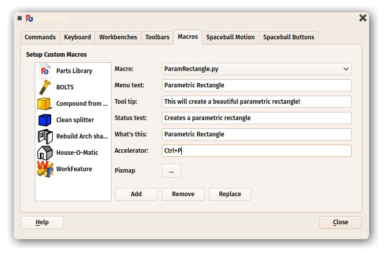
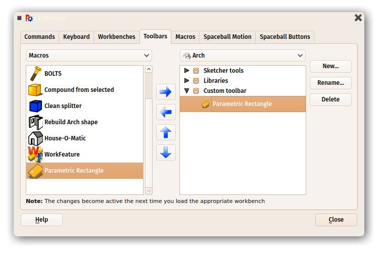

# Manual:Creating parametric objects
{{Manual:TOC}}

In the [previous chapter](Manual_Creating_and_manipulating_geometry.md), we saw how to create Part geometry, and how to display it on screen, by attaching it to a \"dumb\" (non-parametric) document object. This is tedious when we want to change the shape of that object. We would need to create a new shape, then attribute it again to our object.

However, we also saw in all the preceding chapters of this manual how parametric objects are powerful. We only need to change one property, and the shape is recalculated on-the-fly.

Internally, parametric objects don\'t do anything different than we just did: They recalculate the contents of their Shape property, over and over, each time another property has changed.

FreeCAD provides a very convenient system to build such parametric objects fully in Python. They consist of a simple Python class, which defines all the properties that the object needs, and what will happen when one of these properties changes. The structure of such parametric object is as simple as this:

 
```python
class myParametricObject:

    def __init__(self, obj):
        obj.Proxy = self
        obj.addProperty("App::PropertyFloat", "MyLength")
        ...

    def execute(self,obj):
        print ("Recalculating the shape...")
        print ("The value of MyLength is:")
        print (obj.MyLength)
        ...
```

All Python classes usually have an \_\_init\_\_ method. What is inside that method is executed when that class is instantiated (which means, in programming slang, that a Python Object is created from that class. Think of a class as a \"template\" to create live copies of it). In our \_\_init\_\_ function here, we do two important things: 1- store our class itself into the \"Proxy\" attribute of our FreeCAD document object, that is, the FreeCAD document object will carry this code, inside itself, and 2- create all the properties our object needs. There are many types of properties available, you can get the full list by typing this code:

 
```python
FreeCAD.ActiveDocument.addObject("Part::FeaturePython", "dummy").supportedProperties()
```

Then, the second important part is the execute method. Any code in this method will be executed when the object is marked to be recomputed, which will happen when a property has been changed. That is all there is to it. Inside execute, you need to do all that needs to be done, that is, calculating a new shape, and attributing to the object itself with something like obj.Shape = myNewShape. That is why the execute method takes an \"obj\" argument, which will be the FreeCAD document object itself, so we can manipulate it inside our python code.

One last thing is important to remember: When you create such parametric objects in a FreeCAD document, when you save the file, the python code above is not stored inside the file. This is for security reasons, if a FreeCAD file contained code, it would be possible for someone to distribute FreeCAD files containing malicious code that could harm other people\'s computers. So, if you distribute a file that contains objects made with the above code, such code must also be present on the computer that will open the file. The easiest way to achieve that is usually to save the code above in a macro, and distribute the macro together with your FreeCAD file, or share your macro on the [FreeCAD macros repository](Macros_recipes.md) where anybody can download it.

Below, we will do a small exercise, building a parametric object that is a simple parametric rectangular face. More complex examples are available on the [parametric object example](Scripted_objects.md) and in the [FreeCAD source code](https://github.com/FreeCAD/FreeCAD/blob/master/src/Mod/TemplatePyMod/FeaturePython.py) itself.

We will give our object two properties: Length and Width, which we will use to construct a rectangle. Then, since our object will already have a pre-built Placement property (all geometric object have one by default, no need to add it ourselves), we will displace our rectangle to the location/rotation set in the Placement, so the user will be able to move the rectangle anywhere by editing the Placement property.

 
```python
class ParametricRectangle:

    def __init__(self,obj):
        obj.Proxy = self
        obj.addProperty("App::PropertyFloat", "Length")
        obj.addProperty("App::PropertyFloat", "Width")

    def execute(self, obj):
        # We need to import the FreeCAD module here too, because we might be running out of the Console
        # (in a macro, for example) where the FreeCAD module has not been imported automatically:
        import FreeCAD
        import Part

        # First we need to make sure the values of Length and Width are not 0
        # otherwise Part.LineSegment will complain that both points are equal:
        if (obj.Length == 0) or (obj.Width == 0):
            # If yes, exit this method without doing anything:
            return

        # We create 4 points for the 4 corners:
        v1 = FreeCAD.Vector(0, 0, 0)
        v2 = FreeCAD.Vector(obj.Length, 0, 0)
        v3 = FreeCAD.Vector(obj.Length,obj.Width, 0)
        v4 = FreeCAD.Vector(0, obj.Width, 0)

        # We create 4 edges:
        e1 = Part.LineSegment(v1, v2).toShape()
        e2 = Part.LineSegment(v2, v3).toShape()
        e3 = Part.LineSegment(v3, v4).toShape()
        e4 = Part.LineSegment(v4, v1).toShape()

        # We create a wire:
        w = Part.Wire([e1, e2, e3, e4])

        # We create a face:
        f = Part.Face(w)

        # All shapes have a Placement too. We give our shape the value of the placement
        # set by the user. This will move/rotate the face automatically.
        f.Placement = obj.Placement

        # All done, we can attribute our shape to the object!
        obj.Shape = f
```

Instead of pasting the above code in the Python console, we\'d better save it somewhere, so we can reuse and modify it later. For example in a new macro (menu Tools -\> Macros -\> Create). Name it, for example, \"ParamRectangle\". However, FreeCAD macros are saved with a .FCMacro extension, which Python doesn\'t recognize when using import . So, before using the above code, we will need to rename the ParamRectangle.FCMacro file to ParamRectangle.py. This can be done simply from your file explorer, by navigating to the Macros folder indicated in menu Tools -\> Macros.

Once that is done, we can now do this in the Python Console:

 
```python
import ParamRectangle
```

By exploring the contents of ParamRectangle, we can verify that it contains our ParametricRectangle class.

To create a new parametric object using our ParametricRectangle class, we will use the following code. Observe that we use Part::FeaturePython instead of Part::Feature that we have been using in the previous chapters (The Python version allows to define our own parametric behaviour):

 
```python
myObj = FreeCAD.ActiveDocument.addObject("Part::FeaturePython", "Rectangle")
ParamRectangle.ParametricRectangle(myObj)
myObj.ViewObject.Proxy = 0 # This is mandatory unless we code the ViewProvider too.
FreeCAD.ActiveDocument.recompute()
```

Nothing will appear on screen just yet, because the Length and Width properties are 0, which will trigger our \"do-nothing\" condition inside execute. We just need to change the values of Length and Width, and our object will magically appear and be recalculated on-the-fly.

Of course it would be tedious to have to type these 4 lines of Python code each time we want to create a new parametric rectangle. A very simple way to solve this is placing the 4 lines above inside our ParamRectangle.py file, at the end, after the end of the ParametricRectange class (We can do this from the Macro editor).

Now, when we type import ParamRectangle , a new parametric rectangle will automatically be created. Even better, we can add a toolbar button that will do just that:

-   Open menu **Tools -\> Customize**
-   Under the \"Macros\" tab, select our ParamRectangle.py macro, fill in the details as you wish, and press \"Add\":



-   Under the Toolbars tab, create a new custom toolbar in the workbench of your choice (or globally), select your macro and add it to the toolbar:



-   That\'s it, we now have a new toolbar button which, when clicked, will create a parametric rectangle.

Remember, if you want to distribute files created with this new tool to other people, they must have the ParamRectangle.py macro installed on their computer too.

**Read more**

-   [The FreeCAD macros repository](Macros_recipes.md)
-   [Parametric object example](Scripted_objects.md)
-   [More examples in the FreeCAD code](https://github.com/FreeCAD/FreeCAD/blob/master/src/Mod/TemplatePyMod/FeaturePython.py)


---
 [documentation index](../README.md) > [Developer Documentation](Category_Developer Documentation.md) > [Python Code](Category_Python Code.md) > Manual:Creating parametric objects
