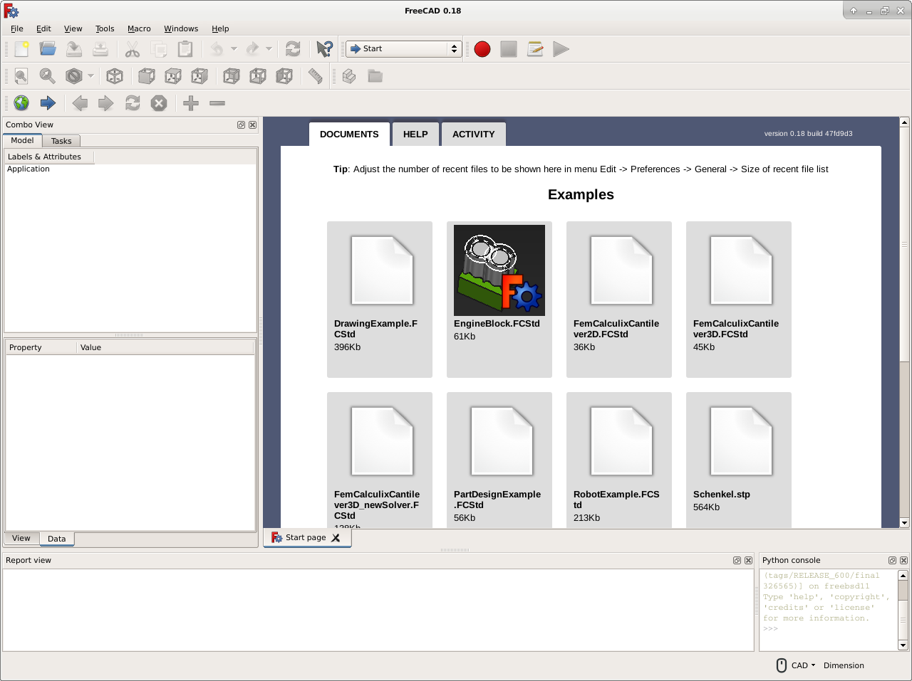
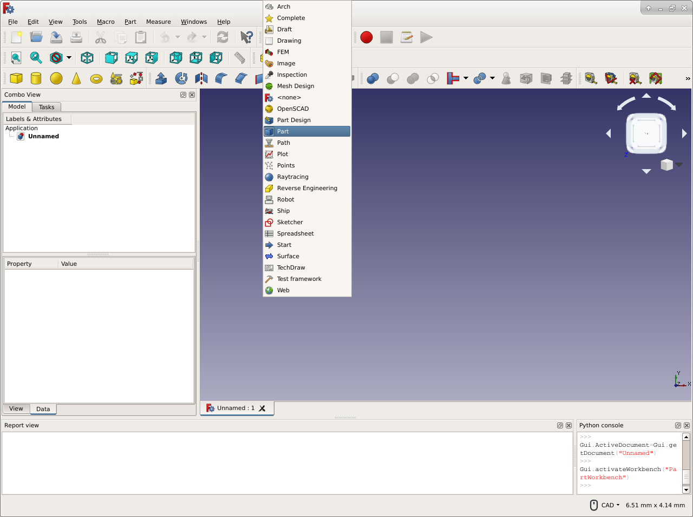
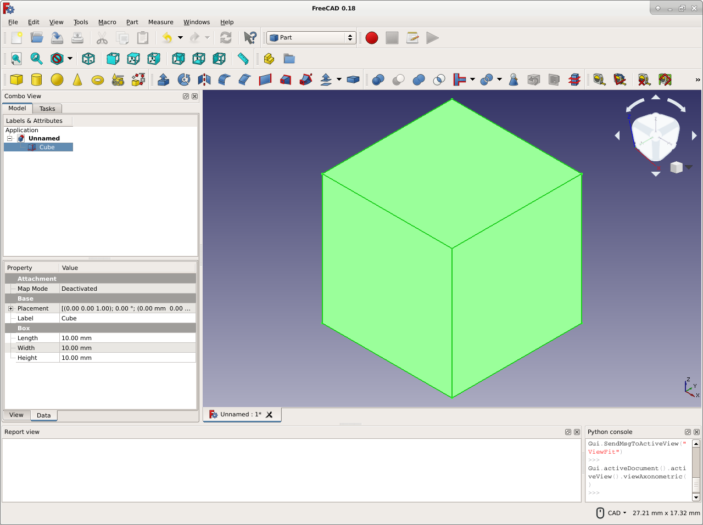
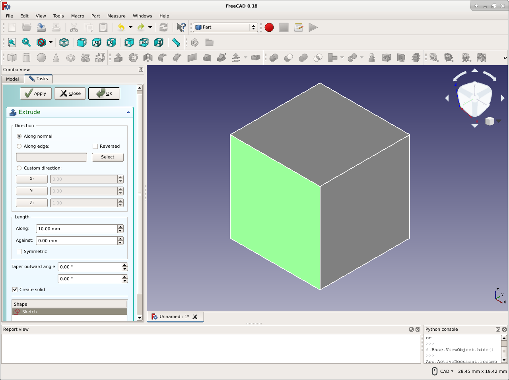
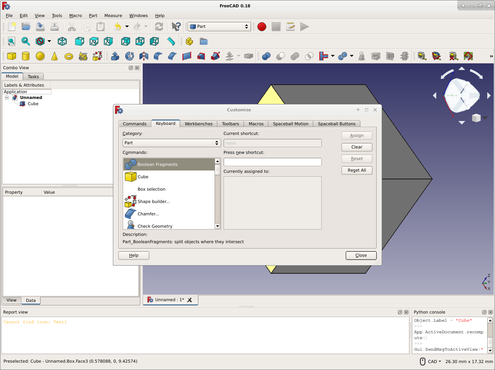

# Manual:The FreeCAD Interface
{{Manual   *TOC}}

FreeCAD uses the [Qt framework](https   *//en.wikipedia.org/wiki/Qt_(software)) to draw and manage its interface. This framework is used in a wide range of applications, so the FreeCAD interface is very classical and presents no particular difficulty to understand. Most buttons are standard and will be found where you expect them **File → Open, Edit → Paste, etc**. Here is the look of FreeCAD when you open it for the first time, just after installing, showing you the start center   *

The start center is a convenient \"welcome screen\", that shows useful information for newcomers, like the latest files you have been working on, what\'s new in the FreeCAD world, or quick info about the most common Workbenches. It will also notify you if a new stable version of FreeCAD is available.

After a while, when you are more familiar with FreeCAD, you may have made changes in the preferences so when FreeCAD starts you find yourself directly in one of the Workbenches with a new document open. Or, simply close the start page tab and create a new document   *

### Workbenches

Note that some of the icons have changed between the two screencaptures above. This is where the most important concept used in the FreeCAD interface comes into play   * Workbenches.

Workbenches are groups of tools (toolbar buttons, menus, and other interface controls) that are grouped together by specialty. Think of a workshop where you have different people working together   * A person who works with metal, another with wood. Each of them has, in their workshop, a separate table with specific tools for his/her job. However, they can all work on the same objects. The same happens in FreeCAD.

The most important control of the FreeCAD interface is the Workbench selector, which you use to switch from one Workbench to the other   *

The Workbenches often confuse new users, since it\'s not always easy to know in which Workbench to look for a specific tool. But they are quick to learn, and after a short while it will feel natural \-- realizing it is a convenient way to organize the multitude of tools FreeCAD has to offer. Workbenches are also fully customizable (see below). The same tool may appear in more than one workbench. The button icon for a particular tool will always be the same no matter which workbench it appears in.

Later in this manual, you will also find a table showing the contents of all Workbenches.

### The interface 

Let\'s have a better look at the different parts of the interface   *

-   **The 3D view** is the main component of the interface; it is where the objects you are working with are drawn and manipulated. You may have several views of the same document (or same objects), or several documents open at the same time. Each of these views may be individually undocked from the main window. You may select objects or parts of objects by clicking them, and you can pan, zoom and rotate the view with the mouse buttons. This will be explained further in the next chapter.

In addition to the 3D view panel, the following information panels are available. They may be made visible or hidden by selecting them from **View → Panels** . The name of the panel appears in the upper left corner of the panel when it is displayed   *

-   **The combo view** has two tabs   *
    -   The Model tab shows you the contents and structure of your document above and the properties (or parameters) of the selected object(s) below. These properties are separated into two categories   *
        -   Data (properties which concern the geometry itself)
        -   View (properties that affect how the geometry looks on screen).
    -   The Tasks tab is where FreeCAD will prompt you for values specific to the workbench and tool you are currently using. For example, entering a \'length\' value when the [Draft Workbench Line Tool](Draft_Line.md) is being used. It will clear and switch back to the Model tab after the **OK** (or Cancel) button is pressed. Double-clicking the related object in the Model tab will usually reopen the corresponding Task tab in order to modify the settings.
        The Tasks tab sometimes has puzzling and frustrating side-effects. If the Task tab is not empty, some FreeCAD operations will not work as expected. For example, if you have a single object in your model such as a cube, double-clicking on it will open the Tasks tab to allow you to modify the parameters characterizing the cube. If you have the [Selection view](#Selection_view.md) open, you will see the cube\'s internal name listed there. The entire cube will turn green in the 3D panel, indicating the entire cube is selected. Clicking on the background will deselect the entire cube and clear the Selection view. So far, this is normal behavior. However, if you now click on a face of the cube, instead of that face being selected, nothing will be selected --- because the Tasks tab has not been completed. Even if you have made no modifications to the parameters there, FreeCAD is waiting for the **OK** (or other) button in the Tasks tab to be clicked.

-   **The report view** is normally hidden, but it is a good idea to open it as it will list any information, warnings or errors to help you decipher (or debug) what you may have done wrong.
-   **The Python console** is also hidden by default. This is where you can interact with the contents of the document using the [Python language](https   *//en.wikipedia.org/wiki/Python_%28programming_language%29). Since every action you do on the FreeCAD interface actually executes a piece of Python code, having this open allows you to watch the code unfold in real time --- allowing you a wonderful and easy way to learn a little Python on the way, almost without noticing it.
-   **The tree view** displays only the object tree shown under the Model tab in the combo view. It is normally hidden.
-   **The property view** displays only the object property information shown at the bottom of the combo view. It is normally hidden.
-   **The selection view** shows the names of any objects which are currently selected. These are the objects to which a workbench operation will be applied. It can be used to refine the selection by deselecting some of those objects before a workbench operation is applied. The selection view can also be used to search for objects by name and then select them. By default, the selection view is hidden. While you can often determine the currently selected object(s) by looking at the object tree in the Model tab of the combo view, for complex operations requiring multiple selections and where selection is difficult it is helpful to make this view visible so you can both see the labels and count the selected objects.

### Customizing the interface 

The interface of FreeCAD is highly customizable. All panels and toolbars can be moved to different places or stacked one above another. They can also be closed and reopened when needed from the View menu or by right-clicking on an empty area of the interface. There are, however, many more options available, such as creating custom toolbars with tools from any of the Workbenches, or assigning and changing keyboard shortcuts.

These advanced customization options are available from the **Tools → Customize menu**   *

**Read more**

-   [Getting started with FreeCAD](Getting_started.md)
-   [Customizing the interface](Interface_Customization.md)
-   [Workbenches](Workbenches.md)
-   [More about Python](https   *//www.python.org)

---
 [documentation index](../README.md) > Manual:The FreeCAD Interface
