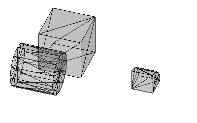

---
- GuiCommand:
   Name:Mesh Intersection
   MenuLocation:Meshes → Boolean → Intersection
   Workbenches:[Mesh](Mesh_Workbench.md)
   SeeAlso:[Mesh Union](Mesh_Union.md), [Mesh Difference](Mesh_Difference.md)
---

# Mesh Intersection

## Description

The **Mesh Intersection** command creates a new non-parametric mesh object, a [Mesh Feature](Mesh_Feature.md), that is the intersection (common) of two mesh objects.

[OpenSCAD](http://www.openscad.org/) must be installed to use this command, and the path to its executable must be set in the [OpenSCAD preferences](OpenSCAD_Preferences.md).

   
*On the left two mesh objects, on the right the mesh object that is the intersection of those objects*

## Usage

1.  Select two mesh objects that partially overlap.
2.  There are several ways to invoke the command:
    -   Press the ** [Mesh Intersection](Mesh_Intersection.md)** button.
    -   Select the **Meshes → Boolean →  Intersection** option from the menu.

## Properties

See: [Mesh Feature](Mesh_Feature.md).

 {{Mesh Tools navi}}

---
[documentation index](../README.md) > [Mesh](Mesh_Workbench.md) > Mesh Intersection
