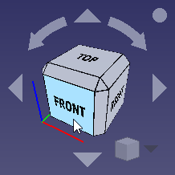

# Navigation Cube
## Introduction

The **Navigation Cube** gives visual information about the camera orientation in the current [3D view](3D_view.md) and can be used to change it. By default it is visible and resides in the upper right corner of the view.

  

The Navigation Cube consists of a number of parts:

-   The [main cube](#Main_cube.md)
-   Six [directional arrows](#Directional_arrows.md)
-   The [reverse view button](#Reverse_view_button.md) (top right) <small>(v0.20)</small> 
-   The [mini-cube menu](#Mini-cube_menu.md) (bottom right)
-   X, Y and Z Axis indicators

All parts, except the axis indicators, can be clicked.

## Usage

### Main cube 

The main cube has 26 faces: 6 main faces, 12 rectangular edge faces (<small>(v0.20)</small> ), and 8 corner faces. Clicking any of them will reorient the camera so that its direction is perpendicular to the selected face.

### Directional arrows 

There are six directional arrows: four triangular arrowheads and two curved arrows. Clicking one of the triangular arrows will rotate the [3D view](3D_view.md) around a line perpendicular to the direction of the arrow. Clicking a curved arrow will rotate the [3D view](3D_view.md) around the view direction.

### Reverse view button 

Clicking the round button in the top right corner of the Navigation Cube will rotate the [3D view](3D_view.md) 180 degrees around the vertical axis of the view.

### Mini-cube menu 

Clicking the small cube in the bottom right corner of the Navigation Cube will bring up a menu with the following options:

-    **[Orthographic](Std_OrthographicCamera.md)**: switches to an orthographic view.

-    **[Perspective](Std_PerspectiveCamera.md)**: switches to a perspective view.

-    **[Isometric](Std_ViewIsometric.md)**: switches to an isometric view.

-    **[Zoom to fit](Std_ViewFitAll.md)**: zooms and pans the camera so that all visible objects fit inside the view.

## Customization

### Move the Navigation Cube 

The entire Navigation Cube can be moved by pressing the mouse anywhere on the main cube and dragging. The structure will not begin to move until the cursor moves beyond one of the edges of the main cube.

### Preferences

The Navigation Cube is controlled by several preferences: **Edit → Preferences... → Display → Navigation → Navigation cube**. See [Preferences Editor](Preferences_Editor#Navigation.md).

### Advanced options 

The [CubeMenu](Interface_Customization#CubeMenu.md) external workbench provides easier access to several more advanced customization options.

---
 [documentation index](../README.md) > [User Documentation](Category_User Documentation.md) > Navigation Cube
