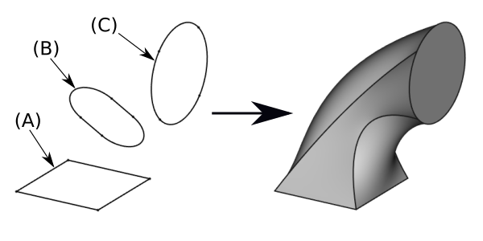

---
- GuiCommand:
   Name:PartDesign AdditiveLoft
   MenuLocation:Part Design → Create an additive feature → Additive loft
   Workbenches:[PartDesign](PartDesign_Workbench.md)
   Version:0.17
   SeeAlso:[PartDesign AdditivePipe](PartDesign_AdditivePipe.md), [PartDesign SubtractiveLoft](PartDesign_SubtractiveLoft.md)
---

# PartDesign AdditiveLoft

## Description

**Additive Loft** creates a solid in the active Body by making a transition between two or more sketches (also referred to as cross-sections). If the Body already contains features, the additive loft will be merged to them.

   
*On the left: cross-sections (A), (B) and (C); created Additive loft on the right.*

## Usage

### Dialog-based workflow 

1.  Press the ** [Additive loft](PartDesign_AdditiveLoft.md)** button.
2.  In the **Select feature** dialog select a sketch to be used as base profile object and click **OK**.
    -   Alternatively, either a single sketch or the face of a 3D object (<small>(v0.20)</small> ) can be selected prior to pressing the Additive loft button.
3.  In the **Loft parameters**, press the **Add Section** button.
4.  Select the next sketch in the [3D view](3D_view.md). Repeat to select more sketches in the order you want them to be lofted through. (You can change the section order any time later in the loft dialog by dragging sections in the list to the desired position.<small>(v0.19)</small> )
5.  Set options if needed and click **OK**.

### Selection-based workflow 

<small>(v0.19)</small> 

1.  Select several sketches. It is hereby important in what order you select them:
    -   The sketch selected at first will become the base profile object in the next step
    -   The sketches selected after the first one will become the loft sections. Also here the selection order is important: The sketch selected as second will become the first loft section, the one selected as third becomes the second section and so on. (You can change the section order any time later in the loft dialog by dragging sections in the list to the desired position.<small>(v0.19)</small> )
    -   The first or last selection can also be a face of a 3D object (<small>(v0.20)</small> )
2.  Press the ** [Additive loft](PartDesign_AdditiveLoft.md)** button.
3.  Set options if needed and click **OK**.

## Options

-   **Ruled surface**: makes straight transitions between cross-sections. Does not apply to a loft with two cross-sections. If not checked, transitions will be smooth.
-   **Closed**: makes a transition from the last cross-section to the first, creating a loop.

## Properties

-    **Label**: name given to the operation, this name can be changed at convenience.

-    **Sections**: lists the sections used.

-    **Ruled**: see [Options](#Options.md).

-    **Closed**: see [Options](#Options.md).

-    **Refine**: true or false. If set to true, cleans the solid from residual edges left by features. See [Part RefineShape](Part_RefineShape.md) for more details.

-    **Profile**: the see base profile object of the loft.

-    **Midplane**: non applicable.

-    **Reversed**: non applicable.

-    **Up To Face**: non applicable.

-    **Allow Multi Face**: non applicable.

## Notes

-   To better control the shape of the loft, it is recommended that all cross-sections have the same number of segments. For example, for a loft between a rectangle and a circle, the circle should be broken down into 4 connected arcs.
-   You can loft from or toward a single [vertex](Glossary#V.md) from a sketch or the body. <small>(v0.20)</small> 
-   [Vertices](Glossary#V.md) can only be either the start or end of a loft. Otherwise the loft body would consist of two solids connected at a single point. This would violates the CAD kernel\'s definition of a 3D object.
-   A cross-section cannot lie on the same plane as the one immediately preceding it.
-   If the sketch has inner geometry, i.e. the loft is supposed to have holes, then the order in which the sketch geometry is created, should be the same for all sections: Either start all sections with the inner geometry or start them all with the outer. Otherwise an invalid loft can be created where inner and outer walls cross.
-   It is not possible to loft disjoint or crossing loops.
-   Some failure modes will turn the part black.

## Links

-   [Part Loft Technical Details](Part_Loft_Technical_Details.md) explains how a [Part Loft](Part_Loft.md) is created, much of its content is relevant to the PartDesign Additive loft.

 {{PartDesign Tools navi}}

---
[documentation index](../README.md) > [PartDesign](PartDesign_Workbench.md) > PartDesign AdditiveLoft
