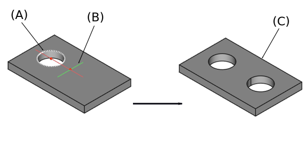
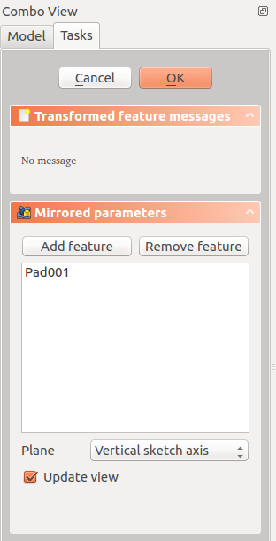
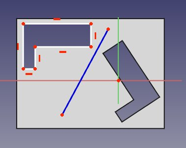

---
- GuiCommand:
   Name:PartDesign Mirrored
   MenuLocation:PartDesign → Apply a pattern → Mirrored
   Workbenches:[PartDesign](PartDesign_Workbench.md)
---

# PartDesign Mirrored

## Description

The **Mirrored** tool mirrors features on a plane.

  

*Above: a Pocket feature was created from a sketch containing a circle (A), the Pocket was subsequently used to create a Mirrored feature. The sketch vertical axis (B) was used as axis of symmetry. The result (C) is shown on the right.*

## Usage

To create a mirroring:

1.  Select the one or more features to be mirrored.
2.  Press the **[ '''Mirrored'''** button.
3.  If you have several features in the mirroring, their order can be important, see for example the image in the [PolarPattern feature](PartDesign_PolarPattern#Usage.md). You can change the order by dragging the feature in the list and you will see the result immediately as preview.
4.  Define the mirror **Plane**. See [Options](#Options.md).
5.  Press **OK**.

To add or remove features from an existing mirroring:

1.  Press **Add feature** to add a feature to be mirrored. The feature must be visible in the [3D view](3D_view.md):
    1.  Switch to the Model tree;
    2.  Select in the tree the feature to be added and press **spacebar** to make it visible in the [3D view](3D_view.md);
    3.  Switch back to the Tasks panel;
    4.  Select the feature in the 3D view; it will be added to the list.
    5.  Repeat to add other features.
2.  Press **Remove feature** to remove a feature from the list, or right-click on the feature in the list and select *Remove*.

## Options

### Plane

When creating a mirrored feature, the **Mirrored parameters** dialog offers different ways of specifying the mirror line or plane .

#### Horizontal sketch axis 

Uses the horizontal axis of the sketch as the axis of symmetry.

#### Vertical sketch axis 

Uses the vertical axis of the sketch as the axis of symmetry.

#### Select reference\... 

Allows you to select a plane (such as a face of an object) to use as a mirror plane .

#### Custom Sketch Axis 

If the sketch which defines the feature to be mirrored also contains a construction line (or lines), then the drop down list will contain one custom sketch axis for each construction line. The first construction line will be labelled \'Sketch axis 0\'. The image below is an example with the sketch in edit mode showing that it includes a construction line for use as the Mirrored axis.

  

#### Base (XY/XZ/YZ) plane 

Select one of the Body Origin\'s standard planes (XY, XZ or YZ).

### Preview

The mirror result can be previewed in real time before clicking  

## Limitations

-   The Mirrored feature cannot mirror a whole solid body. For that, see [Part Mirror](Part_Mirror.md) .
-   A Mirrored feature cannot be applied directly to another pattern, be it polar, linear or another mirror. For this you need a [PartDesign MultiTransform](PartDesign_MultiTransform.md).
-   The mirrored feature must intersect the solid (also called *support*) it is based on, or the command will fail.

 {{PartDesign Tools navi}}

---
 [documentation index](../README.md) > [PartDesign](PartDesign_Workbench.md) > PartDesign Mirrored
