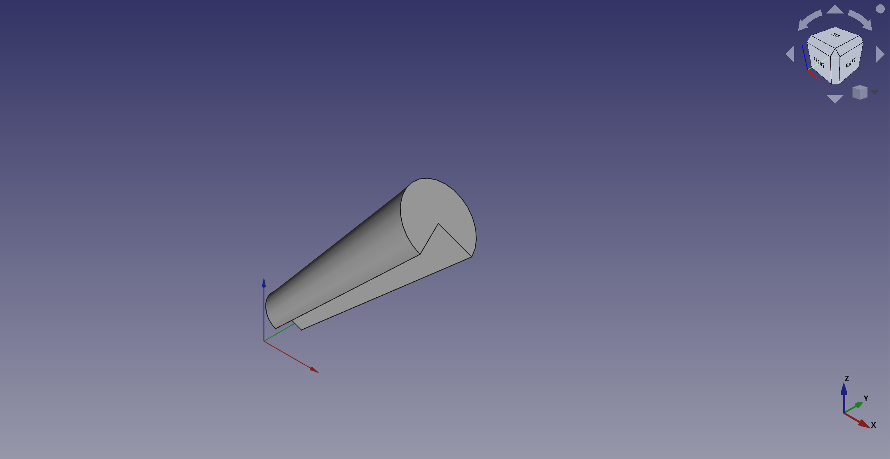

---
- GuiCommand:
   Name:Part Cone
   MenuLocation:Part → Primitives → Cone
   Workbenches:[Part](Part_Workbench.md)
   SeeAlso:[Part Primitives](Part_Primitives.md)
---

# Part Cone

## Description

A parametric truncated Part Cone primitive is available in the Part workbench from the Part tool bar, Part menu (primitives sub-menu) and the Create Primitives dialogue.

   
*A Part Cone with the parameter "Angle" set to 270 degrees and all other parameters are set to their default values.*

## Usage

1.  Switch to the  [Part Workbench](Part_Workbench.md)
2.  There are two ways to invoke the command:
    -   Press the ** Cone** button in the toolbar.
    -   Select the **Part → Primitives →  Cone** from the menu bar.

**Result:** The default values create a truncated parametric cone that is positioned at the origin (point 0,0,0) and attached to the global xy-plane. Its height of 10 mm is along the global z-axis. The lower **Radius 1** is 2 mm, the upper **Radius 2** is 4 mm.

The cone properties can later be edited, either in the [Property editor](Property_editor.md) or by double-clicking the cone in the [Tree view](Tree_view.md).

## Properties

-    **Radius 1**: Radius of the arc or circle defining the lower face

-    **Radius 2**: Radius of the arc or circle defining the upper face

-    **Height**: Height of the Part Cone

-    **Angle**: Number of degrees of the arc or circles defining the upper and lower faces of the truncated cone. The default 360° creates circular faces, a lower value will create a portion of a cone as defined by upper and lower faces each with edges defined by an arc of the number of degrees and two radii.

## Scripting

A Part Cone can be created using the following function:

 
```python
cone = FreeCAD.ActiveDocument.addObject("Part::Cone", "myCone")
```

-   Where {{Incode|"myCone"}} is the name for the object.
-   The function returns the newly created object.

The name of the object can be easily changed by

 
```python
cone.Label = "new coneName"
```

You can access and modify attributes of the {{Incode|cone}} object. For example, you may wish to modify the lower or upper radius, the height or the angle parameters.

 
```python
cone.Radius1 = 5
cone.Radius2 = 10
cone.Height = 50
cone.Angle = 270
```

The result will be a 270° portion of a full cone.

You can change its placement and orientation with:

 
```python
cone.Placement = FreeCAD.Placement(FreeCAD.Vector(2, 4, 6), FreeCAD.Rotation(30, 45, 10))
```

The Part Cone with the values of the scripting example looks like:




---
 [documentation index](../README.md) > [Part](Part_Workbench.md) > Part Cone
