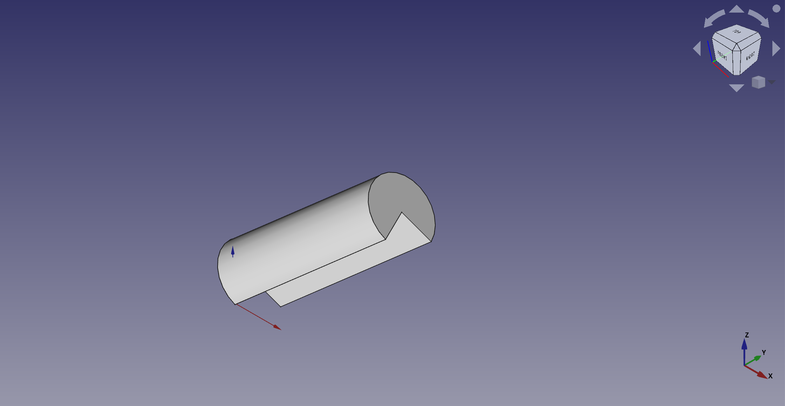

---
- GuiCommand:
   Name:Part Cylinder
   MenuLocation:Part → Primitives → Cylinder
   Workbenches:[Part](Part_Workbench.md)
   SeeAlso:[Part Primitives](Part_Primitives.md)
---

# Part Cylinder

## Description

Creates a simple parametric cylinder, with position, angle, radius and height parameters.

## Usage

1.  Switch to the  [Part Workbench](Part_Workbench.md)
2.  There are several ways to invoke the command:
    -   Press the ** Cylinder** button in the toolbar.
    -   Select **Part → Primitives →  Cylinder** entry from the top menu

**Result:** The default result is a full cylinder with a radius of 2 mm and height of 10 mm, centered along the global z-axis and attached to the global xy-plane.

The cylinder properties can later be edited, either in the [Property editor](Property_editor.md) or by double-clicking the cylinder in the [Tree view](Tree_view.md).


## Notes

## Properties

See also: [Property editor](Property_editor.md).

A Part Cylinder object is derived from a [Part Feature](Part_Feature.md) object and inherits all its properties. It also has the following additional properties:

-    **Angle|Angle**: The rotation angle of the cylinder. The rotation angle permits the creation of a portion of cylinder (it is set to 360° by default).

-    **Height|Height**: The height of the cylinder. This is the dimension in the Z direction.

-    **Radius|Radius**: The radius of the cylinder. This defines a plane in the XY area.

-    **First Angle|First Angle**: Angle in first direction. <small>(v0.20)</small> 

-    **Second Angle|Second Angle**: Angle in second direction. <small>(v0.20)</small> 

## Limitations

## Scripting

A Part Cylinder can be created using the following function:

 
```python
cylinder = FreeCAD.ActiveDocument.addObject("Part::Cylinder", "myCylinder")
```

-   Where {{Incode|"myCylinder"}} is the name for the object.
-   The function returns the newly created object.

You can access and modify attributes of the {{Incode|cylinder}} object.

The name of the object can be easily changed by

 
```python
cylinder.Label = "new cylinderName"
```

For example, you may wish to modify the width, length or of the start and finish vertex.

 
```python
cylinder.Radius = 10
cylinder.Height = 25
cylinder.Angle = 270
cylinder.FirstAngle = 30
cylinder.SecondAngle = 45
```

The result is a three-quarter cylinder.

You can change its placement and orientation with:

 
```python
cylinder.Placement = FreeCAD.Placement(FreeCAD.Vector(2, 4, 6), FreeCAD.Rotation(30, 45, 10))
```




---
 [documentation index](../README.md) > [Part](Part_Workbench.md) > Part Cylinder
