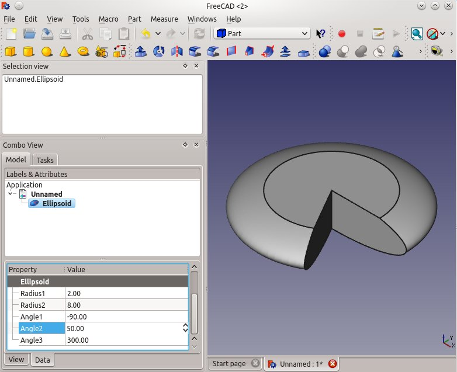

---
- GuiCommand:
   Name:Part Ellipsoid
   MenuLocation:Part → [Create primitives](Part_Primitives.md) → Ellipsoid
   Workbenches:[Part](Part_Workbench.md), [OpenSCAD](OpenSCAD_Workbench.md)
   SeeAlso:[Part Create primitives](Part_Primitives.md)
---

# Part Ellipsoid

## Description

The  [Part Ellipsoid](Part_Ellipsoid.md) command creates a parametric Ellipsoid solid.

The shape produced is limited in FreeCAD to being a solid (optionally truncated) spheroid, the shape you would create by rotating an ellipse around one of its axis. By default it is a [Oblate Spheroid](http://en.wikipedia.org/wiki/Oblate_spheroid), the shape you would create by rotating an ellipse around its minor axis. The parameters can be changed to form a [Prolate Spheroid](http://en.wikipedia.org/wiki/Prolate_spheroid).

The default spheroid in FreeCAD will have a circle for any cross section parallel to the XY plane. The cross section parallel to the other two planes will be an ellipse.

In mathematics, an [Ellipsoid](http://en.wikipedia.org/wiki/Ellipsoid) would have an elliptical cross section in all three planes.

## Usage

A parametric Ellipsoid solid is available from the Create Primitives dialogue in the Part workbench.

1.  Switch to the  [Part Workbench](Part_Workbench.md)
2.  Access the Ellipsoid command several ways:
    -   Through the Create Primitives dialogue, pressing the  [Primitives](Part_Primitives.md) button located in the Part toolbar
    -   Using the **Part → [Create primitives](Part_Primitives.md) → Ellipsoid** entry in the Part menu

## Properties

-   Radius1, by default the minor radius parallel to the Z-axis,
-   Radius2, by default the major radius parallel to the XY plane, it is also the maximum radius of the circular cross section
-   Radius3, by default the major radius parallel to the YZ plane, it is also the maximum radius of the angular cross section
-   Angle1, lower truncation of the ellipsoid, parallel to the circular cross section (-90 degrees in a full spheroid)
-   Angle2, upper truncation of the ellipsoid, parallel to the circular cross section (90 degrees in a full spheroid)
-   Angle3, angle of rotation of the elliptical cross section (360 degrees in a full spheroid)



## Notes

## Properties 

## Limitations

## Scripting

A Part Ellipsoid can be created with the following function:

 
```python
ellipsoid = FreeCAD.ActiveDocument.addObject("Part::Ellipsoid", "myEllipsoid")
```

-   Where {{Incode|"myEllipsoid"}} is the name for the object.
-   The function returns the newly created object.

You can access and modify attributes of the {{Incode| ellipsoid}} object.

The name of the object can be easily changed by

 
```python
ellipsoid.label = "new ellipsoidName"
```

For example, you may wish to modify the two radii and the three angles of the ellipsoid.

 
```python
ellipsoid.Radius1 = 2
ellipsoid.Radius2 = 8
ellipsoid.Radius3 = 8
ellipsoid.Angle1 = -90
ellipsoid.Angle2 = 50
ellipsoid.Angle3 = 300
```

The result will be a part of an ellipsoid.

You can change its placement and orientation with:

 
```python
ellipsoid.Placement = FreeCAD.Placement(FreeCAD.Vector(2, 4, 6), FreeCAD.Rotation(30, 45, 10))
```


---
 [documentation index](../README.md) > [Part](Part_Workbench.md) > Part Ellipsoid
