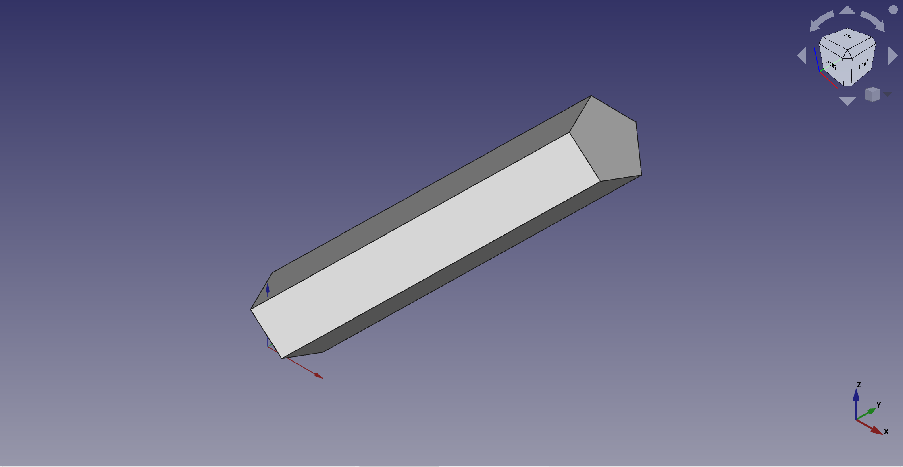

---
- GuiCommand:
   Name:Part Prism
   MenuLocation:Part → [Create primitives](Part_Primitives.md) → Prism
   Workbenches:[Part](Part_Workbench.md)
   Version:0.14
   SeeAlso:[Part Primitives](Part_Primitives.md), [Part Box/Cube](Part_Box.md)
---

# Part Prism

## Description

A Part Prism is a solid defined by a regular polygon cross section and a height.

## Usage

1.  Open the ** [Part](Part_Workbench.md)** Workbench.
2.  Press the ** [Primitives](Part_Primitives.md)** button, or use the **Part → [Create primitives](Part_Primitives.md) → Prism** from the top menu.
3.  Select **Prism** in the dialog and set the parameters.

The prism properties can later be edited, either in the [Property editor](Property_editor.md) or by double-clicking the prism in the [Tree view](Tree_view.md).

## Notes

## Properties

-    **Polygon:**The number of edges for the polygon that forms the base and top plane of the prism.

-    **Circumradius :**The distance from the center of the polygon to the prism edges.

-    **Height:**The height is the distance in the z-axis.

-    **First Angle**: Angle in first direction. <small>(v0.19)</small> 

-    **Second Angle**: Angle in second direction. <small>(v0.19)</small> 

## Limitations

## Scripting

A Part Prism can be created with the following function:

 
```python
prism = FreeCAD.ActiveDocument.addObject("Part::Prism", "myPrism")
```

-   Where {{Incode|"myPrism"}} is the name for the object.
-   The function returns the newly created object.

The name of the object can be easily changed by

 
```python
prism.Label = "new prismName"
```

You can access and modify attributes of the {{Incode|prism}} object. For example, you may wish to modify the number of sides of the base polygon, the circumferential radius or one of the two angles.

 
```python
prism.Polygon = 5
prism.Circumradius = 10
prism.Height = 50
prism.FirstAngle = 22.5
prism.SecondAngle = 45
```

The result will be a new prism with the given attributes.

You can change its placement and orientation with:

 
```python
prism.Placement = FreeCAD.Placement(FreeCAD.Vector(2, 4, 6), FreeCAD.Rotation(30, 45, 10))
```

The Part Prism with the values of the scripting example looks like:




---
 [documentation index](../README.md) > [Part](Part_Workbench.md) > Part Prism
