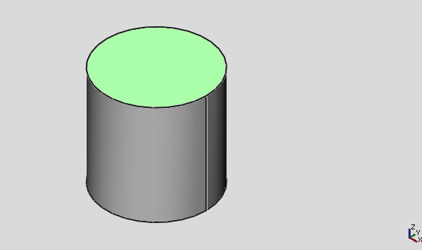
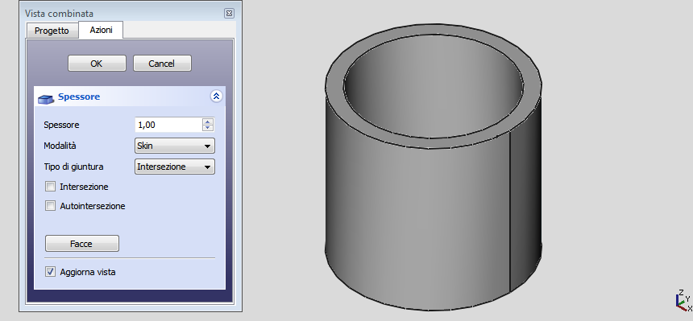
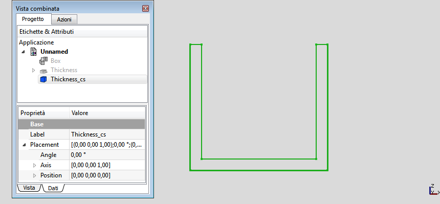

---
- GuiCommand:
   Name:Part Thickness
   MenuLocation:Part → Thickness
   Workbenches:[Part](Part_Workbench.md)
   SeeAlso:[Part Offset](Part_Offset.md)
---

## Description

The  [Thickness](Part_Thickness.md) tool works on a solid shape and transforms it into a hollow object, giving to each of its faces a defined thickness. On some solids it allows you to significantly speed up the work, and avoids making extrusions and pockets.

## Usage

1.  Create a solid
2.  Select one or more faces
3.  Click on the ** '''Part Thickness'''** tool
4.  Set the parameters (see [Options](#Options.md))
5.  Click **OK** to confirm, create the operation and exit the function
6.  In the Properties table adjust the parameters if necessary

## Options

-   Thickness: Wall thickness of the resulting object, set the desired value
    -   A positive value will offset the faces outward
    -   A negative value will offset the faces inward
-   Mode
    -   Skin: Select this option if you want to get an item like a vase, headless but with the bottom
    -   Pipe: Select this option if you want to get an object like a pipe, headless and bottomless. In this case it may be convenient to select the faces to be deleted before you start the tool. Helping with predefined views buttons or use the numeric keys.
    -   RectoVerso:
-   Join Type
    -   Arc: removes the outer edges and create a fillet with a radius equal to the thickness defined
    -   Tangent:
    -   Intersection:
-   Intersection:
-   Self-intersection: Enables self-intersection
-   Face / Done: Select the faces to be removed, then click Done
-   Update view: Automatically updates the view in real time

## Limitations

Complex shapes may produce bizarre, hard to predict results. Carefully inspect the resulting shape and save your work before applying the operation.

## Links

A good example on how to use this tool on the forum: [Re: Help designing a simple enclosure](http://forum.freecadweb.org/viewtopic.php?f=3&t=3766&p=29741&hilit=enclosure#p29547)

## Examples

**Hollow cylinder**

1.  Create ** [Cylinder](Part_Cylinder.md)** with radius 10mm and height 20mm
2.  Select the top and bottom surface of the cylinder
3.  Click on the ** Thickness
** button (no need to change default settings) and press **OK**

Notes:

-   For this shape, consider using ** [Tube](Part_Tube.md)** instead <small>(v0.19)</small> 
-   Select the cylinder\'s top surface only to create a receptacle

**Box-Enclosure**

  
