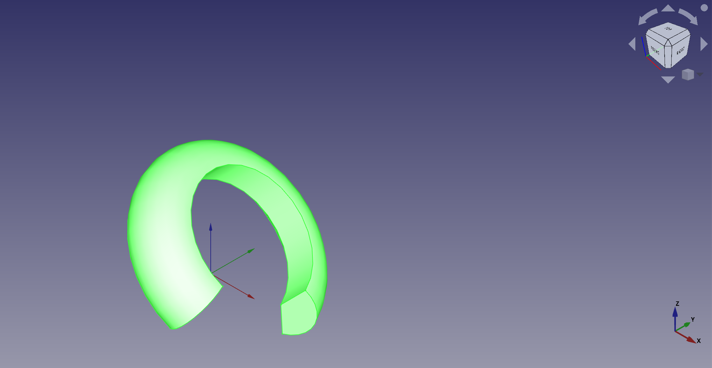

---
- GuiCommand:
   Name:Part Torus
   MenuLocation:Part → Primitives → Torus
   Workbenches:[Part](Part_Workbench.md)
   SeeAlso:[Part Primitives](Part_Primitives.md)
---

# Part Torus

## Description

The  **Part Torus** command creates a parametric torus solid, a doughnut shape. It is the result of sweeping a circular profile around a circular path. In the coordinate system defined by its **Placement** property, the circular path of the torus lies on the XY plane with its center at the origin.

A Part Torus can be turned into a segment of a torus by changing its **Angle3** property. By changing its **Angle1** and/or **Angle2** properties the swept profile can become a segment of a circle.

  

## Usage

1.  There are several ways to invoke the command:
    -   Press the ** [Part Torus](Part_Torus.md)** button.
    -   Select the **Part → Primitives →  Torus** option from the menu.
2.  The torus is created.
3.  Optionally change the dimensions and **Placement** of the torus by doing one of the following:
    -   Double-click the object in the [Tree view](Tree_view.md):
        1.  The **Geometric Primitives** task panel opens.
        2.  Change one or more properties.
        3.  The object is dynamically updated in the [3D view](3D_view.md).
        4.  Press the **OK** button.
    -   Change the properties in the [Property editor](Property_editor.md).
    -   Change the **Placement** with the  [Std TransformManip](Std_TransformManip.md) command.

## Example



A Part Torus object created with the [scripting example](#Scripting.md) below is shown here.

## Notes

-   A Part Torus can also be created with the  [Part Primitives](Part_Primitives.md) command. With that command you can specify the dimensions and placement at creation time.

## Properties

See also: [Property editor](Property_editor.md).

A Part Torus object is derived from a [Part Feature](Part_Feature.md) object and inherits all its properties. It also has the following additional properties:

### Data


{{TitleProperty|Attachment}}

The object has the same attachment properties as a [Part Part2DObject](Part_Part2DObject#Data.md).


{{TitleProperty|Torus}}

-    **Radius1|Length**: The radius of the circular path of the torus. The default is {{Value|10mm}}.

-    **Radius2|Length**: The radius of the circular profile of the torus. The default is {{Value|2mm}}.

-    **Angle1|Angle**: The start angle of the circular profile. Valid range: {{Value|-180° &lt;&#61; value &lt;&#61; 180°}}. The default is {{Value|-180°}}.

-    **Angle2|Angle**: The end angle the circular profile. Valid range: {{Value|-180° &lt;&#61; value &lt;&#61; 180°}}. The default is {{Value|180°}}. If the total angle of the circular profile is smaller than {{Value|360°}} the profile will have a pie-shape.

-    **Angle3|Angle**: The angle of the circular path of the torus. Valid range: {{Value|0° &lt; value &lt;&#61; 360°}}. The default is {{Value|360°}}. If it is smaller than {{Value|360°}} the resulting solid will be a segment of a torus.

## Scripting

See also: [Autogenerated API documentation](https://freecad.github.io/SourceDoc/), [Part scripting](Part_scripting.md) and [FreeCAD Scripting Basics](FreeCAD_Scripting_Basics.md).

A Part Torus can be created with the {{Incode|addObject()}} method of the document:

 
```python
torus = FreeCAD.ActiveDocument.addObject("Part::Torus", "myTorus")
```

-   Where {{Incode|"myTorus"}} is the name for the object.
-   The function returns the newly created object.

Example:

 
```python
import FreeCAD as App

doc = App.activeDocument()

torus = doc.addObject("Part::Torus", "myTorus")
torus.Radius1 = 20
torus.Radius2 = 10
torus.Angle1 = -90
torus.Angle2 = 45
torus.Angle3 = 270
torus.Placement = App.Placement(App.Vector(1, 2, 3), App.Rotation(30, 45, 10))

doc.recompute()
```


 {{Part_Tools_navi}}


---
 [documentation index](../README.md) > [Part](Part_Workbench.md) > Part Torus
