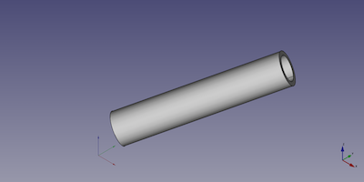

---
- GuiCommand   *
   Name   *Part Tube
   MenuLocation   *Part → Primitives → Create tube
   Workbenches   *[Part](Part_Workbench.md)
   Version   *0.19
   SeeAlso   *[Part Primitives](Part_Primitives.md)
---

# Part Tube

## Description

The  **Part Tube** command creates a parametric tube solid. In the coordinate system defined by its **Placement** property, the bottom face of the tube lies on the XY plane with its center at the origin.

  

## Usage

### Create

1.  There are several ways to invoke the command   *
    -   Press the ** [Part Tube](Part_Tube.md)** button.
    -   Select the **Part → Primitives →  Create tube** option from the menu.
2.  The **Tube** task panel opens and a preview of the tube is displayed in the [3D view](3D_view.md).
3.  Specify the dimensions.
4.  The preview is dynamically updated.
5.  Press the **OK** button.
6.  The tube is created.
7.  Optionally change the **Placement** of the tube in the [Property editor](Property_editor.md), or with the  [Std TransformManip](Std_TransformManip.md) command.

### Edit

1.  Double-click the tube in the [Tree view](Tree_view.md)
2.  The **Tube** task panel opens.
3.  Change one or more dimensions.
4.  The tube is dynamically updated in the [3D view](3D_view.md).
5.  Press the **OK** button.

## Example



A Part Tube object created with the [scripting example](#Scripting.md) below is shown here.

## Properties

See also   * [Property editor](Property_editor.md).

A Part Tube object is derived from a [Part Feature](Part_Feature.md) object and inherits all its properties. It also has the following additional properties   *

### Data


{{TitleProperty|Attachment}}

The object has the same attachment properties as a [Part Part2DObject](Part_Part2DObject#Data.md).


{{TitleProperty|Tube}}

-    **Height|Length**   * The height of the tube. The default is {{Value|10mm}}.

-    **Inner Radius|Length**   * The inner radius of the tube. Must be smaller than **Outer Radius**. Can be {{Value|0}}. The default is {{Value|2mm}}.

-    **Outer Radius|Length**   * The outer radius of the tube. Must be larger than **Inner Radius**. The default is {{Value|5mm}}.

## Scripting

See also   * [Autogenerated API documentation](https   *//freecad.github.io/SourceDoc/), [Part scripting](Part_scripting.md) and [FreeCAD Scripting Basics](FreeCAD_Scripting_Basics.md).

A Part Tube can be created with the {{Incode|addTube()}} method (<small>(v0.20)</small> ) of the Shapes module   *

 
```python
tube = Shapes.addTube(FreeCAD.ActiveDocument, "myTube")
```

-   Where {{Incode|"myTube"}} is the name for the object.
-   The function returns the newly created object.

Example   *

 
```python
import FreeCAD as App
from BasicShapes import Shapes

doc = App.activeDocument()

tube = Shapes.addTube(FreeCAD.ActiveDocument, "myTube")
tube.Height = 20
tube.InnerRadius = 2
tube.OuterRadius = 3
tube.Placement = App.Placement(App.Vector(2, 4, 5), App.Rotation(60, 60, 30))

doc.recompute()
```


 {{Part_Tools_navi}}


---
 [documentation index](../README.md) > [Part](Part_Workbench.md) > Part Tube
