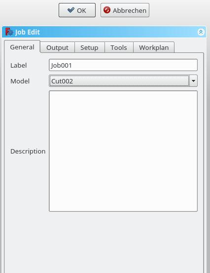
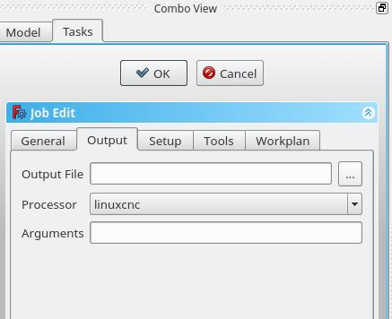
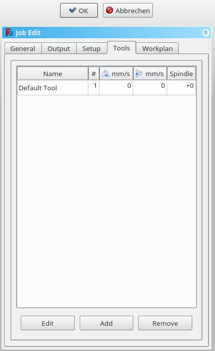
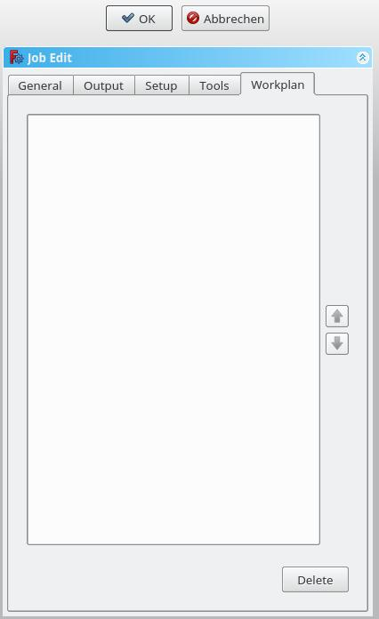

---
- GuiCommand:
   Name:Path Job
   MenuLocation:Path → Job
   Workbenches:[Path](Path_Workbench.md)
   Shortcut:**P** **J**
   SeeAlso:[Path Post](Path_Post.md), [Path Postprocessor Customization](Path_Postprocessor_Customization.md)
---

# Path Job

## Description

The Job tool creates a new Job object in the active document. The Job object contains the following information:

1.  A list of Tool-Controller definitions, specifying the geometry, Feeds, and Speeds for the Path Operations Tools.
2.  A Workflow sequential list of Path Operations.
3.  A Base Body---a clone used for offset.
4.  A Stock, representing the raw material that will be milled to Path Workbench.
5.  A SetupSheet, containing inputs used by the Path Operations, including static values and formulas.
6.  Configuration parameters specifying the output G-Code job\'s destination path, file name, and extension, and the [postprocessor](Path_Post.md) (used to generate the appropriate dialect for the target CNC Controller, and customize Units, Tool Changes, Parking, etc.).

## Usage

1.  There are several ways to invoke the command:
    -   Press the ** [Path Job](Path_Job.md)** button.
    -   Select the **Path →  Job** option from the menu.
    -   Use the keyboard shortcut: **P** then **J**.

The Job GUI dialog box has five horizontal aligned tabs: **General**, **Output**, **Setup**, **Tools**, and **Workplan**. The user can at anytime utilize the **OK** or **Cancel** options within the dialog.

## General

  

-   **Label**: The label of the Job as displayed in the tree view.
-   **Model**: The Base Object which defines by its shape the paths of the job. If it is a Part Design object it is usually the Body which you select here. If you have an element selected in the tree *before* you click the \"Add Job\" icon that element is already entered here. You can change it by selecting a different element from the dropdown menu.
-   **Description**: You can add some notes to the job here. Notes are only for your information and have no effect on the path.

## Output

  

-   **Output File**: Set the name, extension, and the file path of the G-Code output. You can use the following placeholders:
    -   **%D** directory of the active document
    -   **%d** name of the active document (without extension)
    -   **%M** user macro directory
    -   **%j** name of the job

-   **Processor**: Select the [postprocesser](Path_Post.md) for your machine.
-   **Arguments**: Add arguments for the [postprocesser](Path_Post.md) as needed.

## Setup

  

-   **Stock**: set the size and shape of the raw material.
-   **Orientation**: Selected Edge or Face is used to orient Base or Stock accordingly.
-   **Alignment**: select a Vertex to set origin or move Base or Stock

## Tools

  

Add the tool(s) from your [Tooltable](Path_ToolLibraryEdit.md) which you need for the operations at this job.

After adding a tool, you can set/change the feedrate and spindle speed if you need a different feedrate in this job. A change here doesn\'t change the parameters stored in the tooltable.

The default tool you can delete if you have a own tool added.

## Workplan

  

If you have a job which contends more than one path operation, you can determine in which order the operations should be done. To reorder, select a operation an push the up or down button.

 {{Path_Tools_navi}}

---
[documentation index](../README.md) > [Path](Path_Workbench.md) > Path Job
