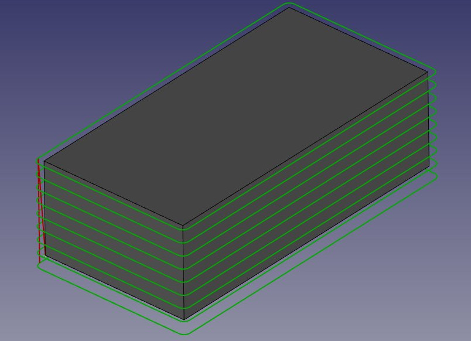
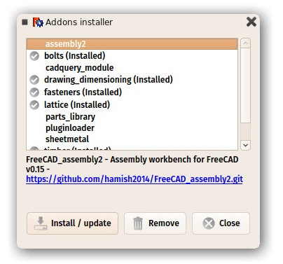

  FreeCAD 0.16 was released on 18. April, 2016, get it from [Github](https://github.com/FreeCAD/FreeCAD/releases). This is a summary of the most interesting changes. The complete list of changes can be found in the [Mantis changelog](http://www.freecadweb.org/tracker/changelog_page.php). Older versions at: [0.15](Release_notes_0.15.md) - [0.14](Release_notes_0.14.md) - [0.13](Release_notes_013.md) - [0.12](Release_notes_012.md) - [0.11](Release_notes_011.md)
  

Satnogs Rotator (https://satnogs.org/)

## Highlights

**Expression support** has been introduced, which allows defining formula relationships between properties of objects. Expression support is a major forward leap, for making better parametric models in FreeCAD. Expressions offer an easy interface for making models controlled by spreadsheets.

**Sketcher solver** behavior has been majorly improved. Not only did it became faster and more stable, it also doesn\'t hang anymore on unsolvable sketches. And automatic document recomputes triggered after each tiny tweak to the sketch can now be switched off, allowing smooth editing of sketches buried under deep dependencies.

FreeCAD now supports touchscreen 3D navigation. This makes it possible to use FreeCAD without a mouse on a convertible laptop with touchscreen and pen, away from a desk.

The **FEM workbench** has tons of improvements. It has proven to be usable for various kinds of mechanical analysis.

## General

-   Support for expressions/formulas
-   Three new navigation styles: Gesture Navigation (with touchscreen support on Windows), Maya Navigation, and OpenCascade Navigation.
-   Customization of workbenches list (list can be reordered, and any workbenches can be made hidden from the list)
-   Recovery tool
-   New save options (Revert, save as a copy)
-   New homepage

## Part Workbench 

-   New tools for joining walled objects (e.g., pipes): [Connect](Part_JoinConnect.md), [Embed](Part_JoinEmbed.md) and [Cutout](Part_JoinCutout.md)
-   New feature: make face from a sketch (parametric)

## Part Design & Sketcher Workbench 

-   New Feature: Toggle Mode for [Toggle reference/driving constraints](Sketcher_ToggleDrivingConstraint.md)
-   New Feature: Continuous creation mode
-   New Feature: Non-driving constraints (aka Driven constraints)
-   Major speedup
-   Advanced solver control
-   New features: tools for duplication, mirroring and rectangular array
-   Support for [expressions/formulas](Expressions.md) in constraints and properties

## Spreadsheet Workbench 

-   Added functions: round, trunc, ceil, and floor.

## Draft Workbench 

-   **New DXF importer**: The Draft Workbench now features a brand-new DXF importer, fully coded in C++, inherited from [HeeksCad](https://github.com/Heeks/heekscad), which no longer needs to download external components, and is now much faster and able to load much larger DXF files. An option in the DXF preferences allows switching back to the old importer if needed.
-   A new **[Mirror tool](Draft_Mirror.md)** allows doing mirroring of objects \"the Draft way\"
-   Many **DXF templates** have been added to the corresponding built-in SVG templates, making the export of Drawing pages to DXF much better.
-   [Rectangles](Draft_Rectangle.md),[wires and lines](Draft_Wire.md) can now be **subdivided**, allowing all kinds of new shape combinations.

## Drawing Workbench 

-   A new **[spreadsheet view](Drawing_SpreadsheetView.md)** tool allows placing a range of cells from a [spreadsheet](Spreadsheet_Workbench.md) on a Drawing page.

## Arch Workbench 

-   **[Materials support](Arch_SetMaterial.md)**: Arch objects can now have a [material](material.md) attached, which uses FreeCAD\'s builtin materials framework. These materials are shared among other workbenches. These materials are fully supported by IFC import and export.
-   The **[Section plane](Arch_SectionPlane.md)** can now do clipping of the 3D view, showing the section in realtime.

-   Several improvements to the **IFC importer** such as new options for treating large IFC files, better support for extrusions (now detected on import) and curved segments, and support of 2D annotation objects. The import of Analytical IFC has been added. At the moment import of geometrical representations of all analytical objects is supported.
-   Better **meshing options** for DAE and IFC formats.
-   A new [Arch Schedule](Arch_Schedule.md) tool allows creating different kinds of schedules from a BIM model.
-   **IFC attributes** can now be imported, edited and exported. This is basically a spreadsheet object attached to an Arch object.

## FEM Workbench 

-   **GUI** FEM commands have keyboard short cuts now. A preference dialog for FEM was introduced. The binary path of CalculiX is one of the preference settings.
-   **GUI analysis container** Analysis member uses drag & drop. They can be moved in and out of a analysis container. Since there is now support for multiple analysis, members can be moved into another analysis too. Multiple constraints can be created in an analysis.
-   **GUI one click analysis** A one click analysis button has been added to the GUI. It purges results, writes the CalculiX input file, and does the analyse with the selected solver. It detects if multithreading is available for CalculiX and uses the maximum possible threads.
-   **Input file** FreeCAD\'s build-in editor supports editing CalculiX input files (\*.inp). Syntax highlighting was implemented too.
-   **Netgen mesh object** The GUI and property editor of the Netgen mesh object has been reworked. Tetrahedron meshing off one order and second order elements is supported as well as adjusting meshing parameter.
-   **Constraint force and constraint fix objects** It is now possible to add Forces and Fixes on edges and Vertexes.
-   **Constraint pressure object** A new object for pressure load on faces has been added. The pressure (load per area) is passed directly to CalculiX which means the node loads are not calculated by FreeCAD but CalculiX instead.
-   **Constraint prescribed displacement object** A new object for prescribed displacements has been added. The prescribed displacement can be added to vertexes, edges and faces. For shell and beam analysis it is possible to fix the rotational degrees of freedom.
-   **Beam section object** The new beam section object allows defining rectangle cross sections for beam FEM. There is support for different beam sections in one analysis by defining reference shapes for each cross section
-   **Shell thickness object** The new shell thickness object allows defining the thicknesses of shell plates. Like the beam section, there is support for multiple shell thicknesses in one analysis by defining reference shapes.
-   **Material object** Multiple materials are supported for edge, shell and solid meshes. Like for the beam section and shell thickness objects an appropriate FEM Mesh is needed to use the multiple materials.
-   **Solver object** As a base for multiple solver, a solver object has been implemented. All analysis properties moved from analysis to solver.
-   **Frequency analysis** A frequency analysis can be made. The number of eigenvalues or eigenshapes to calculate can be adjusted in the preference GUI.
-   *\' View provider*\' Shell and beam FEM-Meshes can be viewed in FreeCAD and thus the results of such analysis too.
-   **Python API** Methods for working with FEM-Meshes and making an analysis from python have been added.
-   **GMSH Macro** An interesting external developing is the [Macro\_GMSH](Macro_GMSH.md) which makes it possible to use GMSH for meshing. Very useful for all not able to compile FreeCAD with Netgen or for meshing shell- or edge meshes.
-   **General Improvements** Due to the heavy development taking place, there have been tons of improvements on the code base of FEM module.

## Path Workbench 

A new [Path Workbench](Path_Workbench.md) has been added to FreeCAD. This workbench, although still under development, already implements some CAM operations, and allows exporting full [G-code](https://en.wikipedia.org/wiki/G-code) programs for a variety of CNC machines.

In its current state, the workbench allows creation of profiles and pockets around [Part](Part_Workbench.md)-based objects, creating complex paths by joining several partial paths, inspection and editing the g-code contents of paths, managing tooltable, and choosing between different pre-processing and post-processing scripts when importing and exporting G-code. It also already provides a complete [python API](Path_scripting.md).

## Additional Modules 

A couple of new [addons workbenches](https://github.com/FreeCAD/FreeCAD-addons) have been created by community members. These workbenches are easily pluggable into an existing FreeCAD installation. Among them are:

-   An [Animation Workbench](https://github.com/microelly2/Animation) allows you to create animations from your FreeCAD models, by defining the movement of a camera and exporting a sequence of images.
-   A [Kerkythea exporter macro](https://github.com/marmni/FreeCAD-Kerkythea) permits exporting your FreeCAD documents to the free [Kerkythea renderer](http://www.kerkythea.net/cms/).
-   A work-in-progress [Menu](http://forum.freecadweb.org/viewtopic.php?f=22&t=10892%7CPie) is also already available.
-   Finally, an [addons repository](https://github.com/FreeCAD/FreeCAD-addons) has been created to gather all the interesting workbenches, modules and other macros that are flourishing around FreeCAD. This repository features a installer that takes care of the installing and updating of these addons for you.

[Category:News{{\#translation:}}](Category:News.md) [Category:Documentation{{\#translation:}}](Category:Documentation.md) [Category:Releases{{\#translation:}}](Category:Releases.md)
