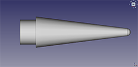
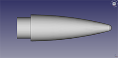
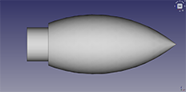
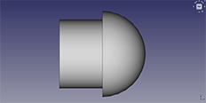

---
- GuiCommand   *
   Name   *Rocket NoseCone
   MenuLocation   *Rocket → Nose Cone
   Workbenches   *[Rocket Workbench](Rocket_Workbench.md)
   Version   *0.19
---

# Rocket NoseCone

## Description

Nose cones come in a variety of shapes and sizes, most of which are difficult to model without programming. For many rocket builders, this makes the process unworkable. This command allows for nose cone creation using simple properties combined with a specialized task dialog.

## Usage

1.  There are several ways to invoke the command   *
    -   Press the ** [Nose Cone](Rocket_NoseCone.md)** button.
    -   Select the **Rocket →  Nose Cone** option from the menu.
    -   Double click on a Nose Cone object in the [Tree view](Tree_view.md).
2.  Set options and press **OK**.

## Options

### Nose Cone Types 

The theory behind the various nose cone shapes is explained here   * [Nose cone design](https   *//en.wikipedia.org/wiki/Nose_cone_design)

Supported nose cone types include   *

-   Cone.

   
*Conical*

-   Blunted Cone. For all blunted shapes, the tip is spherically rounded with a specified diameter. The length is the actual length of the nose and not the virtual length described in the [Nose cone design](https   *//en.wikipedia.org/wiki/Nose_cone_design) reference.

   
*Spherically Blunted Cone*

-   Ogive.

   
*Ogive*

-   Blunted Ogive. For all blunted shapes, the tip is spherically rounded with a specified diameter. The length is the actual length of the nose and not the virtual length described in the [Nose cone design](https   *//en.wikipedia.org/wiki/Nose_cone_design) reference.

   
*Spherically Blunted Ogive*

-   Secant Ogive.

   
*Secant Ogive*

-   Elliptical.

   
*Elliptical*

-   Spherical. This is a special case of the elliptical nose cone where the length is 1/2 of the diameter.

   
*Spherical*

-   Parabola. The shape commonly thought of as a parabola is not generated using a parabolic series, but a power series with a coefficient of 1/2. This is explained in the Wikipedia article.

   
*Parabola (Power series with coefficient 1/2)*

-   Parabolic series. This shape is constrained using a coefficient, as explained in the Wikipedia article.

   
*Parabolic series with coefficient 1/2*

   
*Parabolic series with coefficient 1*

-   Von Karman. A Haack series with a coefficient of 0

   
*Von Karman (Haack series with coefficient 0)*

-   Haack Series. This shape is constrained using a coefficient, as explained in the Wikipedia article.

   
*Haack series with coefficient 1/3*

   
*Haack series with coefficient 2*

### Nose Cone Styles 

Nose cones can be drawn in one of 3 styles   *

-   Solid   * The cone is constructed as a solid piece, such as out of balsa wood.

  

-   Hollow   * The cone is hollow on the inside having a specified thickness. The end is not sealed.

  

-   Capped   * Similar to hollow, except the end is sealed.

  

### Shoulders

Nose cones can be created with or without shoulders   *

   
*Ogive with shoulder*

   
*Ogive without shoulder*

## Properties

{{TitleProperty|Nose Cone}}

-    **Blunted Diameter**   * The diameter of the spherical portion at the tip of the nose

-    **Coefficient**   * Combined with the Nose Type, this defines the shape of the nose cone, see [Options](#Options.md)

-    **Diameter**   * The diameter of the base of the nose cone

-    **Length**   * The length of the nose cone without the shoulder. For all blunted shapes, the length is the actual length of the nose and not the virtual length described in the [Nose cone design](https   *//en.wikipedia.org/wiki/Nose_cone_design) reference.

-    **Nose Style**   * Defines the style of the nose cone, see [Options](#Options.md)

-    **Nose Type**   * Defines the shape of the nose cone using the coefficient when required, see [Options](#Options.md)

-    **Ogive Diameter**   * The diameter of the Ogive circle. This is only required for the Secant Ogive nose cone type

-    **Resolution**   * Used internally, this parameter defines the number of data points to use when drawing the outline of the nose cone

-    **Shoulder**   * True when the Nose Cone includes a shoulder

-    **Shoulder Diameter**   * The diameter of the shoulder. This must be less than the radius of the Nose Cone

-    **Shoulder Length**   * The length of the shoulder

-    **Shoulder Thickness**   * When the Nose Style is hollow or capped, this will determine the wall thickness of the shoulder

-    **Thickness**   * When the Nose Style is hollow or capped, this will determine the wall thickness of the nose cone

{{TitleProperty|Rocket Component}}

These parameters are provided for information and have no effect on the design of the component.

-    **Description**   * Description of the component

-    **Manufacturer**   * Manufacturer when known

-    **Material**   * Material when known

-    **Part Number**   * Manufacturer part number

## Tutorials and Learning 

[Rocket Workbench Nose Cones](https   *//youtu.be/zwLgie2E4Ts) Tutorial on YouTube

 

[Category   *Addons](Category_Addons.md) [Category   *External Workbenches](Category_External_Workbenches.md)

---
 [documentation index](../README.md) > [Addons](Category_Addons.md) > [External Workbenches](Category_External Workbenches.md) > Rocket NoseCone
