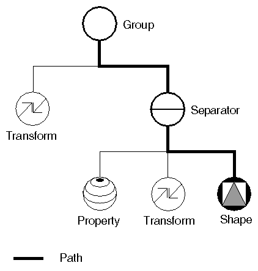

# Scenegraph
## Introduction

The geometry that appears in the [3D views](3D_view.md) of FreeCAD is rendered by the [Coin3D](https://en.wikipedia.org/wiki/Coin3D) library. Coin3D is an implementation of the [OpenInventor](https://en.wikipedia.org/wiki/Open_Inventor) standard. The [OpenCASCADE](https://en.wikipedia.org/wiki/Open_Cascade_Technology) software also provides the same functionality, but it was decided at the very early stages of FreeCAD not to use the built-in OpenCASCADE viewer, but rather switch to the more performant Coin3D software. A good way to learn about that library is the book [Open Inventor Mentor](http://www-evasion.imag.fr/Membres/Francois.Faure/doc/inventorMentor/sgi_html/).

## Description

[OpenInventor](https://en.wikipedia.org/wiki/Open_Inventor) is a 3D scene description language. The scene described in OpenInventor is then rendered in OpenGL on your screen. Coin3D takes care of doing this, so programmers do not need to deal with complex OpenGL calls, and may just provide valid OpenInventor code. The big advantage is that OpenInventor is a very well-known and well documented standard.

One of the big jobs FreeCAD does for you is translating OpenCASCADE geometry information into OpenInventor language.

OpenInventor describes a 3D scene in the form of a [scenegraph](https://en.wikipedia.org/wiki/Scene_graph), like the one below:

   
*Image taken from [https://web.archive.org/web/20190807185912/http://www-evasion.imag.fr/~Francois.Faure/doc/inventorMentor/sgi_html/ Inventor mentor]*

An openInventor scenegraph describes everything that is part of a 3D scene, such as geometry, colors, materials, lights, etc, and organizes all that data in a convenient and clear structure. Everything can be grouped into sub-structures, allowing you to organize your scene contents pretty much the way you like. Here is an example of an openInventor file:  {{Code|lang=bash|code=
#Inventor V2.0 ascii
 
Separator { 
    RotationXYZ {   
       axis Z
       angle 0
    }
    Transform {
       translation 0 0 0.5
    }
    Separator { 
       Material {
          diffuseColor 0.05 0.05 0.05
       }
       Transform {
          rotation 1 0 0 1.5708
          scaleFactor 0.2 0.5 0.2
       }
       Cylinder {
       }
    }
}
}}

As you can see, the structure is very simple. You use separators to organize your data into blocks, a bit like you would organize your files into folders. Each statement affects what comes next, for example the first two items of our root separator are a rotation and a translation, both will affect the next item, which is a separator. In that separator a material is defined and another transformation. Our cylinder will therefore be affected by both transformations, the one applied directly to it and the one that was applied to its parent separator.

We also have many other types of elements to organize our scene, such as groups, switches or annotations. We can define very complex materials for our objects, with colors, textures, shading modes and transparency. We can also define lights, cameras, and even movement. It is even possible to embed pieces of scripting in openInventor files to define more complex behaviors.

If you are interested in learning more about openInventor head directly to its most famous reference: the [Inventor mentor](http://www-evasion.imag.fr/~Francois.Faure/doc/inventorMentor/sgi_html/).

In FreeCAD, normally, we don\'t need to interact directly with the openInventor scenegraph. Every object in a FreeCAD document, being a mesh, a part shape or anything else, gets automatically converted to openInventor code and inserted in the main scenegraph that you see in a [3D view](3D_view.md). That scenegraph gets updated continuously when you modify, add or remove objects. In fact every object (in App space) has a view provider (a corresponding object in Gui space) responsible for issuing openInventor code.

But there are many advantages to being able to access the scenegraph directly. For example, we can temporarily change the appearance of an object, or we can add objects to the scene that have no real existence in the FreeCAD document, such as construction geometry, helpers, graphical hints or tools such as manipulators or on-screen information.

FreeCAD itself features several tools to see or modify openInventor code. For example, the following python code will show the openInventor representation of a selected object:  
```python
obj = FreeCAD.ActiveDocument.ActiveObject
viewprovider = obj.ViewObject
print viewprovider.toString()

``` But we also have a python module that allows complete access to anything managed by Coin3D, such as our FreeCAD scenegraph. So, read on to [Pivy](Pivy.md).

## Coding examples 

See [Coin3d snippets](Coin3d_snippets.md) courtesy of MariwanJ\'s research for the [Design456 Workbench](Design456_Workbench.md). The code repository of said examples can be found at <https://github.com/MariwanJ/COIN3D_Examples>.

[top](#top.md)


 {{Powerdocnavi}}

_

---
[documentation index](../README.md) > [Developer Documentation](Category_Developer Documentation.md) > Scenegraph
