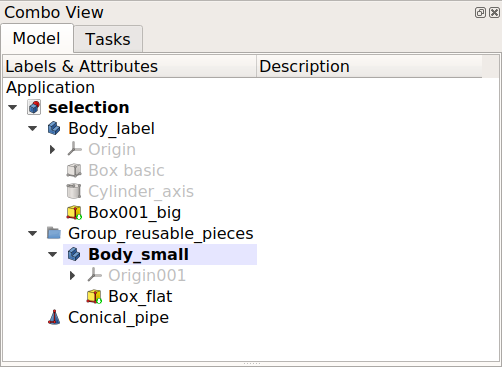

# Selection view
 

## Introduction

  The [selection view](selection_view.md) is a panel in the [interface](interface.md) by default located below the [combo view](combo_view.md). Just like the [property editor](property_editor.md), it shows more information about the currently selected objects.

A selection can be made by picking an object in the [3D view](3D_view.md) or in the [tree view](tree_view.md). Multiple bodies can be selected by holding **Ctrl**.


*Selection view indicated by the number 5, in the standard [interface](interface.md).*

## Selection of objects 

The tree view of this example has two [PartDesign Bodies](PartDesign_Body.md), with several features each, and a simple [Part Cone](Part_Cone.md). The tree is as follows.



The selection view is empty if no object is selected in the [3D view](3D_view.md) or in the [tree view](tree_view.md).

 

If you select an object, it will appear in the list of objects, together with the document it belongs to. Both the read-only internal `Name`, and the user changeable `Label` will be displayed.

The `Name` can contain only basic alphanumeric characters `[_0-9a-zA-Z]`, while the `Label` can contain any symbol including spaces and accented characters. 
```python
Document#Name (Label)
```

 

If you select various objects, they will be listed in the view. If these objects are located inside a type of container, for example, a [PartDesign Body](PartDesign_Body.md), the displayed name will be given in a hierarchical manner, that is, `Document#Parent.Child`. In this case, not only the child, but the entire parent will appear highlighted in the 3D view. 
```python
Document#Body.Feature. (Feature_label)
```

 

Individual body elements, that is, vertices, edges, and faces, can be selected, and they will be displayed in a hierarchical manner as well. 
```python
Document#Body.Feature.Vertex (Feature_label)
Document#Body.Feature.Edge (Feature_label)
Document#Body.Feature.Face (Feature_label)
```

 

## Search bar 

If you have many objects in your document and you cannot pick the one that you want from the [3D view](3D_view.md) or from the [tree view](tree_view.md), you can write the partial name of the object in the search field; it will search all names in the document, and show a list of those that partially match the text that you entered. When you find the object that you are looking for, you may click on it to select it.

## Actions

Right clicking on an element in the list brings up various commands.

-    **Select only**: deselects everything, and selects only the parent object that contains the given element.

-    **Deselect**: completely removes the selection of all objects.

-    **Zoom to fit**: deselect everything, ans selects only the parent object that contains the given element. Moreover, the [3D view](3D_view.md) is panned and zoomed so that the parent object is centered on the screen. This is useful when selecting one object in the tree view, and then quickly focus the camera on it in the 3D view.

-    **Go to selection**: deselects everything, and selects only the the parent object that contains the selected element. In this case, the [tree view](tree_view.md) is adjusted and expanded to show exactly where the selected object is in the tree. This is useful when the objects in the 3D view are contained inside many container objects in the tree view, for example, [Std Parts](Std_Part.md), [Std Groups](Std_Group.md), [PartDesign Bodies](PartDesign_Body.md), [Arch BuildingParts](Arch_BuildingPart.md), and similar. When you have hundreds of bodies, it is easier to select the object in the 3D view, and then choose **Go to selection**, to immediately locate the object in the tree view, and then proceed to edit its properties in the [Property editor](Property_editor.md).

-    **Mark to recompute**: marks the selected object as \"Touched\", meaning that its properties will be updated next time the document is [recomputed](Recompute.md).

-    **To Python console**: this creates a variable `obj` that holds a reference to the parent object. This is useful when writing scripts and testing commands in the [Python console](Python_console.md). Instead of using the full name of the object, it\'s easier to use the shorter and more compact name `obj`.

## Picked object 

Starting from v0.19, the **picked object list** checkbox is available. If this is checked, a secondary list will appear showing all the sub-elements (vertices, edges, and faces) that could be selected by a single click, even those that are behind (hidden by) other objects.

 


{{Interface navi

}} {{Std Base navi}} 
