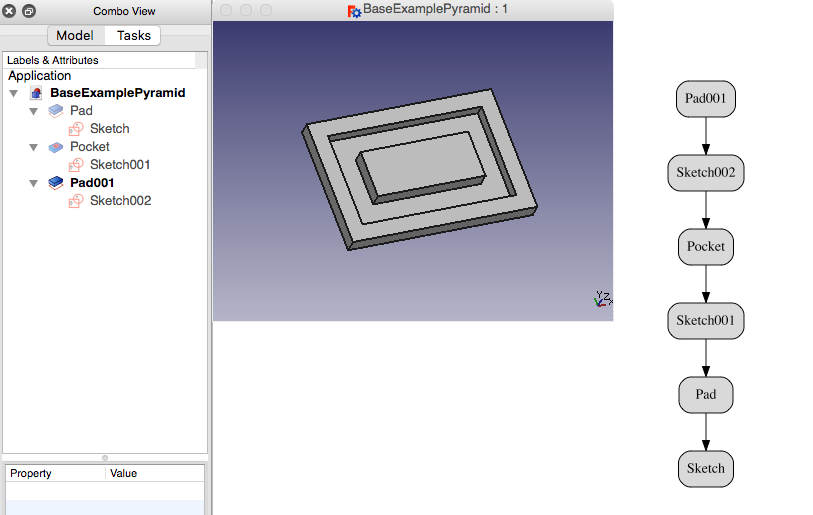
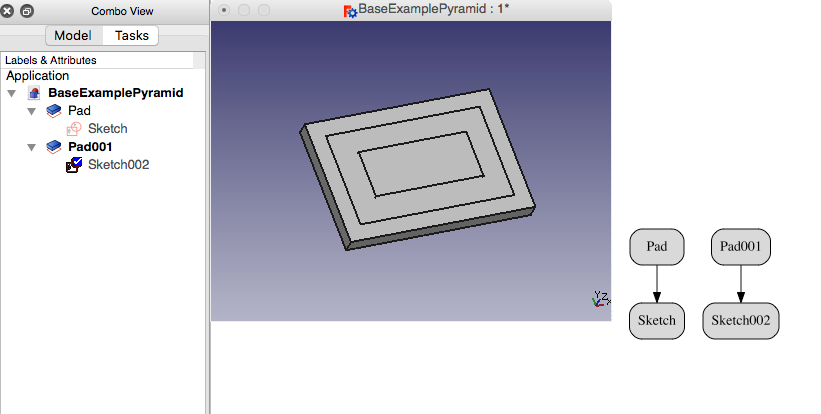
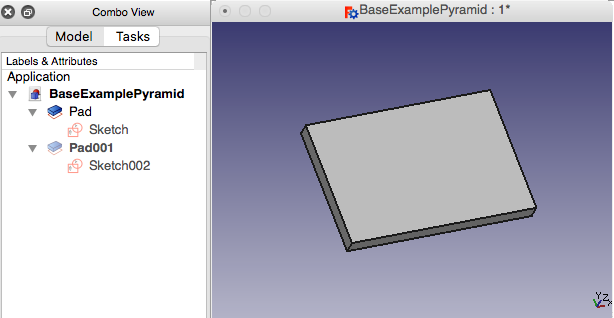

---
- GuiCommand:
   Name:Sketcher MapSketch
   MenuLocation:Part Design/Sketch → Map sketch to face...
   Workbenches:[Sketcher](Sketcher_Workbench.md), [PartDesign](PartDesign_Workbench.md)
   SeeAlso:[Sketcher New sketch](Sketcher_NewSketch.md)
---

## Description

This tool maps an existing sketch onto the face of a shape. PartDesign features created from this sketch will be fused with the underlying solid for additive features (Pad, Revolution) or be subtracted from the underlying solid in case of subtractive features (Pocket, Groove).

Please note that this tool is not used to create new sketches. It only maps, or remaps an existing sketch to the face of a solid or a PartDesign feature. Typical use cases are:

-   The sketch was created on a standard plane (XY, XZ, YZ) and you want to map it to the face of a solid in order to build a feature upon it.
-   The sketch was mapped on a specific face of a solid but you need to map it to a different face.
-   Repairing a broken model.

  

## Usage

-   Select the face of a PartDesign feature or a solid.
-   Click on the ** [Map sketch to face](Sketcher_MapSketch.md)** icon in the toolbar (or go to the PartDesign or Sketch menu depending on which workbench is active)
-   In the **Select sketch** dialog window that opens, select from the list the sketch to map to the face and click OK.
-   The sketch is automatically opened in edit mode.

## Use when repairing a broken model 

Sketcher MapSketch is often used when repairing a broken model.

One common use case is when the dependency graph has been broken. (You can view the dependency graph by **Tools** → **[Dependency graph](Std_DependencyGraph.md)**.) This can happen when you delete a feature in the middle of your model tree. In the following example we will break and repair a model.

This is the base model. It has one pad, a pocket, and a pad inside that pocket. Note that the dependency graph is linear.

Now we have deleted the pocket and the sketch that created the pocket (Pocket and Sketch001). Note that the dependency graph is broken. To repair this model we want to attach Sketch002 to the top face of Pad. In the view of the model you can see that it would be easy to select the wrong face.

To repair the model we first change the visibility of the solids. We make Pad001 hidden and we make Pad visible.

Now we select the top face of Pad and then select the Map A Sketch To A Face tool. In the dialog that appears we select Sketch002. Our model is now repaired. In the model view we make Pad001 visible and Pad hidden and we can see the correct model.

 {{Sketcher Tools navi}}  
