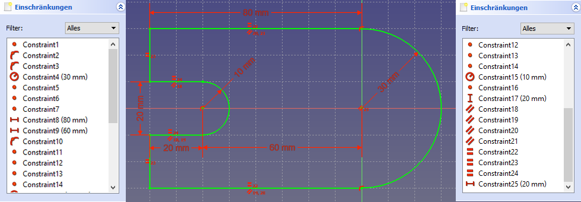

# Sketcher requirement for a sketch
{{TutorialInfo
|Topic=Sketch
|Level=Beginner
|Author=[Maker](User_Maker.md)
|Time=
|FCVersion=
}}

## Minimum requirement for a sketch 

The creation of a body in the workspace PartDesign is already possible and *only* with the help of a closed curve (profile). The complete determination of all their dimensions and properties (*fully constrained*) is not yet required.

That a closed curve is present, is not self-evident and not recognizable. When connecting a circular arc to a straight line, e.g. The two endpoints are created only one above the other. You must use the  [Coincident](Sketcher_ConstrainCoincident.md) constraint to make a single point that actually connects the line and the arc.

  

*A simple sketch. 
Left: Curve only in four places (red, automatic constraints when drawing with [ [Polyline](Sketcher_CreatePolyline.md)) closed. 
Middle: Warning - ... broken face (broken curve). 
Right: Curve closed at remaining four places (green)*

However, consistent parametric working means that the sketch is completely determined.

## Defining a sketch completely 

Even a relatively simple sketch may contain dozens of indeterminacies (indicated in the combo view as a \"degrees of freedom\" number). To eliminate them together at the end is a relatively confusing task.

  

*A simple sketch; completely determined by 25 constraints, of which only 5 are dimension constraints.*

This work is clearer and simpler if one immediately eliminates the \"freedoms\" of each added geometric element, i. this \'\' dimensions \'\' (that is, values for dimensions and placements). The provisional completeness is reached if all lines are displayed in green.

If one waits until the end of the drawing to determine, one finds remaining \"freedoms\" by touching the points and lines with the mouse pointer and determining where they are not yet fixed. When complete, the entire drawing is displayed in green.

If you accidentally create an \"overmodulation\", a warning appears in the combo-view asking you to undo the corresponding actions (constraints).

 {{Sketcher Tools navi}}

---
[documentation index](../README.md) > [Sketcher](Sketcher_Workbench.md) > Sketcher requirement for a sketch
