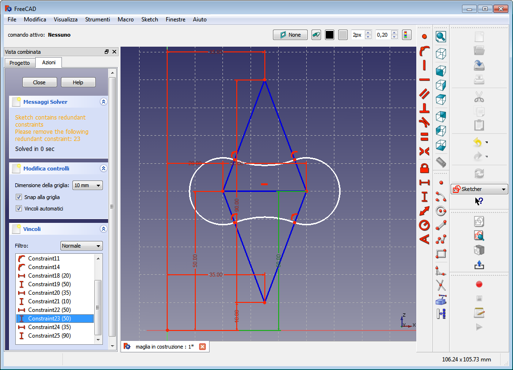
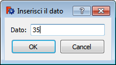
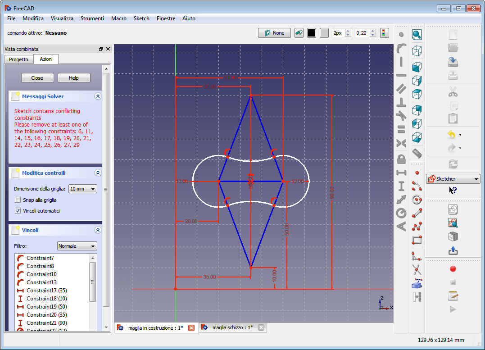
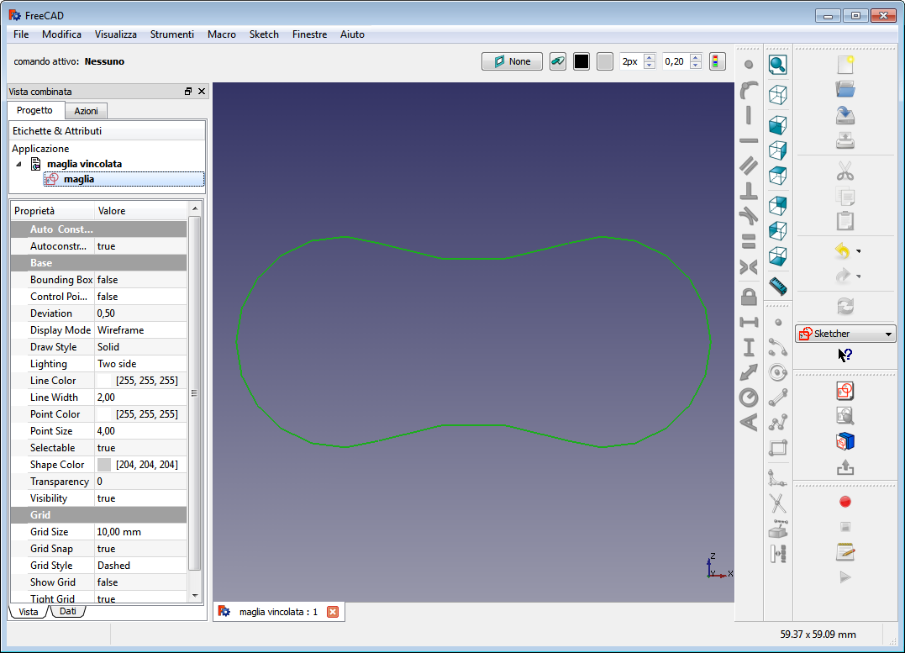

# Soluzione2
**pagina in costruzione**

## Costruzione di contorno completamente vincolato 

## Preparare l\'ambiente 

Come per il caso precedente:

-   Avviare l\'ambiente **Sketcher**
-   Creare un nuovo file (documento) e rinominarlo **Maglia**
-   Cliccare sull\'icona **Crea un nuovo sketch**, si apre il dialogo per l\'orientamento
-   Scegliere il piano **XZ**
-   Impostare una griglia con maglie di 10 mm
-   Ruotare la rotella del mouse per ingrandire la griglia
-   Premere **Ctrl+Alt** + **destro del mouse** e spostare la griglia
-   Attivare **Snap alla griglia**
-   Attivare **Vincoli automatici**

## Disegnare le linee di costruzione 

-   Selezionare lo strumento **Polilinea** e tracciare un rombo
-   Con lo strumento **Linea** tracciare la diagonale minore
    -   Fissare i punti quando quelli presenti assumono il colore **bianco**: significa che coincidono

-   Selezionare tutte i segmenti del rombo
-   Cliccare sullo strumento **Linea di costruzione**
-   Notare che tutti gli oggetti assumono il colore **blu**

## Disegnare il contorno 

-   Avviare lo strumento **arco** e, con centro nei vertici del poligono, tracciare gli archi del contorno utilizzando come limiti i lati del rombo
    -   Notare il prodursi dei **vincoli automatici**

## Stabilire i vincoli 

Come si può vedere nell\'immagine precedente, alcuni vincoli sono attribuiti automaticamente. Ora si tratta di **vincolare completamente** lo schizzo:

-   Selezionare un vertice del rombo poi cliccare sull\'icona **Blocca** (il lucchetto).Nell\'area di disegno appaiono le quote e nell\'elenco dei vincoli vengono inserite due nuove voci con, tra parentesi, i valori delle quote.
-   Proseguire in questo modo per tutti i vertici del rombo.
    -   Nel risultato notare la pessima disposizione delle quote e
    -   notare il messaggio (in giallo) del solutore che consiglia di rimuovere il vincolo 23 in quanto ripetizione di un altro vincolo:

Risolvere la rindondanza e sistemare le quote:

-   Cliccare sulla quota indicata nel messaggio e premere **Canc**
-   Sorvolare la quotatura da riposizionare, Quando assume il colore **giallo**, cliccare e tenere premuto trascinando il mouse per spostarla. Se l\'operazione non riesce, provare a disattivare **Snap alla griglia**

Correggere eventuali errori di posizionamento:

-   Cliccare due volte sulla voce del vincolo o direttamente sulla nota da modificare per visualizzare la seguente finestra di inserimento dati:

I punti finora vincolati sono i centri degli archi. Ora vincolare il loro raggio:

-   Selezionare un arco poi selezionare lo strumento **Fissa il raggio**
-   Ripetere le operazioni per tutti gli archi
    -   Notare i messaggi del solutore

-   Eliminare i vincoli in conflitto
    -   Notare che lo schizzo completamente vincolato in modo corretto assume il colore **verde**:

-   Chiudere lo strumento Schizzo
    -   Notare che rimane visibile solo il contorno senza le annotazioni dello schizzo e senza le linee di costruzione

-   Rinominare lo schizzo in **maglia**
-   Salvare il file con il nome **maglia vincolata** e osservare che questo diventa anche il nome del documento attivo
    -   Ricordare che attribuire dei nomi descrittivi agli oggetti è molto utile

Torna a [Esercitazioni](Esercitazioni.md)

{{languages/it | }}

[ Documentation/it]( Documentation/it.md) [ Tutorials/it]( Tutorials/it.md)

---
[documentation index](../README.md) > Soluzione2
