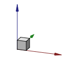

---
- GuiCommand   *
   Name   *Std ViewDimetric
   MenuLocation   *View → Standard views → Axonometric → Dimetric
   Workbenches   *All
   SeeAlso   *[Std ViewIsometric](Std_ViewIsometric.md), [Std ViewTrimetric](Std_ViewTrimetric.md)
---

# Std ViewDimetric

## Description

The **Std ViewDimetric** command realigns the camera in the active [3D view](3D_view.md) to obtain a [dimetric](https   *//en.wikipedia.org/wiki/Axonometric_projection#Three_types) view. For a truly dimetric view the 3D view must be in [orthographic mode](Std_OrthographicCamera.md), but the command also works if the view is in [perspective mode](Std_PerspectiveCamera.md).

   
*The [axis cross](Std_AxisCross.md) and a cube in dimetric view*

## Usage

1.  Select the **View → Standard views → Axonometric →  Dimetric** option from the menu.

## Scripting


**See also   ***

[FreeCAD Scripting Basics](FreeCAD_Scripting_Basics.md).

To change to dimetric view use the `viewDimetric` method of the ActiveView object. This method is not available if FreeCAD is in console mode.

 
```python
import FreeCADGui

FreeCADGui.ActiveDocument.ActiveView.viewDimetric()
FreeCADGui.ActiveDocument.ActiveView.getViewDirection()
```


 {{Std Base navi}}


---
 [documentation index](../README.md) > Std ViewDimetric
