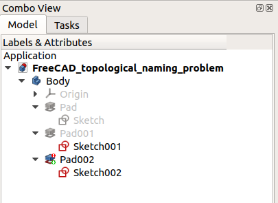
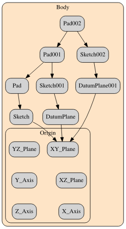

# Topological naming problem
## Introduction

 

The [topological naming problem](topological_naming_problem.md) in FreeCAD refers to the issue of a shape changing its internal name after a modelling operation (pad, cut, union, chamfer, fillet, etc.) is performed. This will result in other parametric features that depend on that shape to break or be incorrectly computed. This issue affects all objects in FreeCAD but is especially notable when building solids with the  [PartDesign Workbench](PartDesign_Workbench.md), and when dimensioning those solids with the  [TechDraw Workbench](TechDraw_Workbench.md).

-   In  [PartDesign](PartDesign_Workbench.md), if a feature is supported on a face (or edge or vertex), the feature may break if the underlying solid changes size or orientation, as the original face (or edge or vertex) may be internally renamed.
-   In  [TechDraw](TechDraw_Workbench.md), if a dimension is measuring the length of a projected edge, the dimension may break if the 3D model is changed, as the vertices may be renamed thus changing the measured edge.

The topological naming issue is a complex problem in CAD modelling that stems from the way the internal FreeCAD routines handle updates of the geometrical shapes created with the [OCCT kernel](OpenCASCADE.md). As of FreeCAD 0.19 there are ongoing efforts to improve the core handling of shapes in order to reduce or eliminate such issues.

-   Forum thread   * [Topological Naming, My Take](https   *//forum.freecadweb.org/viewtopic.php?t=27278)

The topological naming problem most often affects and confuses new users of FreeCAD. In PartDesign, the user is advised to follow the best practices discussed in the [feature editing](feature_editing.md) page. Use of supporting datum objects like [planes](PartDesign_Plane.md) and [local coordinate systems](PartDesign_CoordinateSystem.md) is strongly recommended to produce models that aren\'t easily subject to such topological errors. In TechDraw, the user is advised to add dimensions only when the 3D model is complete and won\'t be modified further.

## Example

1\. In the  [PartDesign Workbench](PartDesign_Workbench.md), create a  [PartDesign Body](PartDesign_Body.md), then use  [PartDesign NewSketch](PartDesign_NewSketch.md) and select the XY plane to draw the base sketch; then perform a  [PartDesign Pad](PartDesign_Pad.md) to create a first solid.

  

2\. Select the top face of the previous solid, and then use  [PartDesign NewSketch](PartDesign_NewSketch.md) to draw another sketch; then perform a second pad.

   
     
   

3\. Select the top face of the previous extrusion, and once again create a sketch, and a pad.

  

4\. Now, double click the second sketch, and modify it so that its length is along the X direction; doing this will recreate the second pad. The third sketch and pad will stay in the same place.

   
     
   

 

5\. Now, double click the second sketch again, and adjust its points so that a portion of it is outside the limits defined by the first pad. By doing this, the second pad will recompute correctly, however, when looking at the [tree view](tree_view.md), an error will be indicated in the third pad.

   
     
   

  

6\. By making visible the third sketch and pad, it is clear that the computation of the new solid did not proceed correctly. The third sketch, instead of being supported by the top face of the second pad, appears in a strange place, with its normal oriented towards the X direction. This results in an invalid pad, as this pad would be disconnected from the rest of the  [PartDesign Body](PartDesign_Body.md), which is not allowed.

The problem appears to be that when the second sketch was modified, the top face of the second pad was renamed from `Face13` to `Face14`. The third sketch is attached to `Face13` as it originally was, but since this face is now on the side (not at the top), the sketch follows its orientation and now is incorrectly positioned.

   
     
   

7\. To fix the issue, the third sketch should be mapped to the top face again. Select the sketch, click on the ellipsis (three dots) next to the **Map Mode** property, and choose the top face of the second pad again. Then the sketch moves to the top of the existing solid, and the third pad is generated without issues.

  

   
     
   

Remapping a sketch in this way can be done every time there is a topological naming error, however, this may be tedious if the model is complicated and there are many such sketches that need to be adjusted.

## Solution

  

The [dependency graph](Std_DependencyGraph.md) is a tool that is helpful to observe the relationships between the different bodies in the document. Using the original modelling workflow reveals the direct relationship that exists between the sketches and the pads. Like a chain, it is easy to see that this direct dependence will be subject to topological naming problems if any of the links in the sequence changes.

As explained in the [feature editing](feature_editing.md) page, a solution to this problem is to support sketches not on faces but on datum planes which are offset from the main planes of the [PartDesign Body\'s](PartDesign_Body.md) Origin.

1\. Select the origin of the [PartDesign Body](PartDesign_Body.md) and make sure that it is visible. Then select the XY plane, and click on [PartDesign Plane](PartDesign_Plane.md). In the attachment offset dialog, give it an offset in the Z direction so that the datum plane is coplanar with the top face of the first pad.

2\. Repeat the process but this time add a larger offset so that the second datum plane is coplanar with the top face of the second pad.

 

   
     
   

3\. Select the second sketch, click on the ellipsis next to the **Map Mode** property, and then select the first datum plane. The datum plane is already offset from the body\'s XY plane, so no further Z offset is required for the sketch.

4\. Repeat the process with the third sketch, and select the second datum plane as support. Again, no further Z offset is necessary.

5\. The dependency graph now shows that the sketches and pads are supported by the datum planes. This model is more stable as each sketch can be modified essentially independently from each other.

  

6\. Double click the second sketch and modify the shape. The second pad should update immediately without causing topological problems with the third sketch and the third pad.

  

7\. In fact, every sketch can be modified without interfering with each other\'s pads. As long as the pads have sufficient extrusion length, so that they touch and form a contiguous solid, the entire body will be valid.

  

## Final remarks 

Adding datum objects is more work for the user but ultimately produces more stable models that are less subject to the topological naming problem.

Naturally, datum objects can be created before any sketches are drawn, and pads are produced. This may be helpful to visualize the approximate shape and dimensions of the final body.

Datum planes can also be based on other datum planes. This creates a chain of dependencies that could also result in topological problems; however, since datum planes are very simple objects, the risks of having these issues is less than if the face of a solid object is used as support.

Datum objects, [points](PartDesign_Point.md), [lines](PartDesign_Line.md), [planes](PartDesign_Plane.md), and [coordinate systems](PartDesign_CoordinateSystem.md), may also be useful as reference geometry, that is, as visual aids to show the important features in the model, even if no sketch is directly attached to them.

## Links

-   [PartDesign Fillet - Topological naming](PartDesign_Fillet#Topological_naming.md)
-   [Topological Naming, My Take](https   *//forum.freecadweb.org/viewtopic.php?t=27278)   * a possible solution, by realthunder.
-   [Topological Naming Project](Topological_Naming_Project.md)   * idea to solve the problem, by ickby.
-   [Topological data scripting](Topological_data_scripting.md)
-   [Feature editing](Feature_editing.md)   * contains alternate advice for stable modelling techniques.

## Videos

-   [Why do my FreeCAD models break? - \"Topological Naming Problem\"](https   *//youtu.be/6p2vqEEmWq4)   * A Video explanation of the underlying issues of [Topological naming problem](Topological_naming_problem.md)
-   [FreeCAD Is Fundamentally Broken! - Now what\... Help Me Decide\...](https   *//www.youtube.com/watch?v=QSsVFu929jo)   * A Maker Tales Video

  {{TechDraw Tools navi}} {{PartDesign Tools navi}} 

[Category   *Common Questions](Category_Common_Questions.md)

---
 [documentation index](../README.md) > [Common Questions](Category_Common Questions.md) > [TechDraw](Category_TechDraw.md) > [PartDesign](Category_PartDesign.md) > [Part](Category_Part.md) > Topological naming problem
