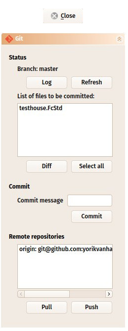

---
- GuiCommand:
   Name:WebTools Git‏‎
   MenuLocation:Web Tools → Git
   Workbenches:[WebTools](WebTools_Workbench.md)
   Version:0.17
---

# WebTools Git


**Starting from FreeCAD v0.17, this tool has been removed from the Arch Workbench and is now part of the external [[WebTools Workbench]] that you can install via menu Tools →  [[Addon manager]].
**

## Description

This command allows to manage the current document with [GIT](https://en.wikipedia.org/wiki/Git_%28software%29). GIT is a powerful file version control system, which can manage different versions of files and keep track of the changes.

Git is a complex tool, consider learning the basics of it before using this tool, to avoid wrong operations that can cause data loss. An abundant literature about GIT is available and easy to find on the internet.

**Prerequisite:** To be able to use this command, the [gitpython](https://github.com/gitpython-developers/GitPython) package must be installed on your system. On most linux distributions, gitpython is available from the standard software repositories as *gitpython* or *python-git*.

## Usage

1.  Make sure the [Report view](Report_view.md) is open since Git messages will be printed there.
2.  Save the current active document making sure the saved file is inside an existing git repository. It can be in a subdirectory.
3.  Select menu **Web Tools →  [Git](WebTools_Git.md)
**
4.  This opens up a [Task panel](Task_panel.md) in the [Combo view](Combo_view.md).

## Options



-   The **Log** button will pop up a dialog showing the most recent log entries. The output corresponds to git log.
-   The **Refresh** button will re-scan the repository for changed files. After saving your work you have to do a manual refresh.
-   The **Diff** button will show the differences between the current version of a selected file and the most recent version stored in the repository. The output corresponds to git diff.
    -   By default a binary diff is made, you have to set up the fcinfo tool for textual diffing.
-   The **Select all** button will select all files to be committed.
-   The **Commit** button will commit the selected files. Be sure to write a commit message that describes the changes you are committing.
-   The **Pull** button will **download** any new changes to the repository from the selected remote. If the file currently opened in FreeCAD is being modified by a pull, a warning message will inform you so you can either save the file again or save it elsewhere.
-   The **Push** button will **upload** your latest commit(s) to the selected remote.

## Limitations

-   The tool cannot create new repositories yet. You must have an existing local repository already created. (FreeCAD will check if the current document file is inside a Git repository.)
-   The tool cannot change or create branches. You must do that manually with standard Git tools.

## Enabling human-readable diffs for FCStd files with the fcinfo utility 

FreeCAD\'s [FCStd file format](File_Format_FCStd.md) is a zip-based binary format, for which Git cannot produce proper diffs. This means that you cannot see what has changed between one version and another, and also that each new version stored in the Git repository is a full copy of the file.

Although the second problem currently has no solution, the first one can be solved with a little tool available from the FreeCAD source code, called [fcinfo](https://github.com/FreeCAD/FreeCAD/blob/master/src/Tools/fcinfo). Git can be told to use the fcinfo utility to print a human-friendly report of a FCStd file, and, when asked to produce a diff between two FCStd files, will produce a diff between the two fcinfo reports instead. Please note that this is only visual feedback, a full copy of the file will still be stored internally.

Example of a diff produced with fcinfo:

 
```python
diff --git a/testhouse.FcStd b/testhouse.FcStd
index 08077b6..985b1d8 100644
--- a/testhouse.FcStd
+++ b/testhouse.FcStd
@@ -1,26 +1,25 @@
-Document: /tmp/43un09_testhouse.FcStd (442K)
-   SHA1: 67c1985a45d93cba57d5bf44490897aba460100d
+Document: /tmp/zfXoDd_testhouse.FcStd (370K)
+   SHA1: db1cb5fca18af7bfdca849028f40550df4d845cb
    Comment : This is a test house to showcase FreeCAD's BIM worflow and IFC export capabilities
    Company : uncreated.net
    CreatedBy : Yorik van Havre
    CreationDate : Fri May  9 12:05:54 2014 
    FileVersion : 1
    Id : 
-   Label : testhouse
-   LastModifiedBy : Yorik van Havre
-   LastModifiedDate : 2016-06-28T17:05:57-03:00
+   Label : testhouse2
+   LastModifiedBy : Yorik van Havre
+   LastModifiedDate : Sat Sep 13 20:46:36 2014
+
    License : CC-BY 3.0
    LicenseURL : http://creativecommons.org/licenses/by/3.0/
-   ProgramVersion : 0.17R7800 (Git)
-   TipName : 
+   ProgramVersion : 0.15R3989 (Git)
    Uid : 67e62d8a-6674-4358-92fe-615443be887a
-   Objects: (231)
+   Objects: (221)
        Annotation : Drawing::FeatureViewAnnotation
        Annotation001 : Drawing::FeatureViewAnnotation
        Annotation002 : Drawing::FeatureViewAnnotation
        Annotation003 : Drawing::FeatureViewAnnotation
-       Annotation004 : Drawing::FeatureViewAnnotation
-       Annotation005 : Drawing::FeatureViewAnnotation
        Array : Part::FeaturePython (9K)
        Box : Part::Box (2K)
        Building : App::DocumentObjectGroupPython
@@ -110,7 +109,7 @@ Document: /tmp/43un09_testhouse.FcStd (442K)
        Floor : App::DocumentObjectGroupPython
        Floor001 : App::DocumentObjectGroupPython
        Floor002 : App::DocumentObjectGroupPython
-       Frame : Part::FeaturePython (89K)
```

 Each FreeCAD file contains a SHA1 checksum number, which will change each time the file is saved, even if no contents was changed. So fcinfo will always print something, no matter of the contents changes.

To enable the use of fcinfo (Linux and Mac only - TODO: add Windows instructions)

1.  Save the fcinfo file somewhere in your system path
2.  Make it executable
3.  Create a .gitattributes file in your Git repository and add the following line in it:

*.FCStd diff=fcinfo

Add the following lines to the .gitconfig file in your home directory:

[diff "fcinfo"]
textconv = /path/to/fcinfo

Alternatively, if you want to invoke fcinfo with arguments (e.g., --gui) use this approach [1](https://stackoverflow.com/questions/55601430/how-to-pass-a-filename-argument-gitconfig-diff-textconv):

[diff "fcinfo"]
textconv = sh -c '/path/to/fcinfo --gui "$0"'

---
[documentation index](../README.md) > WebTools Git
